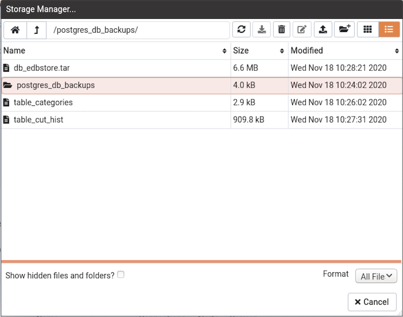
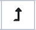
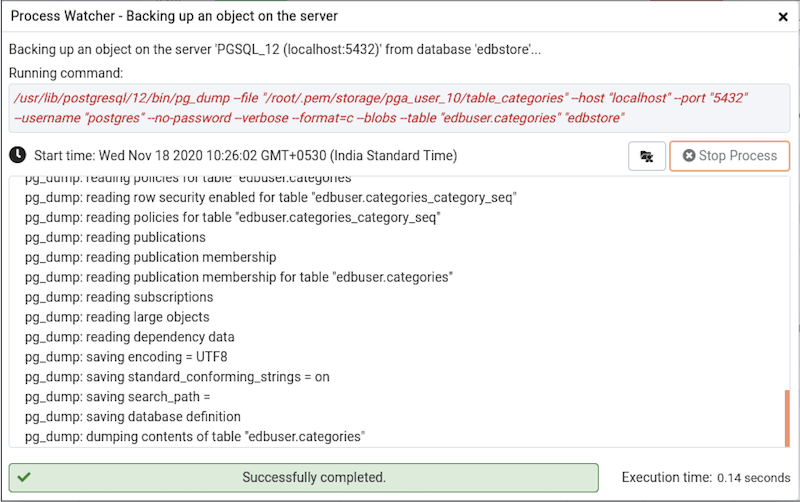

*Storage Manager* is a feature that helps you manage your systems storage device. You can use *Storage Manager* to:

-   Download, upload, or manage operating system files.
-   Download *backup* or *export* files (custom, tar and plain text format) on a client machine.
-   Download *export* dump files of tables.

You can access *Storage Manager* from the *Tools* Menu.

Use icons on the top of the *Storage Manager* window to manage storage:

Use the `Home` icon  to return to the home directory.

Use the `Up Arrow` icon  to return to the previous directory.

Use the `Refresh` icon  to display the most-recent files available.

Select the `Download` icon  to download the selected file.

Select the `Delete` icon  to delete the selected file or folder.

Select the `Edit` icon  to rename a file or folder.

Use the `Upload` icon  to upload a file.

Use the `New Folder` icon  to add a new folder.

Use the `Grid View` icon  to display all the files and folders in a grid view.

Use the `Table View` icon  to display all the files and folders in a list view.

Click on the check box next to *Show hidden files and folders* at the bottom of the window to view hidden files and folders.

Use the *Format* drop down list to select the format of the files to be displayed; choose from *sql*, *csv*, or *All Files*.

You can also download backup files through *Storage Manager* at the successful completion of the backups taken through [Backup Dialog](06_backup_dialog/#backup_dialog), [Backup Global Dialog](07_backup_globals_dialog/#backup_globals_dialog), or [Backup Server Dialog](08_backup_server_dialog/#backup_server_dialog).

At the successful completion of a backup, click on the icon to open the current backup file in *Storage Manager* on the *process watcher* window.

