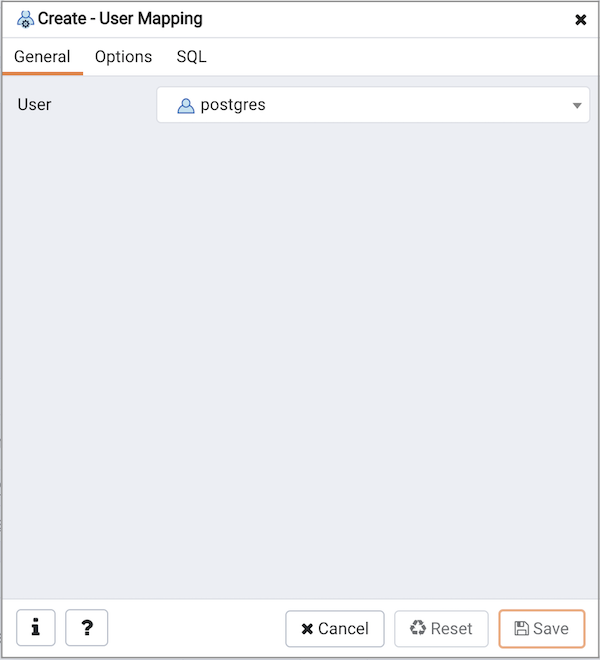
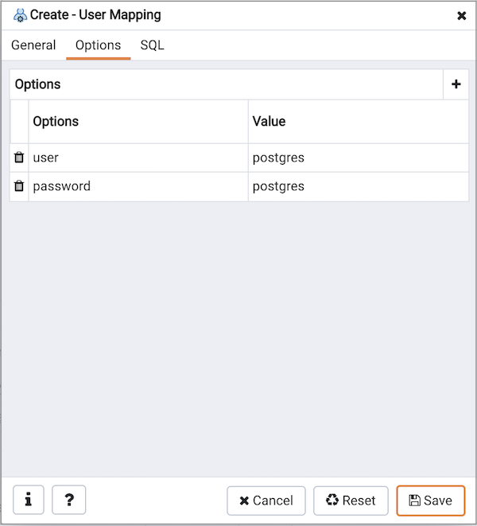
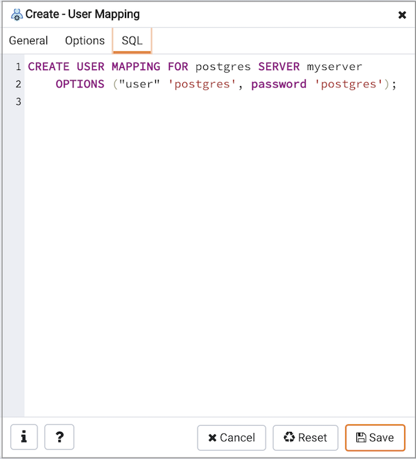

Use the `User Mapping` dialog to define a new mapping of a user to a foreign server.

The `User Mapping` dialog organizes the development of a user mapping through the following dialog tabs: `General` and `Options`. The `SQL` tab displays the SQL code generated by dialog selections.

<figure><figcaption aria-hidden="true"><em>Create User Mapping dialog - General tab</em></figcaption></figure>

Use the drop-down listbox in the `User` field in the `General` tab to identify the connecting role:

-   Select `CURRENT_USER` to use the name of the current role.
-   Select `PUBLIC` if no other user-specific mapping is applicable.
-   Select a pre-defined role name to specify the name of an existing user.

Click the `Options` tab to continue.

<figure><figcaption aria-hidden="true"><em>Create User Mapping dialog - Options tab</em></figcaption></figure>

Use the fields in the `Options` tab to specify connection options; the accepted option names and values are specific to the foreign data wrapper associated with the server specified in the user mapping. Click the `Add` button to add an option/value pair.

-   Specify the option name in the `Option` field.
-   Provide a corresponding value in the `Value` field.

Click `Add` to specify each additional option/value pair; to discard an option, click the trash icon to the left of the row and confirm deletion in the `Delete Row` popup.

Click the `SQL` tab to continue.

Your entries in the `User Mapping` dialog generate a SQL command (see an example below). Use the `SQL` tab for review; revisit or switch tabs to make any changes to the SQL command.

**Example**

The following is an example of the sql command generated by user selections in the `User Mapping` dialog:

<figure><figcaption aria-hidden="true"><em>Create User Mapping dialog - SQL tab</em></figcaption></figure>

The example shown demonstrates a user mapping for the `hdfs_server`. The user is `CURRENT_USER` with a password `secret`.

-   Click the `Info` button (i) to access online help. View context-sensitive help in the `Tabbed browser`, where a new tab displays the PostgreSQL core documentation.
-   Click the `Save` button to save work.
-   Click the `Cancel` button to exit without saving work.
-   Click the `Reset` button to restore configuration parameters.
