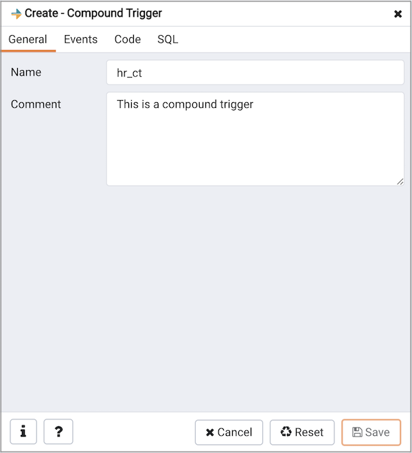
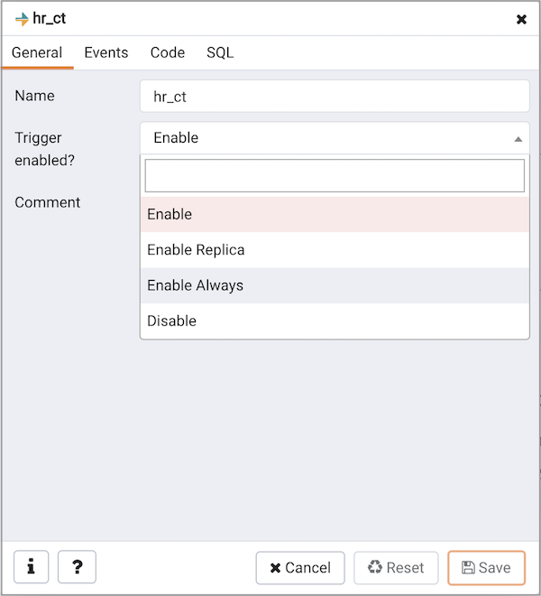
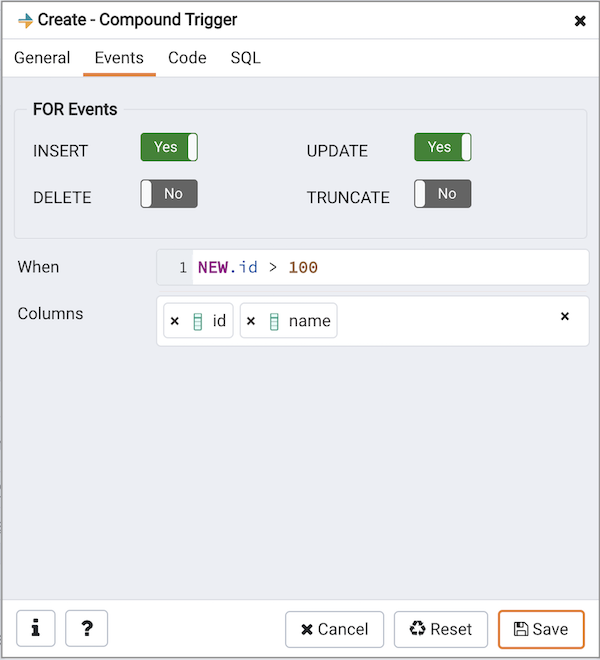
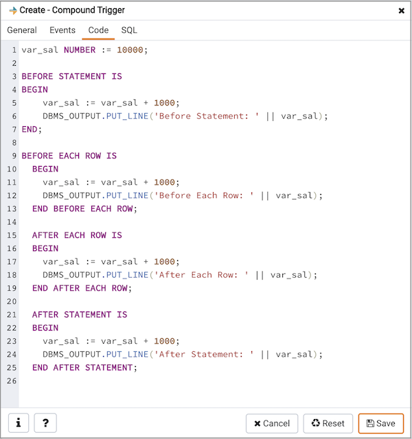
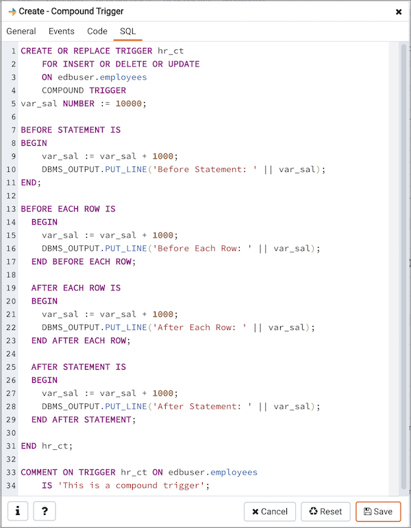

Use the `Compound Trigger` dialog to create a compound trigger or modify an existing compound trigger. `Compound Trigger` is supported only for EPAS server 12 and above. A compound trigger executes a specified code when certain events occur.

The `Compound Trigger` dialog organizes the development of a compound trigger through the following dialog tabs: `General`, `Events`, and `Code`. The `SQL` tab displays the SQL code generated by dialog selections.

Use the fields in the `General` tab to identify the compound trigger:

-   Use the `Name` field to add a descriptive name for the compound trigger. This must be distinct from the name of any other compound trigger for the same table. The name will be displayed in the `Browser` tree control.
-   Store notes about the compound trigger in the `Comment` field.

-   `Trigger enabled` field is available in compound trigger dialog once the trigger is created by selecting the `properties` of the trigger. You can select one of the four options available.

Click the `Events` tab to continue.

Use the fields in the `Events` tab to specify how and when the compound trigger fires:

-   Select the type of event(s) that will invoke the compound trigger; to select an event type, move the switch next to the event to the `YES` position. The supported event types are `INSERT`, `UPDATE`, `DELETE` and `TRUNCATE`. Views cannot have TRUNCATE triggers.
-   Use the `When` field to provide a boolean condition that will invoke the compound trigger.
-   If defining a column-specific compound trigger, use the `Columns` field to specify the columns or columns that are the target of the compound trigger.

Click the `Code` tab to continue.

Use the `Code` field to specify the code for the five timing events `BEFORE STATEMENT`, `AFTER STATEMENT`, `BEFORE EACH ROW`, `AFTER EACH ROW`, `INSTEAD OF EACH ROW` that will be invoked when the compound trigger fires. Basic template is provided with place holders.

Click the `SQL` tab to continue.

Your entries in the `Compound Trigger` dialog generate a SQL command (see an example below). Use the `SQL` tab for review; revisit or switch tabs to make any changes to the SQL command.

## Example

The following is an example of the sql command generated by user selections in the `Compound Trigger` dialog:

The example demonstrates creating a compound trigger named `test_ct`.

-   Click the `Info` button (i) to access online help.
-   Click the `Save` button to save work.
-   Click the `Cancel` button to exit without saving work.
-   Click the `Reset` button to restore configuration parameters.
