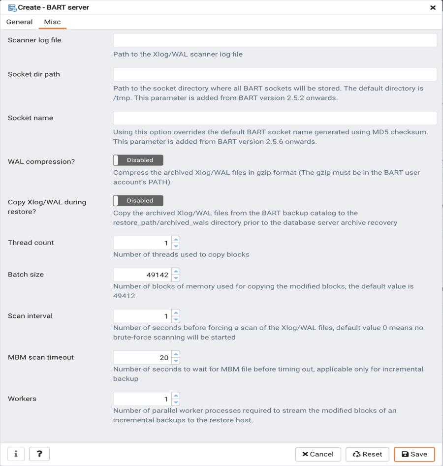

You can use the `Create–BART server` dialog to register an existing BART server with the PEM server. To access the dialog, right-click on the `BART Servers` node and select `Create-BART Server`.

Use the fields on the `General` tab to describe the general properties of the BART Server:

-   Use the `Agent Name` field to select the agent that you want to configure as a BART server. Only those PEM agents that are supported for BART are listed in the drop-down list.

-   Use the `Server Name` field to specify a user-friendly name for the server. The name specified will identify the server in the Browser tree.

-   Use the `Host` field to specify the IP address of the host or agent where BART is installed.

-   Use the `User` field to specify the user name that will be used for performing all the BART operations. You can either use the `enterprisedb` (for Advanced Server) or `postgres` (for PostgreSQL) database user account or you can create a new BART user account. This user must be an operating system user who owns the BART backup catalog directory.

-   Use the `Installation path` field to specify the directory path where BART is installed on the host or BART server.

-   Use the `Backup path` field to specify the file system parent directory where all BART backups and archived WAL files will be stored.

-   Use the `pg_basebackup_path` field to specify the path to the `pg_basebackup` utility.

-   Use the `Xlog/WAL` method field to specify how the transaction log should be collected during the execution of pg_basebackup. The default option is `fetch`; it specifies that the transaction log files will be collected after the backup has completed. Set the `Xlog` method to `stream` to stream the transaction log in parallel with the full base backup creation. If streaming is used, the `max_wal_senders` configuration parameter in the `postgresql.conf` file for affected database servers must account for an additional session for the streaming of the transaction log (the setting must be a minimum of 2).

    For more information about Xlog method, see:

    > <https://www.postgresql.org/docs/current/app-pgbasebackup.html>

-   Use the `Retention policy` field to specify the retention policy for the backup. This determines when an active backup should be marked as obsolete, and hence, be a candidate for deletion. You can specify the retention policy in terms of number of backup or in terms of duration (days, weeks, or months).

-   Use the `Log file` field to specify the path to BART log file. This is an optional field.

Use the fields on the `Misc` tab to describe the backup-related properties of the BART Server:

-   Use the `Scanner log file` field to specify the path to the Xlog/WAL scanner log file. This is an optional field; BART does not create a WAL scanner log file if you do not specify the path.
-   Use the `Socket dir path` field to specify the path to the socket directory where all BART sockets will be stored. The default directory is `/tmp`. This parameter is added from BART version 2.5.2 onwards.
-   Use the `Socket name` field to specify a user-friendly BART socket file name. Using this option overrides the default BART socket name generated using MD5 checksum. This parameter is added from BART version 2.5.6 onwards.
-   Use the `WAL compression?` switch to specify if you want to compress the archived Xlog/WAL files in Gzip format. To enable WAL compression, the gzip compression program must be present in the BART user account’s PATH. The WAL compression setting must not be enabled for those database servers where you need to take incremental backups.
-   Use the `Copy WALs during restore?` field to specify how the archived WAL files are collected when invoking the RESTORE operation. Set to enabled to copy the archived WAL files from the BART backup catalog to the `restore_path/archived_wals` directory prior to the database server archive recovery. Set to `disabled` to retrieve the archived WAL files directly from the BART backup catalog during the database server archive recovery. Enabling this option helps you save time during the restore operation.
-   Use the `Thread count` field to specify the number of worker threads for copying blocks or data files from the database server to the BART backup catalog. Specify a `thread count` of `1` if you want to take the backup using the `pg_basebackup` utility.
-   Use the `Batch size` field to specify the number of blocks of memory used for copying modified blocks. This is applicable only for incremental backups.
-   Use the `scan interval` field to specify the number of seconds after which the WAL scanner should scan the new WAL files.
-   Use the `MBM scan timeout` field to specify the number of seconds to wait for MBM files before timing out. This is applicable only for incremental backups.
-   Use the `Workers` field to specify the number of parallel worker processes required to stream the modified blocks of an incremental backups to the restore host.
