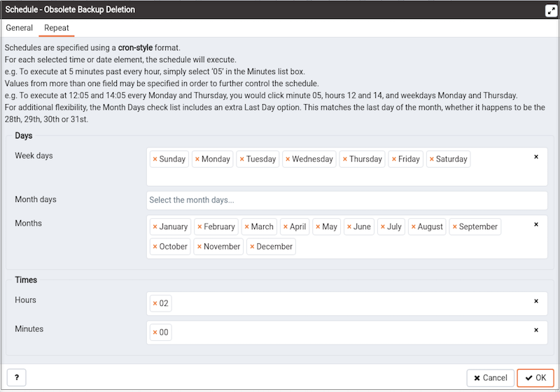

Use the `Schedule Obsolete Backup Deletion` dialog to schedule or modify a BART obsolete backup deletion. Use context menu from database server where BART has been configured.

Provide information on the `General` tab to describe the scheduling details:

-   Use the `Enabled?` switch to indicate if the schedule should be enabled (`Yes`) or disabled (`No`).
-   Use the calendar selector in the `Start` field to specify the starting date and time for the schedule.
-   Use the calendar selector in the `End` field to specify the ending date and time for the schedule.

Use the fields on the `Repeat` tab to specify the details about the schedule in a cron-style format. The schedule will execute on each date or time element selected on the `Repeat` tab. Click within a field to open a list of valid values for that field; click on a specific value to add that value to the list of selected values for the field. To clear the values from a field, click the `X` located at the right-side of the field.

Use the fields within the `Days` box to specify the days on which the schedule will execute:

-   Use the `Week Days` field to select the days on which the schedule will execute.
-   Use the `Month Days` field to select the numeric days on which the schedule will execute. Specify the Last Day to indicate that the schedule should be performed on the last day of the month, regardless of the date.
-   Use the `Months` field to select the months in which the schedule will execute.

Use the fields within the `Times` box to specify the times at which the schedule will execute:

-   Use the `Hours` field to select the hour at which the schedule will execute.
-   Use the `Minutes` field to select the minute at which the schedule will execute.
