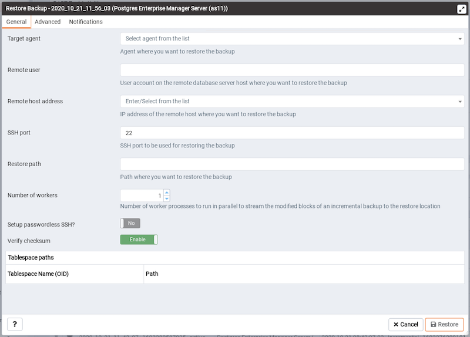
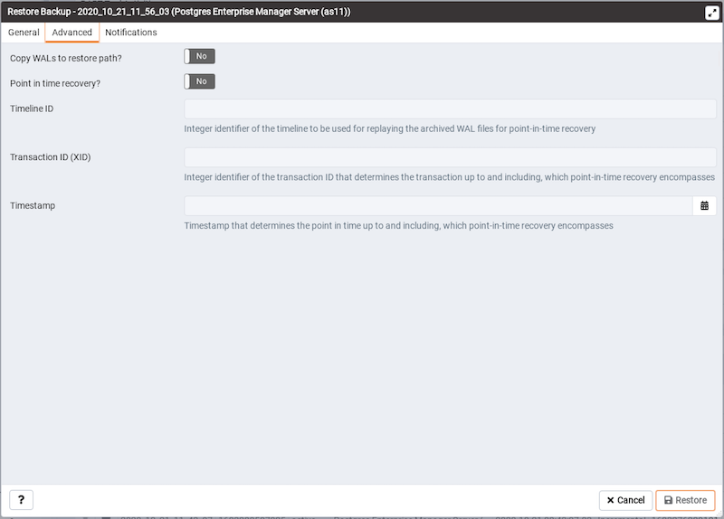

You can restore the backups that you have earlier created using BART server on a target remote host. When you select a particular BART server, all the associated backups are listed in the Dashboard under `Initiated Server Backups`.

To restore a backup, click the `Restore` icon next to the backup that you want to restore.

<figure><figcaption aria-hidden="true"><em>Restore Backup dialog - General tab</em></figcaption></figure>

In the `Restore Backup` dialog, provide information in the fields on the `General` tab:

-   Use the `Target agent` field name to specify the name of the agent where you want to restore the backup.
-   Use the `Remote user` field to specify the use account on the remote database server host where you want to restore the backup.
-   Use the `Remote host address` field to specify the IP address of the remote host where you want to restore the backup.
-   Use the `SSH port` field to specify the SSH port to be used for restoring the backup.
-   Use the `Restore path` field to specify the path where you want to restore the backup.
-   Use the `Number of workers` field to specify processes to run in parallel to stream the modified blocks of an incremental backup to the restore location.
-   Use the `Setup passwordless SSH?` switch to specify if you want to create SSH certificates to allow passwordless logins between the BART server and the target host for restore.
-   Use the `Verify checksum` switch to specify if you want to verify checksum of a backup.

<figure><figcaption aria-hidden="true"><em>Restore Backup dialog - Advanced tab</em></figcaption></figure>

On the `Advanced` tab, specify your preferences for advanced options for restoring the backup:

-   Use the `Copy WALs to restore path?` switch to specify if you want to copy WALs to the restore path.
-   Use the `Point in time recovery` switch to specify if you want point in time recovery.
-   Use the `Timeline ID` field to specify the timeline ID to be used for replaying the archived WAL files for point-in-time recovery.
-   Use the `Transaction ID (XID)` field to specify the transaction ID for point-in-time recovery.
-   Use the `Timestamp` field to the timestamp to be used for restore.

!!! Note
    You can specify either `Transaction ID` or `Timestamp` for the point-in-time recovery.

<figure><figcaption aria-hidden="true"><em>Restore Backup dialog - Notifications tab</em></figcaption></figure>

Use the fields on the `Notifications` tab to specify the email notification settings for restoring the backup.

-   Use the `Send the notifications` field to specify when you want the email notifications to be sent.
-   Use the `Email group` field to specify the email group that should receive the email notification.
