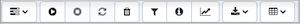

## Toolbar Options

Toolbar options on the SQL Profiler tab allow you to define new traces, start or stop existing traces, open and search through previous traces, and filter trace results.

Use the following options to manage your SQL Profiler traces:

| Option           | Action                                                                                                                                                                                               | Shortcut      |
| ---------------- | ---------------------------------------------------------------------------------------------------------------------------------------------------------------------------------------------------- | ------------- |
| `Menu`           | Use options accessed through the drop_down menu icon to manage SQL Profiler traces.                                                                                                                  | Accesskey + O |
| `Start Trace`    | Select the `Start Trace` icon to start a new trace, using the attributes (user names, database names, comments, etc) that were defined for the trace currently displayed in the SQL Profiler dialog. | Accesskey + S |
| `Stop Trace`     | Select the `Stop Trace` icon to stop an executing trace.                                                                                                                                             | Accesskey + Q |
| `Refresh Trace`  | Select the `Refresh Trace` icon to update the display to include any recent changes to an active trace.                                                                                              | Accesskey + R |
| `Clear Trace`    | Select the `Clear Trace` icon to delete the trace and close the SQL Profiler window.                                                                                                                 | Accesskey + C |
| `Filter`         | Select the `Filter` icon to define a new filter, or apply an existing filter to the trace.                                                                                                           | Accesskey + T |
| `Information`    | Select the information icon to view the properties of the trace displayed in the SQL Profiler window.                                                                                                | Accesskey + P |
| `Index Advisor`  | Select the `Index Advisor` icon to open the [PEM Index Advisor](04_sp_index_advisor/#sp_index_advisor). \| Ac                                                                                        | cesskey + I   |
| `Download Trace` | Use options accessed through the `Download Trace` menu to download a CSV file that contains the trace events shown on the current page or the complete set of trace data.                            | Accesskey + X |
| `Column Picker`  | Click the `Column Picker` icon to choose the columns to be displayed in below table.                                                                                                                 | Accesskey + W |

## Viewing Trace Data

The SQL Profiler tab is divided into three panes:

-   The top of the tabbed browser window (the trace data pane) displays a list of the SQL commands executed during the trace.
-   The lower-left panel dislays the SQL query that was executed, or the metrics gathered during the execution.
-   The lower-right panel displays the query execution plan; you can view the execution plan in a Text-based form, or as a Graphical Plan.

**The Trace Data Pane**

The Trace Data pane displays the SQL commands executed during the trace. By default, the commands are displayed in the order that the command was executed.

Double-click a column heading to sort the trace by the column values; double-click the column heading a second time to toggle the data in the column to be in ascending or descending order.

Use the drop-down listbox next to the `Show queries per page` label to specify the number of events that SQL Profiler should display in the pane. Select from 20, 50, 100, 200, 500, 1000, or 2000. The default is 500.

If the number of events in the trace exceeds the count of events per page, use the page selector controls (located in the top left corner of the table) to navigate through pages of the trace.

To include or exclude events from the currently displayed trace, select the Filter icon from the SQL Profiler toolbar. The Trace Filter dialog will allow you to define and apply a filter that will screen the displayed trace.

**The Query/Metrics Pane**

The Query/Metrics pane is located in the lower-left corner of the SQL Profiler window. The tabs provide detailed information about the currently selected query:

-   The `SQL Query` tab displays the text of the query that is currently highlighted in Trace Data pane.
-   The `Metrics` tab displays detailed statistical information about the execution of the query. The table below describes the metrics that are displayed in the Metrics dialog; the percentages listed describe the percentage of the total quantity of the parameter that is attributed to the selected SQL command:

| **Property**                 | **Description**                                                                                                                                                                    |
| ---------------------------- | ---------------------------------------------------------------------------------------------------------------------------------------------------------------------------------- |
| Executed (#)                 | The number of times that the selected SQL command executed.                                                                                                                        |
| Execution (%)                | The percentage of the execution count that the SQL command represents. For example if the trace profiles 4 SQL commands, each command will represent 25% of the trace execution %. |
| Duration (%)                 | The percentage of the total trace time consumed by the highlighted SQL Command.                                                                                                    |
| Rows updated (%)             | The percentage of the rows updated during the trace that were updated by the selected SQL command.                                                                                 |
| Page faults (%)              | The percentage of the page faults that occur during the trace that can be attributed to the selected SQL command.                                                                  |
| Page reclaims (%)            | The percentage of the pages reclaimed during the trace that can be attributed to the selected SQL command.                                                                         |
| Swaps (%)                    | The percentage of swaps that occur during the trace that can be attributed to the selected SQL command.                                                                            |
| File system in (%)           | The percentage of bytes written to disk during the trace that can be attributed to the selected SQL command.                                                                       |
| File system out (%)          | The percentage of bytes read from disk during the trace that can be attributed to the selected SQL command.                                                                        |
| Signals received (%)         | Currently unused.                                                                                                                                                                  |
| Messages received            | (%)Currently unused.                                                                                                                                                               |
| Messages sent (%)            | Currently unused.                                                                                                                                                                  |
| Voluntary context switches   | (%)Currently unused.                                                                                                                                                               |
| Involuntary context switches | (%)Currently unused.                                                                                                                                                               |
| Shared blocks read (%)       | The percentage of the shared blocks read by the highlighted SQL command.                                                                                                           |
| Shared blocks written (%)    | The percentage of the shared blocks written by the highlighted SQL command.                                                                                                        |
| Shared blocks hit (%)        | The percentage of the shared blocks hit by the highlighted SQL command.                                                                                                            |
| Local blocks read (%)        | The percentage of local blocks read by the highlighted SQL command.                                                                                                                |
| Local blocks written (%)     | The percentage of local blocks written by the highlighted SQL command.                                                                                                             |
| Local blocks hit (%)         | The percentage of local blocks hit by the highlighted SQL commands.                                                                                                                |
| Temporary blocks read (%)    | The percentage of the temporary blocks read by the highlighted SQL commands.                                                                                                       |
| Temporary blocks written (%) | The percentage of the temporary blocks written by the highlighted SQL commands.                                                                                                    |

**The Explain Pane**

The Graphical or Text-based explain pane displays one of two representations of the query execution plan for the selected query.

-   Select the Text-based Plan tab to display the execution plan for the currently highlighted event in text format:
-   Select the Graphical-based Plan tab to display a graphical interpretation of the execution plan of the highlighted query. For more information about interpreting the graphical query plan, see [Interpreting the Graphical Query Plan](../08_toc_pem_developer_tools/03_pem_interpreting_graphical_query/#pem_interpreting_graphical_query).
