

The graphical explain plan provides clues that can help you identify the aspects of the selected query that consume the most resources; within the diagram, thicker lines indicate the portions of the query that are expected to take the most processing time.

To view a graphical interpretation of an executed query, select `Explain` or `Explain Analyze` from the `Execute/Refresh` drop-down menu. Please note that you can use the `Explain Options` pull-aside menu to specify the level of detail displayed for each node.

Hover over an icon within the plan to view details for the selected node:

Each query operator (within the selected query) is represented in the graphical display by an icon. The table below describes the Advanced Server query operators:

| Icon                                                                    | Represents                              | Description                                                                                                                                                                                                                                          |
| ----------------------------------------------------------------------- | --------------------------------------- | ---------------------------------------------------------------------------------------------------------------------------------------------------------------------------------------------------------------------------------------------------- |
|                        | Result Set                              | The Result Set icon represents a simple result set in the query plan. Typically, a Result Set operator is used to evaluate a query that does not fetch data from a table.                                                                            |
|                           | Aggregate                               | The server creates an Aggregate operator whenever the query invokes an aggregate function (a function that returns a value computed from multiple rows). Aggregate functions include: AVG(), COUNT(), MAX(), MIN(), STDDEV(), SUM(), and VARIANCE(). |
|            | Window Aggregate                        | The server may use a Window aggregate operator to implement windowed aggregate functions; a windowed aggregate function is a function that returns a value computed from a set of rows within the input.                                             |
|                                    | Seek                                    | The server may use a Seek operator in any plan that includes an Index Scan operator. The Seek operator represents a probe into the heap to fetch the tuple that corresponds to an index entry (found by the Index Scan operator).                    |
|                            | Seq Scan                                | The server may use a Seq scan (sequential scan) to read through a table from beginning to end.                                                                                                                                                       |
| 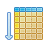                       | Index Scan                              | The server may use an Index scan operator to read through a table in the order specified in the index.                                                                                                                                               |
|                            | CTE Scan                                | The server may use a CTE Scan operator if the query performs a scan of a common table expression.                                                                                                                                                    |
|                  | Tuple ID Scan                           | The server uses a Tuple ID scan if the query uses the Tuple ID (ctid) as a constraint in a WHERE clause.                                                                                                                                             |
| 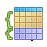                                 | Group                                   | The server may use a Group operator when the query includes a GROUP BY clause. The operator requires a single input set ordered by the target column(s).                                                                                             |
|                                    | Sort                                    | The server may use a Sort operator when a query includes an ORDER BY clause to impose an order on a result set.                                                                                                                                      |
|                                  | Limit                                   | The server may use the Limit operator to limit the size of a result set (when a query includes the LIMIT or OFFSET clause).                                                                                                                          |
|                             | Sub Plan                                | The server may use a Subplan operator for queries that include subselects.                                                                                                                                                                           |
| 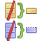                               | Unique                                  | The server may use the Unique operator to remove duplicate values from a result set; the diagram will include a Unique operator if the query includes a DISTINCT clause.                                                                             |
| 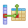                                   | Hash                                    | The server may use a Hash operator when joining two input sets that are not ordered by the column that controls the join.                                                                                                                            |
| 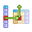               | Hash Semi-Join                          | The server may use a Hash Semi-Join operator to evaluate a query that joins two tables, but returns data from only one of those tables.                                                                                                              |
|                | Hash Anti-Join                          | The server may use a Hash Anti-Join operator to evaluate a query that includes a NOT IN clause.                                                                                                                                                      |
| 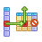                         | Anti-Join                               | The server may use an Anti-Join operator to evaluate a query that includes a NOT IN clause.                                                                                                                                                          |
|                                    | Join                                    | The server may use a Join operator when joining two input sets that are ordered by the column that controls the join.                                                                                                                                |
| 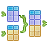             | Recursive Union                         | The server may use a Recursive Union operator if the query includes a WITH RECURSIVE clause.                                                                                                                                                         |
|                    | Set Operator                            | The server may use a Set operator if the query includes an INTERSECT, INTERSECT ALL, EXCEPT or EXCEPT ALL clause.                                                                                                                                    |
|          | Hash Set Operator (Setop) Intersect     | The server may use an Intersect Set operator if the query includes an INTERSECT clause.                                                                                                                                                              |
|        | Hash Set Operator (Setop) Intersect All | The server may use an Intersect Set operator if the query includes an INTERSECT ALL.                                                                                                                                                                 |
| 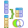         | Hash Set Operator (Setop) Except        | The server may use an Except Set operator if the query includes an EXCEPT.                                                                                                                                                                           |
|  | Hash Set Operator (Setop) Except All    | The server may use an Except All Set operator if the query includes an EXCEPT ALL clause.                                                                                                                                                            |
|                      | Materialize                             | The server may choose to use a Materialize operator for a subselect operation (a nested query).                                                                                                                                                      |
|                                | Append                                  | The server may use an Append operator to implement queries that contain a UNION clause.                                                                                                                                                              |
|                      | Nested Loop                             | The server may use a Nested Loop operator to perform a join between two tables. When implementing a nested loop, the server searches for rows from the inner table that match the corresponding row in the outer table.                              |
| 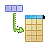                       | Merge Join                              | The server may use a Merge Join operator to join two tables. A Merge Join requires two sets of inputs, where each set is ordered by the column used for the comparison.                                                                              |
|              | Merge Semi-Join                         | The server may use a Merge Semi-Join operator to evaluate a query that joins two tables, but returns data from only one of those tables.                                                                                                             |
| 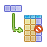             | Merge Anti-Join                         | The server may use a Merge Anti-Join operator to evaluate a query that includes a NOT IN clause.                                                                                                                                                     |
| 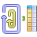 | Nested Loop Semi-Join                   | The server may use a Nested Semi-Join operator to evaluate a query that joins two tables, but returns data fro m only one of those tables.                                                                                                           |
| 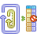 | Nested Loop Anti-Join                   | The server may use a Nested Anti-Join operator to evaluate a query that includes a NOT IN clause.                                                                                                                                                    |
|                    | Bitmap Index                            | The server may use a Bitmap Index operator when locating a subset of rows in an indexed table.                                                                                                                                                       |
| 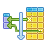                     | Bitmap Heap                             | The server may use a Bitmap Heap operator when the query returns a subset of rows from an indexed table.                                                                                                                                             |

While you cannot directly specify the execution plan of a query, you can use indexes, configuration parameters and optimizer hints to direct Advanced Server as it selects from the query plans presented by the server. See the following resources for more information about query optimization:

-   For more information about interpreting and understanding a query plan, see Using EXPLAIN, in the PostgreSQL documentation.
-   For information about using PEM's Index Advisor, see the EDB Postgres Advanced Server Guide, available from the EnterpriseDB website at [www.enterprisedb.com](http://www.enterprisedb.com).
-   For information about using configuration parameters to influence query plans, see Query Planning, in the PostgreSQL documentation.
-   For more information about using Oracle-compatible optimizer hints, see the EDB Postgres Advanced Server Oracle Compatibility Developer's Guide, available from the EnterpriseDB website at [www.enterprisedb.com](http://www.enterprisedb.com).
