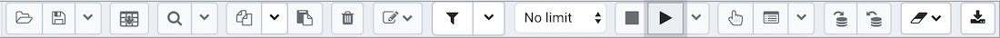

<div id="editgrid" class="registered_link"></div>

To review or modify data, right click on a table or view name in the `Browser` tree control. When the context menu opens, use the `View/Edit Data` menu to specify the number of rows you would like to display in the editor panel.


To modify the content of a table, each row in the table must be uniquely identifiable. If the table definition does not include an OID or a primary key, the displayed data is read only. Note that views cannot be edited; updatable views (using rules) are not supported.

The editor features a toolbar that allows quick access to frequently used options, and a work environment divided into two panels:

-   The upper panel displays the SQL command that was used to select the content displayed in the lower panel.
-   The lower panel (the Data Grid) displays the data selected from the table or view.

**The View/Edit Data Toolbar**

The toolbar includes context-sensitive icons that provide shortcuts to frequently performed tasks.



Hover over an icon to display a tooltip that describes the icon's functionality.

| Icon              | Behavior                                                                                                                                                                                                                                                                                                                                                                                                                                                                                                                                                                                                                                                                                                                                                                                                                                                                                                                                                                     | Shortcut    |
| ----------------- | ---------------------------------------------------------------------------------------------------------------------------------------------------------------------------------------------------------------------------------------------------------------------------------------------------------------------------------------------------------------------------------------------------------------------------------------------------------------------------------------------------------------------------------------------------------------------------------------------------------------------------------------------------------------------------------------------------------------------------------------------------------------------------------------------------------------------------------------------------------------------------------------------------------------------------------------------------------------------------- | ----------- |
| `Save`            | Use the `Save` icon to save your changes to the currently displayed table contents.                                                                                                                                                                                                                                                                                                                                                                                                                                                                                                                                                                                                                                                                                                                                                                                                                                                                                          |             |
| `Find`            | Use options on the `Find` menu to access Search and Replace functionality or to Jump to another line.                                                                                                                                                                                                                                                                                                                                                                                                                                                                                                                                                                                                                                                                                                                                                                                                                                                                        | Ctrl/Cmd +F |
| `Copy`            | Click the `Copy` icon to copy the currently selected data.                                                                                                                                                                                                                                                                                                                                                                                                                                                                                                                                                                                                                                                                                                                                                                                                                                                                                                                   | Ctrl+C      |
| `Paste Row`       | Click the `Paste Row` icon to paste the content that is currently on the clipboard.                                                                                                                                                                                                                                                                                                                                                                                                                                                                                                                                                                                                                                                                                                                                                                                                                                                                                          |             |
| `Delete Row`      | Use the `Delete Row` icon to delete all the selected rows from the output panel.                                                                                                                                                                                                                                                                                                                                                                                                                                                                                                                                                                                                                                                                                                                                                                                                                                                                                             |             |
| `Filter`          | Click the `Filter` icon to open a dialog that allows you to write and apply a filter for the content currently displayed in the output panel. Click the down arrow to open the `Filter` drop-down menu and select from pre-defined options:<br /><br /><br />Use options on the `Filter` menu to quick-sort or quick-filter the data set:<br />-   Filter: This option opens a dialog that allows you to define a filter. A filter is a condition that is supplied to an arbitrary WHERE clause that restricts the result set.     <br /> -   Remove Filter: This option removes all selection / exclusion filter conditions.     <br /> -   By Selection: This option refreshes the data set and displays only those rows whose column value matches the value in the cell currently selected.     <br /> -   Exclude Selection: This option refreshes the data set and excludes those rows whose column value matches the value in the cell currently selected.     <br /> |             |
| `No limit`        | Use the `No limit` drop-down listbox to specify how many rows to display in the output panel. Select from: `No limit` (the default), `1000 rows`, `500 rows`, or `100 rows`.                                                                                                                                                                                                                                                                                                                                                                                                                                                                                                                                                                                                                                                                                                                                                                                                 |             |
| `Execute/Refresh` | Click the `Execute/Refresh` icon to execute the SQL command that is displayed in the top panel. If you have not saved modifications to the content displayed in the data grid, you will be prompted to confirm the execution. To preserve your changes before refreshing the content, click the `Save` toolbar button before executing the refresh.                                                                                                                                                                                                                                                                                                                                                                                                                                                                                                                                                                                                                          | F5          |
| `Stop`            | Click the `Stop` icon to cancel the execution of the currently running query.                                                                                                                                                                                                                                                                                                                                                                                                                                                                                                                                                                                                                                                                                                                                                                                                                                                                                                |             |
| `Clear History`   | Use the `Clear History` drop-down menu to erase the contents of the `History` tab.                                                                                                                                                                                                                                                                                                                                                                                                                                                                                                                                                                                                                                                                                                                                                                                                                                                                                           |             |
| `Download as CSV` | Click the `Download as CSV` icon to download the result set of the current query to a comma-separated list. You can control the CSV settings through `Preferences -> SQL Editor -> CSV output` dialogue.                                                                                                                                                                                                                                                                                                                                                                                                                                                                                                                                                                                                                                                                                                                                                                     | F8          |

**The Data Grid**

The top row of the data grid displays the name of each column, the data type, and if applicable, the number of characters allowed. A column that is part of the primary key will additionally be marked with \[PK].

<div id="data-grid" class="registered_link"></div>

To modify the displayed data:

-   To change a numeric value within the grid, double-click the value to select the field. Modify the content in the square in which it is displayed.
-   To change a non-numeric value within the grid, double-click the content to access the edit bubble. After modifying the contentof the edit bubble, click the `Save` button to display your changes in the data grid, or `Cancel` to exit the edit bubble without saving.

To enter a newline character, click Ctrl-Enter or Shift-Enter. Newline formatting is only displayed when the field content is accessed via an edit bubble.

To add a new row to the table, enter data into the last (unnumbered) row of the table. As soon as you store the data, the row is assigned a row number, and a fresh empty line is added to the data grid.

To write a SQL NULL to the table, simply leave the field empty. When you store the new row, the will server fill in the default value for that column. If you store a change to an existing row, the value NULL will explicitly be written.

To write an empty string to the table, enter the special string '' (two single quotes) in the field. If you want to write a string containing solely two single quotes to the table, you need to escape these quotes, by typing ''

To delete a row, press the `Delete` toolbar button. A popup will open, asking you to confirm the deletion.

To commit the changes to the server, select the `Save` toolbar button. Modifications to a row are written to the server automatically when you select a different row.

**Geometry Data Viewer**

If PostGIS is installed, you can view GIS objects in a map by selecting row(s) and clicking the 'View Geometry' button in the column. If no rows are selected, the entire data set will be rendered:


You can adjust the layout by dragging the title of the panel. To view the properties of the geometries directly in map, just click the specific geometry:


Notes:

-   `Supported data types:` The Geometry Viewer supports 2D and 3DM geometries in EWKB format including `Point, LineString, Polygon MultiPoint, MultiLineString, MultiPolygon and GeometryCollection`.
-   `SRIDs:` If there are geometries with different SRIDs in the same column, the viewer will render geometries with the same SRID in the map. If SRID=4326 the OSM tile layer will be added into the map.
-   `Data size:` For performance reasons, the viewer will render no more than 100000 geometries, totaling up to 20MB.
-   `Internet access:` An internet connection is required for the Geometry Viewer to function correctly.

**JSON Data Editor**

A built in json editor is provided for *JSON/JSONB Data*.Double clicking on json/jsonb data type cell in data grid will open JSON Editor.Editor provides different mode to view and edit json data.


*Code Mode*: Provides way to format & compact json data.Also provides ability to repair json data by fixing quotes and escape characters, removing comments and JSONP notation and turn JavaScript objects into JSON.

*Tree Mode*: Enabled to change, add, move, remove, and duplicate fields and values.Provides ability to search & highlight data.

*Form Mode*: Allows only to edit values in json data there by providing ability to keep data structure unchanged while editing.

Preview Mode\*: Provides ability to check data before saving and also shows size of current json data. Format and compact json data as well.

*Editor Toolbar*

Different options are provided to manipulate json data.

Code/Preview mode:


Tree/Form mode:


| Icon           | Behavior                                                                                                          | Available in mode         |
| -------------- | ----------------------------------------------------------------------------------------------------------------- | ------------------------- |
| *Format Json*  | Click to *Format Json* format json data with proper indentation.                                                  | Code, Preview             |
| *Compact Json* | Click to *Compact Json* get compacted json data.                                                                  | Code, Preview             |
| *Sort*         | Click to *Sort* icon to set sorting criteria for the data using file values.                                      | Code, Preview, Tree       |
| *Transform*    | Click to *Transform* to filter data using JSME query language.                                                    | Code, Preview, Tree       |
| *Undo*         | Click to *Undo* to undo last action performed on data .                                                           | Code, Preview, Tree, From |
| *Redo*         | Click to *Redo* to repat last action performed on data .                                                          | Code, Preview, Tree, From |
| *Mode*         | Click to *Mode* dropdown to change dipaly mode of editor.Different modes avaialble are Code, Preview, Tree, From. | Code, Tree, From, Preview |
| *Expand All*   | Click to *Expand All* to expand json data.                                                                        | Tree, From                |
| *Collapse All* | Click to *Redo* to collapse json data.                                                                            | Tree, From                |
| *Search Box*   | Enter partial/complete string to search in data.                                                                  | Tree, From                |

**Sort/Filter options dialog**

You can access `Sort/Filter options dialog` by clicking on Sort/Filter button. This allows you to specify an SQL Filter to limit the data displayed and data sorting options in the edit grid window:


-   Use `SQL Filter` to provide SQL filtering criteria. These will be added to the "WHERE" clause of the query used to retrieve the data. For example, you might enter:

```sql
id > 25 AND created > '2018-01-01'
```

-   Use `Data Sorting` to sort the data in the output grid

To add new column(s) in data sorting grid, click on the \[+] icon.

-   Use the drop-down `Column` to select the column you want to sort.
-   Use the drop-down `Order` to select the sort order for the column.

To delete a row from the grid, click the trash icon.

-   Click the `Help` button (?) to access online help.
-   Click the `Ok` button to save work.
-   Click the `Close` button to discard current changes and close the dialog.

<div class="toctree" maxdepth="2">

viewdata_filter

</div>
