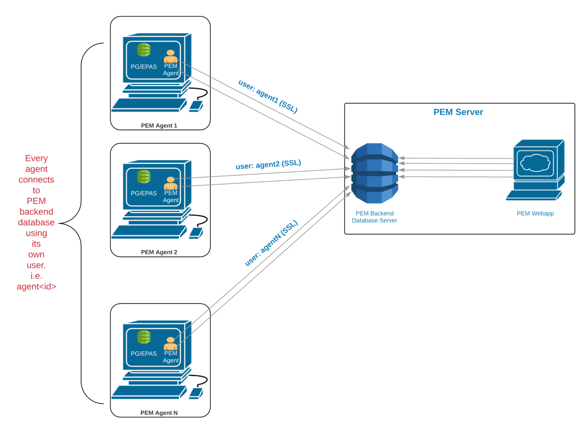
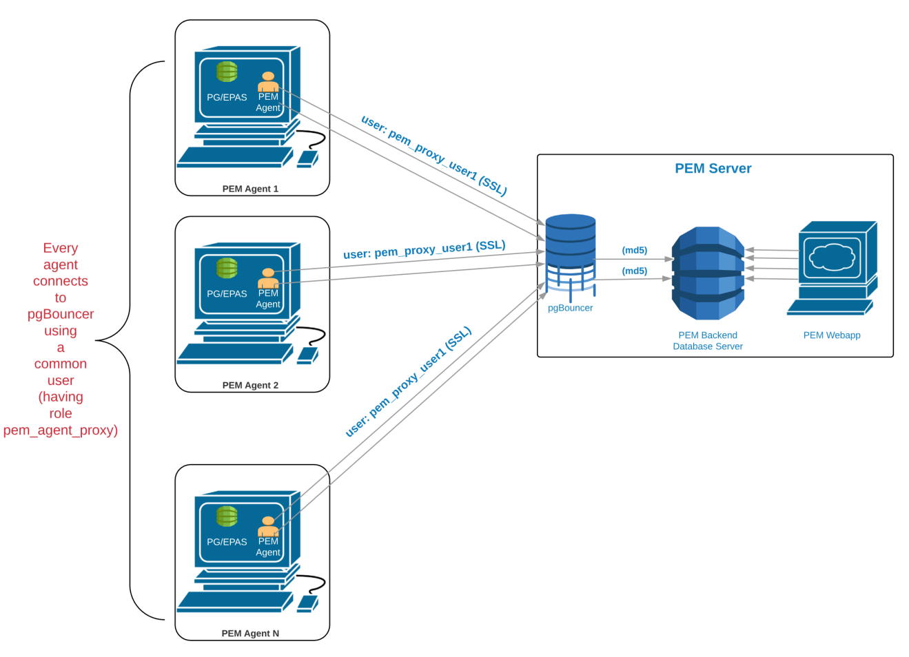

Each PEM Agent connects to the PEM database server using the SSL certificates for each individual user. For example, an Agent with `ID#1` connects to the PEM database server using the `agent1` user.

Prior to PEM version 7.5, the following limitations disallowed the use of the connection pooler between the PEM Server and PEM Agent:

-   The PEM Agent uses an SSL Certificate to connect the PEM database server.
-   It uses an individual user identifier when connecting to the PEM database server.

EDB has modified the PEM Agent to allow the agent to use a common database user (instead of the dedicated agent users) to connect the PEM database server.

We recommend using PgBouncer versions equal to or later than version 1.9.0 as the connection pooler. Versions 1.9.0 or later support `cert` authentication; PEM Agents can connect to pgBouncer using SSL certificates.
