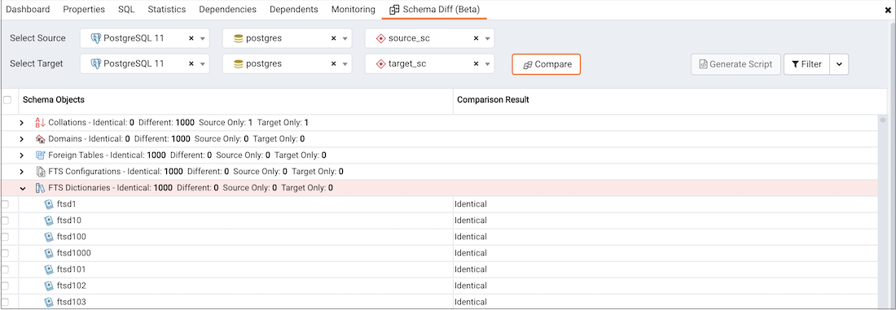
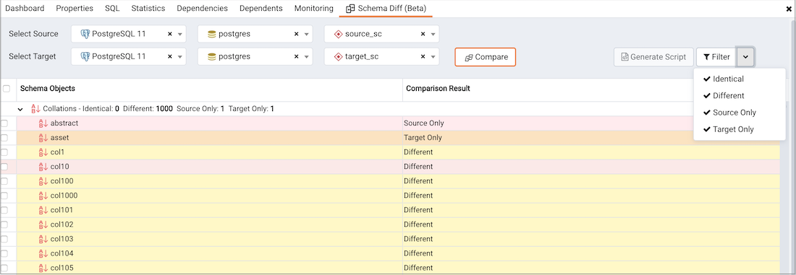
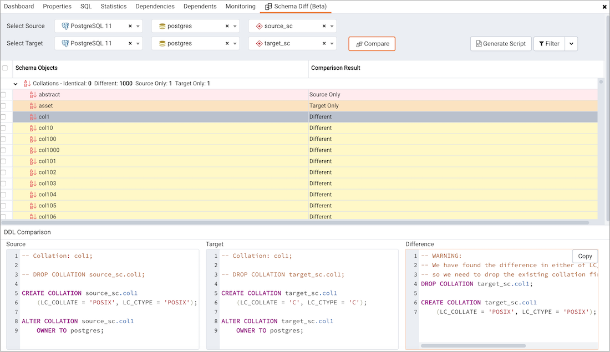
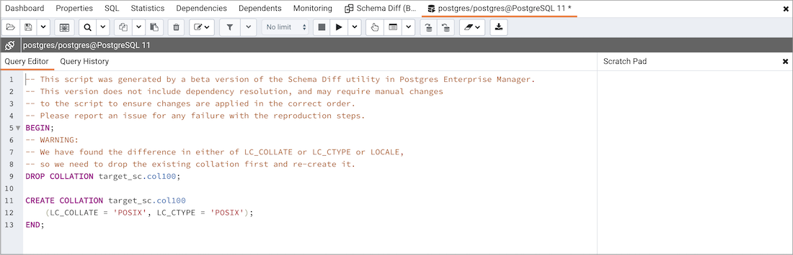

Schema Diff is a feature that allows you to compare schema objects between two database schemas. Use the **Tools** menu to access Schema Diff.

The Schema Diff feature allows you to:

-   Compare and synchronize the database schemas (from source to target).
-   Visualize the differences between database schemas.
-   List the differences in SQL statement for target schema objects.
-   Generate synchronization scripts.

!!! Note
    The source and target databases must be of the same major version.

Select **Tools > Schema Diff** and a selection panel opens. Choose the source and target servers, databases, and schemas to compare. After choosing the objects, select **Compare**.

You can open multiple copies of Schema Diff in individual tabs simultaneously. To close a tab, select **X** in the upper-right corner of the tab bar.

To specify whether to open Schema Diff in a new browser tab, select the Preferences dialog box. Set **Open in new browser tab** option to **true**.

The Schema Diff panel is divided into two panels: an Object Comparison panel and a DDL Comparison panel.

## Schema Diff Object Comparison panel

In the Object Comparison panel, you can select the source and target servers of the same major version, databases, and schemas to compare. You can select any server listed under the browser tree whether it is connected or disconnected. If you select a server that isn't connected, then you must enter the password before using that server.

Next, select the databases to compare. The databases can be the same or different (and from the same server or different servers).

Lastly, select the source and target schemas to compare.

After you select servers, databases, and schemas, select **Compare** to obtain the comparison results.

Use the lists of Functions, Materialized Views, Tables, Trigger Functions, Procedures, and Views to view the DDL statements of all the schema objects.

To filter the schema objects, select **Filter** in the upper-right corner of the Object Comparison panel. Filter the schema objects according to these criteria:

-   **Identical** – If the object is found in both schemas with the same SQL statement, then the comparison result is identical.
-   **Different** – If the object is found in both schemas but have different SQL statements, then the comparison result is different.
-   **Source Only** – If the object is found only in source schema and not in target schema, then the comparison result is source only.
-   **Target Only** – If the object is found only in target schema and not in source schema, then the comparison result is target only.

Select any of the schema objects in the Object Comparison panel to display the DDL statements for that object in the DDL Comparison panel.

## Schema Diff DDL Comparison panel

The DDL Comparison panel displays three columns:

-   The first column displays the DDL statement of the object from the source schema.
-   The second column displays the DDL statement of the object from the target schema.
-   The third column displays the difference in the SQL statement of the target schema object.

To check for differences in the SQL statements, review the DDL statements of all the schema objects.

The Schema Diff tool can generate a SQL script with the differences found in the target schema object. The SQL script compares the target schema object to the SQL statement of the source schema object. To generate the script:
1.   Select the checkboxes of the schema objects in the Object Comparison panel.
1.   Select **Generate Script**.

To open the Query Tool in a new tab and display the differences in the SQL statement in the Query Editor: 
1.   Select the schema objects.
1.   Select **Generate Script**.

If you select the schema object to check the difference generated in the DDL Comparison panel but don't select the checkbox of the schema object, then PEM opens the Query Tool in a new tab and displays the differences in the SQL statements in the Query Editor.

To copy the difference generated in the DDL Comparison panel, select **Copy**.

Apply the SQL Statement in the target schema to synchronize the schemas.
