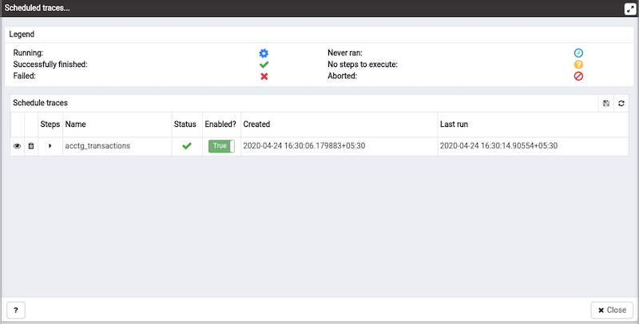

Most RDBMS experts agree that inefficient SQL code is the leading cause of most database performance problems. The challenge for DBAs and developers is to locate the poorly-running SQL code in large and complex systems, and then optimize that code for better performance.

The SQL Profiler component allows a database superuser to locate and optimize poorly-running SQL code. Users of Microsoft SQL Server’s Profiler will find PEM’s SQL Profiler very similar in operation and capabilities. SQL Profiler is installed with each Advanced Server instance; if you are using PostgreSQL, you must download the SQL Profiler installer, and install the SQL Profiler product into each managed database instance you wish to profile.

For each database monitored by SQL Profiler, you must:

1.  Edit the `postgresql.conf` file; you must include the SQL Profiler library in the shared_preload_libraries configuration parameter.

    For Linux installations, the parameter value should include:

    `$libdir/sql-profiler`

    on Windows, the parameter value should include:

    `$libdir/sql-profiler.dll`

2.  Create the functions used by SQL Profiler in your database. The SQL Profiler installation program places a SQL script (named sql-profiler.sql) in the `share/postgresql/contrib` subdirectory of the main PostgreSQL installation directory on Linux systems. On Windows systems, this script is located in the `share` subdirectory. You must invoke this script on the maintenance database specified when registering the server with PEM.

3.  Stop and re-start the server for the changes to take effect.

Please note: if you have connected to the PEM server with the PEM client before configuring SQL Profiler, you must disconnect and reconnect with the server to enable SQL Profiler functionality. For more detailed information about installing and configuring the SQL Profiler plugin, please refer to the [PEM Installation Guides](https://www.enterprisedb.com/docs/pem/latest).

## Creating a new SQL trace

SQL Profiler captures and displays a specific SQL workload for analysis in a SQL trace. You can start and review captured SQL traces immediately, or save captured traces for review at a later time. You can use SQL Profiler to create and store up to 15 named traces; use menu options to create and manage traces.

### Creating a trace

You can use the `Create trace...` dialog to define a SQL Trace for any database on which SQL Profiler has been installed and configured. installed and configured. To access the dialog, highlight the name of the database in the PEM client tree control; navigate through the Management menu to the SQL Profiler pull-aside menu, and select Create trace....

Use the fields on the `Trace options` tab to specify details about the new trace:

-   Provide a name for the trace in the Name field.
-   Click in the `User filter` field to specify the roles whose queries will be included the trace; optionally, check the box next to Select All to include queries from all roles.
-   Click in the `Database filter` field to specify which databases to trace; optionally, check the box next to Select All to include queries against all databases.
-   Specify a `trace size in the Maximum Trace File Size` field; SQL Profiler will terminate the trace when it reaches approximately the size specified.
-   Specify Yes in the `Run Now` field to start the trace when you select the Create button; select No to enable fields on the Schedule tab.

Use the fields on the `Schedule` tab to specify scheduling details for the new trace:

-   Use the `Start time` field to specify the starting time for the trace.
-   Use the `End time` field to specify the ending time for the trace.
-   Specify Yes in the `Repeat?` field to indicate that the trace should be repeated every day at the times specified; select No to enable fields on the Periodic job options tab.

Fields on the `Periodic job options` tab specify scheduing details about a recurring trace. Use fields in the Days section to specify the days on which the job will execute:

-   Click in the `Week days` field to select the days of the week on which the trace will execute.
-   Click in the `Month days` field to select the days of the month on which the trace will execute.
-   Click in the `Months` field to select the months in which the trace will execute.

Use fields in the `Times` section to specify a time schedule for the trace execution:

-   Click in the `Hours` field to select the hours at which the trace will execute.
-   Click in the `Minutes` field to select the hours at which the trace will execute.

When you've completed the `Create trace...` dialog, click `Create` to start the newly defined trace or to schedule the trace for a later time.

If you elect to execute the trace immediately, the trace results will display in the PEM client.

### Opening an existing trace

To view a previous trace, highlight the name of the profiled database in the PEM client tree control; navigate through the `Management` menu to the SQL Profiler pull-aside menu, and select `Open trace....` You can also use the `SQL Profiler toolbar` menu to open a trace; select the `Open trace...` option. The Open trace... dialog opens.

Highlight an entry in the trace list and click Open to open the selected trace. The selected trace opens in the SQL Profiler tab.

### Filtering a trace

A filter is a named set of (one or more) rules, each of which can hide events from the trace view. When you apply a filter to a trace, the hidden events are not removed from the trace, but are merely excluded from the display.

Click the Filter icon to open the `Trace Filter` dialog and create a rule (or set of rules) that define a filter. Each rule will screen the events within the current trace based on the identity of the role that invoked the event, or the query type invoked during the event.

To open an existing filter, select the `Open` button; to define a new filter, click the `Add (+)` icon to add a row to the table displayed on the General tab and provide rule details:

-   Use the `Type` drop-down listbox to specify the trace field that the filter rule will apply to.
-   Use the `Condition` drop-down listbox to specify the type of operator that SQL Profiler will apply to the Value when it filters the trace:
    -   Select `Matches to` filter events that contain the specified Value.
    -   Select `Does not match` to filter events that do not contain the specified Value.
    -   Select `Is equal to` to filter events that contain an exact match to the string specified in the Value field.
    -   Select `Is not equal` to to filter events that do not contain an exact match to the string specified in the Value field.
    -   Select `Starts with` to filter events that begin with the string specified in the Value field.
    -   Select `Does not start with` to filter events that do not begin with the string specified in the Value field.
    -   Select `Less than` to filter events that have a numeric value less than the number specified in the Value field.
    -   Select `Greater than` to filter events that have a numeric value greater than the number specified in the Value field.
    -   Select `Less than or equal to` to filter events that have a numeric value less than or equal to the number specified in the Value field.
    -   Select `Greater than or equal to` to filter events that have a numeric value greater than or equal to the number specified in the Value field.
-   Use the `Value` field to specify the string, number or regular expression that SQL Profiler will search for.

When you've finished defining a rule, click the Add (+) icon to add another rule to the filter. To delete a rule from a filter, highlight the rule and click the Delete icon.

Click the `Save` button to save the filter definition to a file without applying the filter; to apply the filter, click `OK`. Select `Cancel` to exit the dialog and discard any changes to the filter.

### Deleting a trace

To delete a trace, highlight the name of the profiled database in the PEM client tree control; navigate through the `Management` menu to the SQL Profiler pull-aside menu, and select `Delete trace(s)....` You can also use the SQL Profiler toolbar menu to delete a trace; select the `Delete trace(s)...` option. The `Delete traces` dialog opens.

Click the icon to the left of a trace name to mark one or more traces for deletion and click `Delete`. The PEM client will acknowledge that the selected traces have been deleted.

### Viewing scheduled traces

To view a list of scheduled traces, highlight the name of the profiled database in the PEM client tree control; navigate through the `Management` menu to the SQL Profiler pull-aside menu, and select `Scheduled traces...` You can also use the SQL Profiler toolbar menu to the list; select the `Scheduled traces...` option.

The `Scheduled traces...` dialog displays a list of the traces that are awaiting execution. Click the edit button to the left of a trace name to access detailed information about the trace:

-   The `Status` field lists the status of the current trace.
-   The `Enabled?` switch displays Yes if the trace is enabled; No if it is disabled.
-   The `Name` field displays the name of the trace.
-   The `Agent` field displays the name of the agent responsible for executing the trace.
-   The `Last run` field displays the date and time of the last execution of the trace.
-   The `Next run` field displays the date and time of the next scheduled trace.
-   The `Created` field displays the date and time that the trace was defined.

## Using the Index Advisor

Index Advisor is distributed with Advanced Server 9.0 and above. Index Advisor works with SQL Profiler by examining collected SQL statements and making indexing recommendations for any underlying tables to improve SQL response time. The Index Advisor works on all DML (INSERT, UPDATE, DELETE) and SELECT statements that are invoked by a superuser.

Diagnostic output from the Index Advisor includes:

-   Forecasted performance benefits from any recommended indexes
-   The predicted size of any recommended indexes
-   DDL statements you can use to create the recommended indexes

Before using Index Advisor, you must:

1.  Modify the `postgresql.conf` file on each Advanced Server host, adding the index_advisor library to the shared_preload_libraries parameter.

2.  Install the `Index Advisor contrib` module. To install the module, use the psql client or PEM Query Tool to connect to the database, and invoke the following command:

    `\i <complete_path>/share/contrib/index_advisor.sql`

3.  Restart the server for your changes to take effect.

Index Advisor can make indexing recommendations based on trace data captured by SQL Profiler. Simply highlight one or more queries in the `SQL Profiler Trace Data` pane, and click the `Index Advisor` toolbar button (or select Index Advisor from the View menu). For detailed usage information about Index Advisor, please see the EDB Postgres Advanced Server Guide.

Please note: Index Advisor cannot analyze statements invoked by a non-superuser. If you attempt to analyze statements invoked by a non-superuser, the server log will include the following error:

`ERROR: access to library "index_advisor" is not allowed` 

!!! Note
    It is recommended that you disable the index advisor while using the pg_dump functionality.

For more information about configuring and using Index Advisor, please see the EDB Postgres Advanced Server Guide, available from EDB at:

[https://www.enterprisedb.com/docs](/epas/latest/epas_guide/05_index_advisor/)
