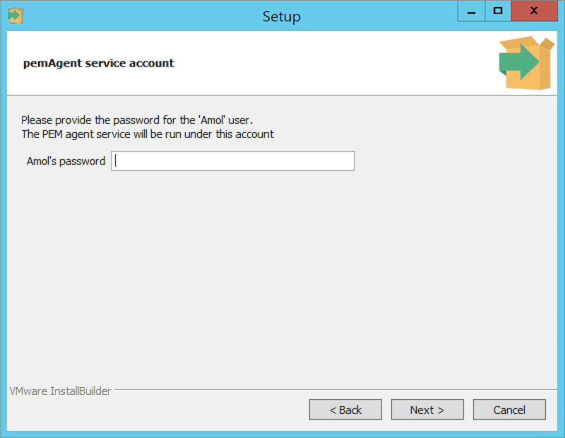
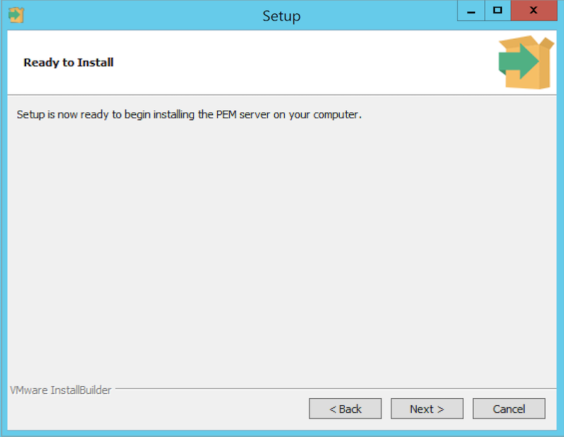
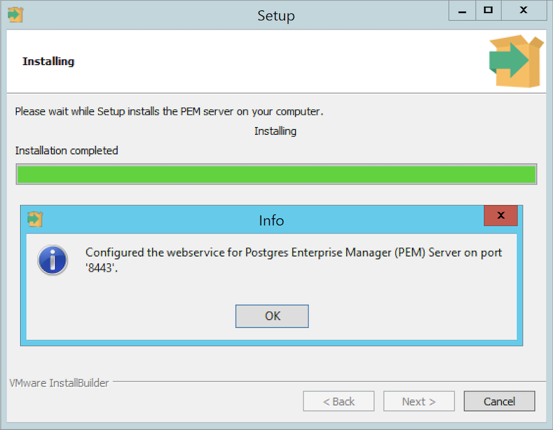
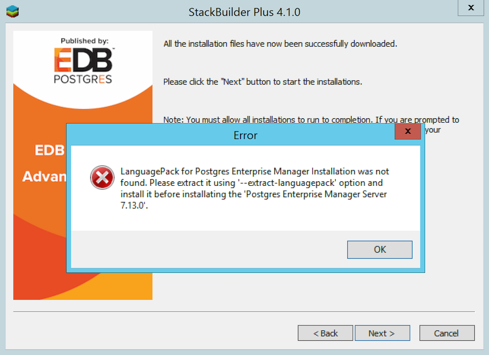

To upgrade PEM component software on Windows hosts, simply invoke a newer version of the PEM component installers in the following order:

1.  Invoke the PEM agent installer on each monitored node `except` the PEM Server host.
2.  Invoke the PEM Server installer; this installer will upgrade `both` the PEM Server and the PEM Agent that resides on the PEM Server host.

During an installation, the component installer will automatically detect an existing installation, and perform an upgrade. After upgrading the PEM Agent and Server, you can upgrade SQL Profiler if required; this step is platform-specific.

The following sections will walk you through the upgrade process on a Windows host, step-by-step.

## Upgrading a PEM Agent on a Windows Host

To upgrade a system that is currently monitored by a PEM agent to a more-recent PEM agent, simply download and invoke a newer version of the PEM Agent installer on the system that the agent is monitoring.

You can invoke the installer by right-clicking on the downloaded installer's icon, and selecting `Run as Administrator`. The `PEM Agent Setup Wizard` opens, welcoming you.

Read and accept the `License Agreement` before clicking `Next` to continue.

The setup wizard will automatically detect an existing agent, and upgrade the installed version. Click `Next` to continue.

The `pemAgent service account` dialog may prompt you for the password of the account under which the PEM Agent service runs.

If prompted, provide the password, and click `Next` to continue.

When the `Ready to Install` dialog informs you that the installation is about to begin, click `Next` to continue. It will upgrade your PEM Agent to the latest version.

The setup wizard displays progress bars to inform you of each component that is being installed.

The `PEM Agent Setup Wizard` will inform you when the installation completes. Click `Finish` to exit the wizard and close the window.

After the installation completes, a window pops-up to restart the machine. Click `Yes` to restart the machine and the PEM Agent.

## Upgrading the PEM Server on a Windows Host

The PEM Server installer facilitates upgrading directly between major versions of the PEM Server; you can upgrade directly from version 5.0 to version 7.16 without first upgrading to version 6.0.

You can invoke the installer by right-clicking on the downloaded installer's icon, and selecting `Run as Administrator`.

The `PEM Server Setup Wizard` welcomes you, as shown in the image. Click `Next` to continue to the `License Agreement`.

The `PEM Server setup wizard` will prompt you to accept the `License Agreement`. After reviewing the license agreement, check the radio button next to `I accept the agreement`, and click `Next` to continue to the `Existing installation dialog`.

The wizard will check the PEM Server host for an existing PEM Server installation; if the wizard locates an installation, it will perform an upgrade. Click `Next` to continue.

Before upgrading the PEM Server, the wizard will confirm that the requirements of the new PEM Server are present. If any supporting components are missing, or are a version that will not support the new PEM installation, the PEM installation wizard will inform you that it must upgrade the dependencies, and will invoke the required installers.

When the installation wizards complete the dependency upgrades, then a window pops-up asking whether you want to restart the machine or not.

Click on `No` to continue the upgrade process.

The wizard then opens the `Database Server Installation Details` dialog, prompting you for connection credentials for the database superuser of the PEM backend database. Provide:

-   The name of the database superuser in the `User` field.
-   The password associated with the database superuser in the `Password` field.

Click `Next` to continue.

The `pemAgent service account` dialog may prompt you for the password of the account under which the PEM agent service runs.

If prompted, provide the password, and click `Next` to continue.

The `Ready to Install` dialog will inform you that the setup wizard is ready to perform the installation. Click `Next` to start the installation.

During the installation, progress bars will keep you informed of the progress of the update.

After upgrading the PEM Server (and the agent that resides on the same host as the PEM server) and configuring the web service, the PEM setup wizard notifies you of the port on which the service is listening. Use this port number when connecting to the PEM Server with the PEM client.

Click `OK` to close the `Info` popup. The PEM server setup wizard informs you that the installation is complete.

If the window pops-up asking to restart the machine, then click on `Yes` to restart the machine and hence the `httpd` service.

If you have installed the PEM backend database server and PEM-HTTPD on different hosts, then you must run the PEM Server installer twice – once on each host. Extract the language pack installer, and install it on the host of PEM-HTTPD before invoking the PEM installer. Include the following keywords when invoking the installer to extract the language pack:

`--extract-languagepack <path>`

Where `<path>` specifies an existing path for extracting the language pack installer.

!!! Note
    By default EDB Language Pack is installed in `C:\edb\languagepack\v1`.

If you are upgrading the PEM Server via StackBuilder Plus then you might face the error shown below; after displaying the error, PEM will say that installation is completed. Please note that the installation is not done and you will need to do the installation by invoking the installer file from the location where it is downloaded.

After upgrading the PEM Server, you may wish to upgrade the backend database to a more recent version. For information about upgrading the backend database, see [Upgrading the Backend Postgres Database](../02_upgrading_backend_database/#upgrading_backend_database).