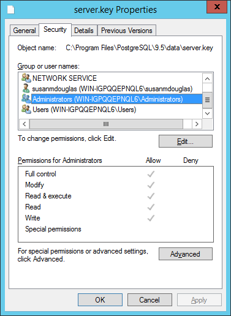
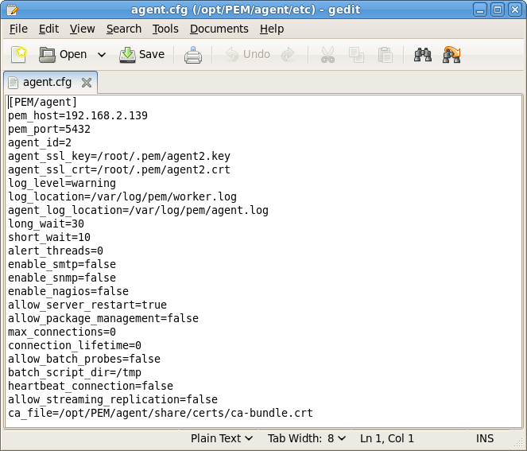
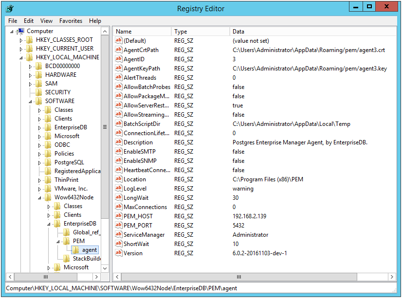
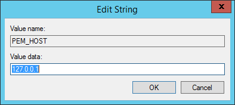
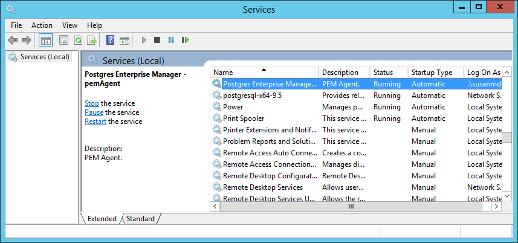

The steps in this section describe how to move a PEM server from one host machine to a new host machine. The PEM server on the new host (the target) must be installed with the same version of the PEM server installer as the original host (the source). Please note that if you do not use the same installer version, you may encounter a schema-mismatch error.

The backend database of the target server (either PostgreSQL or Advanced Server) may be of the same type and version, or a different type and version than the backend database of the source PEM server. A PEM server that resides on a PostgreSQL host can be migrated to an Advanced Server host, or vice versa.

Before starting the server migration, you should ensure that the firewalls between the source host, the target host, and the host of any PEM Agent will allow connections between the services.

1.  Prepare the Target Host

    Invoke the installer for the PEM server on the target host. Please note that you must use the same version of the PEM server installer that you used when installing the source PEM server.

    The backend database of the target server may be a different version or type than the backend database of the source. If the new PEM server does *not* reside on the same type of backend database as the original server, you must ensure that the same version of the `sslutils` extension is installed on the new server host. The version of `sslutils` that is distributed with the PEM installers is freely available for download from the EDB website at:

    <https://www.enterprisedb.com/downloads/modified-gpl-source-code>

    For information about installing the PEM server or the `sslutils` extension, please refer to the `PEM Installation Guides`, available at:

    [https://www.enterprisedb.com/docs/p/edb-postgres-enterprise-manager](/pem/latest/)

2.  Drop Existing Schemas from the New PEM Server

    The migration process re-creates the `pem`, `pemdata`, and `pemhistory` schemas from the source PEM server on the target PEM server. In preparation for the move, use the `psql` client to delete these schemas from the `pem` database on the target host. You can open the `psql` client at the command line, or by selecting `SQL Shell (psql)` from the `Postgres Enterprise Manager` menu.

    When the `psql` client opens, connect to the `pem` backend database as the database superuser. After connecting to the `pem` database on the target host, use the following commands to drop the schemas:

    ```text
    DROP SCHEMA pem CASCADE;

    DROP SCHEMA pemdata CASCADE;

    DROP SCHEMA pemhistory CASCADE;
    ```

    When dropping the schemas, you must include the `CASCADE` keyword, instructing the server to delete all dependent objects. When executing the command, the `psql` client displays a list of the dependent objects; the client confirms each the schema is removed by displaying `DROP SCHEMA`.

3.  Prepare the PEM Agents on the New PEM Server

    Before moving the PEM server, you must identify the number of Agents that are monitored by the source PEM server, and create identities for that number of Agents (less one) on the target server. To discover the total number of `PEM` Agents monitored by the PEM server, connect to the pem database on the source host with the `psql` client, and query the `pem.agent` table.

    ```text
    SELECT id FROM pem.agent WHERE active = true;
    ```

    You must manually create the number of Agents that reside on the original PEM server, less one; the PEM server installer has already created one Agent on the target host. For example, if the source server contains three Agents, you must manually create two additional Agents. Open a `psql` session with the `pem` database on the target server, and create the required Agents. Use the command:

    ```text
    CREATE USER agent<X>;
    ```

    Where `<X>` specifies an Agent number. Remember, `agent1` is created on the target host by the PEM Server installer.

    Then, use the `GRANT` command to assign each Agent that resides on the target PEM Server `pem_agent` permissions:

    ```text
    GRANT pem_agent TO agent<X>;
    ```

    Where `<X>` specifies an agent number.

4.  Generate a Backup Script of the Source PEM Server

    You can use the `pg_dump` utility to generate a script that contains the commands required to recreate the `pem` database on the target host. By default, `pg_dump` is installed in the `bin` directory under your Postgres installation. To invoke `pg_dump`, open a command line, navigate to the `bin` directory, and enter:

    ```text
    pg_dump -U <user_name> <db_name> > <file_name>
    ```

    Where:

    -   `<user_name>` specifies the name of the database superuser for the PEM backend database.
    -   `<db_name>` specifies the name of the PEM backend database.
    -   `<file_name>` specifies the name of the script generated by pg_dump.

        When prompted, provide the password associated with the user specified.

        The command shown instructs `pg_dump` to generate a script that (when executed) will re-create the `pem` database. The script will be named `backup.sql`, and will be created in the `tmp` directory. `pg_dump` is connecting to the server using the credentials of the user, `postgres`.

        Note that invoking the `pg_dump` utility will not interrupt current database users.

    !!! Note
        If the source PEM Server is lower than the 7.16 version, then you need to replace the following functions before you run `pg_dump` to take backup:

        -   The `abstime`, `reltime`, and `tinterval` datatypes are deprecated from Postgres version 12 or later, hence to replace those dataypes  with `timestamptz` data type use below command:

        ```text
        DO
        $$
        DECLARE
            rec record;
            cnt integer;
        BEGIN
            -- Check for the deprecated type in our user info probe
            SELECT count(*) INTO cnt
            FROM pem.probe_column
            WHERE sql_data_type = ‘abstime’ AND internal_name = ‘valuntil’;
              IF cnt = 0 THEN
                RETURN;
              END IF;
            ALTER TABLE pemdata.user_info
              ALTER COLUMN valuntil SET DATA TYPE timestamptz;
            ALTER TABLE pemhistory.user_info
              ALTER COLUMN valuntil SET DATA TYPE timestamptz;
            -- Now update the pem.probe_column itself
            UPDATE pem.probe_column
            SET sql_data_type = ‘timestamptz’
            WHERE sql_data_type = ‘abstime’ AND internal_name = ‘valuntil’;
        END;
        $$ LANGUAGE ‘plpgsql’;
        ```

        -   Replace the below function to avoid any alert errors:

        ```text
        CREATE OR REPLACE FUNCTION pem.check_alert_params_array_size(
        template_id pem.alert_template.id%type, params text[]
        )
        RETURNS bool AS $FUNC$
        DECLARE
          res bool := TRUE;
        BEGIN
          /*
           * During restoring the pem database, it does not maintain the order while
           * inserting data in the table, and uses the sort table based on the
           * names.
           * Hence - we need to check the foreign key constraint is present before
           * validating these values.
           */
         IF EXISTS(
          SELECT 1 FROM information_schema.table_constraints
          WHERE constraint_name='alert_template_id_fkey' AND
          table_name='alert' AND table_schema='pem'
         ) THEN
          /*
           * Need to use the IS TRUE construct outside the main query, because
           * otherwise if there's no template by that ID then the query would return
           * 0 rows and the result of the function would be undefined and CHECK
           * constraint would succeed.
           * Probably this is being over-cautious, because pem.alert.template_id
           * references pem.alert_template.id. But the SQL standard (probably) does
           * not define the order in which the CHECK or the FOREIGN KEY constraints
           * should be validated; in case CHECK is validated first, we want it to
           * fail.
           */
        EXECUTE $SQL$
            SELECT (
                SELECT pem.check_array_size_equal(t.param_names, $2)
                FROM pem.alert_template AS t
                WHERE id = $1
            ) IS TRUE
          $SQL$ INTO res USING template_id, params;
        END IF;
         RETURN res;
        END
        $FUNC$ LANGUAGE 'plpgsql';
        ```


5.  Move the Backup to the Target Host

    Move the script generated by the `pg_dump` utility to the target host of the PEM server.

6.  Restore the Backup on the Target Host

    Open a command line on the target host and navigate into the `bin` directory (under the Postgres backend database installation directory). Start `psql`, executing the script generated by the `pg_dump` utility:

    ```text
    psql -U <user_name> -d pem -f <file_name>
    ```

    Where:

    -   `<user_name>` specifies the name of the database superuser. The user specified must have connection privileges for the backend database.
    -   `<file_name>` specifies the complete path to the backup script generated by pg_dump.

    When prompted, provide the password associated with the database superuser.

    The example shown uses the `psql` client to invoke a script named `backup.sql` to recreate the `pem` database. The script is invoked using the privileges associated with the database superuser, `postgres`.

7.  Stop the Database Server on the Target Host

    To stop the PEM Server on CentOS or RHEL 7.x or 8.x, use the command:

    ```text
    systemctl stop <service_name>
    ```

    Where, `<service_name>` specifies the name of the backend database server. For a PostgreSQL backend database, the service name is `postgresql-<x>`, and for an Advanced Server backend database, the service name is `edb-as-<X>`, where `<X>` specifies the version number.

    If you are using Windows, you can use the `Services` dialog to control the service. To open the `Services` dialog, navigate through the `Control Panel` to the `System and Security` menu. Select `Administrative Tools`, and then double-click the `Services` icon. When the `Services` dialog opens, highlight the service name in the list, and use the option provided on the dialog to Stop the service.

8.  Copy the Certificate Files to the Target Host

    You must replace the certificate files that are created when the target host is installed with the certificate files of the source host. Copy the following files from the source PEM server to the target PEM server:

    -   `ca_certificate.crt`
    -   `ca_key.key`
    -   `root.crt`
    -   `root.crl`
    -   `server.key`
    -   `server.crt`

    Copy the files to the `data` directory under the Postgres installation that provides the backend database for the target cluster.

    On Linux, the files reside in:

    ```text
    /var/lib/pgsql/<X>/data/
    ```

    On Windows, the files reside in:

    ```text
    C:\Program Files\PostgreSQL\<X>\data
    ```

    Where:

    `<X>` specifies the version of PostgresSQL on your system.

    The files will already exist on the target cluster; delete the existing files before performing the copy, or overwrite the existing files with the files from the source server. Once in place on the target server, the files should have the (platform-specific) permissions described in the sections that follow.

    **Permissions and Ownership on Linux**

    | **File Name**      | **Owner** | **Permissions** |
    | ------------------ | --------- | --------------- |
    | ca_certificate.crt | postgres  | -rw-------      |
    | ca_key.key         | postgres  | -rw-------      |
    | root.crt           | postgres  | -rw-------      |
    | root.crl           | postgres  | -rw-------      |
    | server.key         | postgres  | -rw-------      |
    | server.crt         | postgres  | -rw-r--r--      |

    On Linux, the certificate files must be owned by postgres. You can use the following command at the command line to modify the ownership of the files:

    ```text
    chown postgres <file_name>
    ```

    Where `file_name` specifies the name of the certificate file.

    The server.crt file may only be modified by the owner of the file, but may be read by any user. You can use the following command to set the file permissions for the server.crt file:

    ```text
    chmod 644 server.crt
    ```

    The other certificate files may only be modified or read by the owner of the file. You can use the following command to set the file permissions:

    ```text
    chmod 600 <file_name>
    ```

    Where `file_name` specifies the name of the file.

    Permissions and Ownership on Windows

    On Windows, the certificate files moved from the source host must be owned by the service account that performed the PEM server and backend database installation on the target host. If you invoked the PEM server and Postgres installer using the `Run as Administrator` option (selected from the context menu of the installer), the owner of the certificate files will be `Administrators`.

    To review and modify file permissions on Windows, right-click on the file name, and select `Properties`.

    
    ** The Permissions tab **

    Navigate to the `Security` tab and highlight a `Group or user name` to view the assigned permissions. Select `Edit` or `Advanced` to access dialogs that allow you to modify the permissions associated with the selected user.


9.  Move the PEM Agent Certificate Files to the PEM Server Host

    You must move the certificate files used by the PEM Agent of the source PEM server to the target host. This step is platform-specific.

    **On Linux**

    Copy the `agent1.key` and `agent1.crt` files from the source host to the target host. By default, on Linux, the files are installed in `/root/.pem`; copy the files to the same directory on the target host.

    File ownership and permissions of the files must be set to:

    | **File Name** | **Owner** | **Permissions** |
    | ------------- | --------- | --------------- |
    | agent1.key    | root      | -rw-------      |
    | agent1.crt    | root      | -rw-r--r--      |

    If necessary, navigate to `/root/.pem`, and use the following commands to modify the permissions and ownership of the `agent1.key` file:

    ```text
    chmod 600 agent1.key

    chown root agent1.key
    ```

    Use the following commands to modify the permissions and ownership of the `agent1.crt` file:

    ```text
    chmod 644 agent1.crt

    chown root agent1.crt
    ```

    **On Windows**

    Copy the `agent1.key` and `agent1.crt` files from the source host to the target host. On Windows, the files are located in:

    ```text
    C:\Users\<user_name>\AppData\Roaming\pem
    ```

    Where `user_name` is the name of the user that invoked the PEM installer.

    The ownership and permissions associated with the certificate files on the target machine should match the ownership and permissions of the certificate files on the source machine. If you invoked the PEM server and Postgres installer using the `Run as Administrator` option (selected from the context menu of the installer), the owner of the Agent certificate files will be `Administrators`.

    To review and modify file permissions on Windows, right-click on the file name, and select `Properties`. Navigate to the `Security` tab and highlight a `Group or user name` to view the assigned permissions. Select `Edit` or `Advanced` to access dialogs that allow you to modify the permissions associated with the selected user.

10. Update the `pg_hba.conf` Files on the Target Host

    Modify the `pg_hba.conf` file on the target host to allow connections from each PEM Agent. By default, the `pg_hba.conf` file is located in the data directory under your Postgres installation.

11. Start the Server on the Target Host

    After modifying the `pg_hba.conf` file, you must restart the server for the changes to take effect.

    To restart the database server on Linux, use the command:

    ```text
    /etc/init.d/<service_name> start
    ```

    Where `service_name` is the name of the backend database server.

    If you are using Windows, you can use the `Services` dialog to control the service. To open the `Services` dialog, navigate through the `Control Panel` to the `System and Security` menu. Select `Administrative Tools`, and then double-click the `Services` icon. When the `Services` dialog opens, highlight the service name in the list, and use the option provided on the dialog to Start the service.

12. Connecting Monitored Agents to the New PEM Server Host

    To instruct existing PEM Agents to connect to the new PEM server host, you must:

    -   Ensure that the PEM Agent host can connect to the new PEM server host.
    -   Modify the registry (on each Windows host with a PEM Agent) or the Agent configuration files (on each Linux host with a PEM Agent), specifying the IP address and port of the new PEM server.
    -   Restart the PEM Agent's service. These steps are platform-specific:
        -   [On Linux](#if_the_pem_agent_resides_on_linux)
        -   [On Windows](#if_the_pem_agent_resides_on_windows)

    **If the PEM Agent Resides on Linux**

    Use your choice of editor to modify the `agent.cfg` file, specifying the new IP address and port number of the PEM server in the `pem_host` and `pem_port` parameters.

    By default, the `agent.cfg` file is located in:

    `/usr/edb/pem/agent/etc/agent.cfg`

    

    After modifying the `agent.cfg` file, you must restart the PEM Agent service; you can use the `pemagent` service script on the Linux command line to restart the service:

    ```text
    /etc/init.d/pemagent restart
    ```

    **If the PEM Agent Resides on Windows**

    Before modifying the Windows registry on the monitored node, confirm that the firewall on the host of the PEM Agent will allow connections to the PEM server. After confirming that the PEM Agent host can connect to the PEM server host, you can use the Windows `Registry Editor` to review and edit the `PEM_HOST` and `PEM_PORT` entries to ensure that they correctly identify the host and port used by the PEM server. To open the `Registry Editor`, enter `regedit` in the Windows `Run` dialog or in the Windows start menu search box. Navigate through the registry tree control to view or modify registry entries.

    On 64-bit Windows, the PEM Agent registry entries are located:

    `HKEY_LOCAL_MACHINE SOFTWARE wow6432Mode EnterpriseDB PEM Agent`

    On 32-bit Windows, the PEM Agent registry entries are located:

    `HKEY_LOCAL_MACHINE SOFTWARE EnterpriseDB PEM Agent`

    

    The `PEM_HOST` and `PEM_PORT` entries must specify the address and port number of the new PEM server on the target host. To modify a registry entry, right click on the entry `Name`, and select `Modify` from the context menu to open the `Edit String` dialog.

    

    Use the `Edit String` dialog to make any changes to the value of the entry. When you're finished, click `OK` to save your changes, or `Cancel` to exit without saving.

    After modifying the registry, you must restart the PEM Agent's service; you can use the `Services` dialog (accessed through the Windows `Control Panel`) to restart the `Postgres Enterprise Manager - pemagent` service .

    
    ** Restarting the PEM Agent service **

    After moving the server, change the connection properties in any installed PEM clients to connect to the new host of the PEM server, Agents, and monitored servers.
