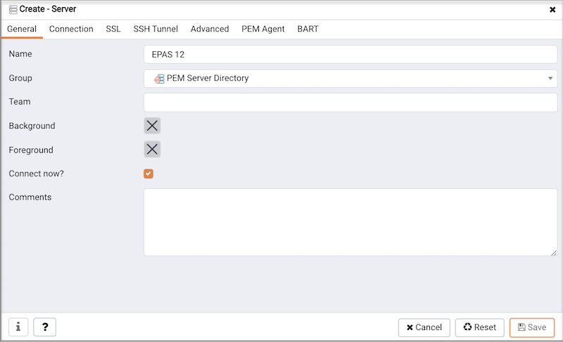
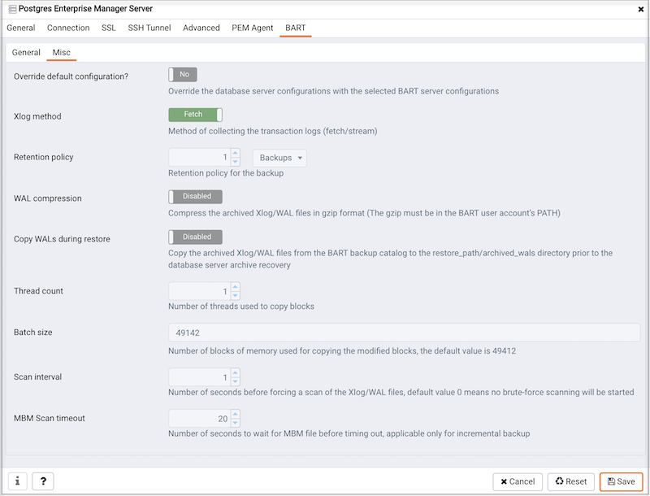
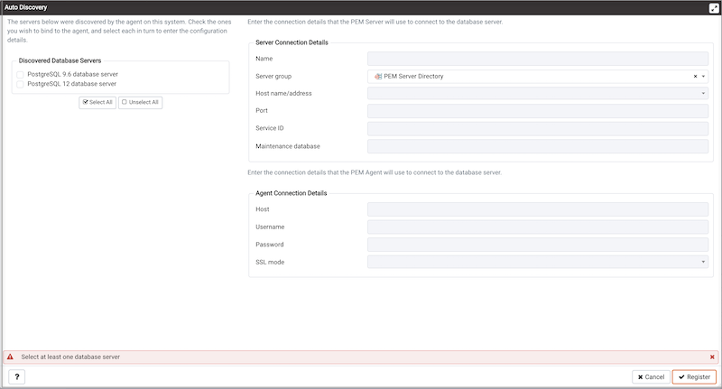

Before you can manage or monitor a server with PEM, you must register the server with PEM and bind an agent. You can bind a server to a remote agent (an agent that resides on a different host). However, if the agent doesn't reside on the same host, it doesn't have access to all of the statistical information about the instance.

## Manually registering a database server

To manage or monitor a database server with PEM, you must:

-   Register your EDB Postgres Advanced Server or PostgreSQL server with the PEM server.
-   Bind the database server to a PEM agent.

You can use the Create Server dialog box to provide registration information for a server, bind a PEM agent, and display the server in the PEM client tree. To open the Create Server dialog box, select **Object > Create > Server**.

!!! Note
    You must ensure the `pg_hba.conf` file of the Postgres server that you're registering allows connections from the host of the PEM client before attempting to connect.

Use the **General** tab to describe the general properties of the server:

-   Use the **Name** field to specify a name for the server. The name identifies the server in the PEM browser tree.
-   You can use groups to organize your servers and agents in the tree. Using groups can help you manage large numbers of servers more easily. For example, you can have a production group, a test group, or LAN-specific groups. Use the **Group** list to select the server group in which to display the new server.
-   Use the **Team** field to specify a Postgres role name. Only PEM users who are members of this role, who created the server initially, or have superuser privileges on the PEM server see this server when they log in to PEM. If you leave this field blank, all PEM users see the server.
-   Use the **Background** color selector to select the color to display in the PEM tree behind database objects that are stored on the server.
-   Use the **Foreground** color selector to select the font color of labels in the PEM tree for objects stored on the server.
-   Select **Connect now?** to attempt a server connection when you select **Save**. Clear **Connect now?** if you don't want the PEM client to validate the specified connection parameters until a later connection attempt.
-   Provide notes about the server in the **Comments** field.

Use the **Connection tab** to specify connection details for the server:

-   Specify the IP address of the server host or the fully qualified domain name in the **Host name/address** field. On Unix-based systems, leave the address field blank to use the default PostgreSQL Unix Domain Socket on the local machine. Or you can set an alternative path containing a PostgreSQL socket. If you enter a path, the path must begin with a forward slash (/).
-   Specify the port number of the host in the **Port** field.
-   Use the **Maintenance database** field to specify the name of the initial database for PEM to connect to that's expected to contain pgAgent schema and adminpack objects installed (both optional). On PostgreSQL version 8.1 and later, the maintenance DB is normally called `postgres`. On earlier versions `template1` is often used, although it's better to create a `postgres` database to avoid cluttering the template database.
-   Set **Kerberos Authentication** to **Yes** to use the Kerberos authentication for a monitored server. By default, the monitored server uses the same authentication method as the PEM server. If the monitored server doesn't want to use Kerberos authentication, then set `ALLOW_DATABASE_CONNECTION_WITHOUT_KERBEROS` to `TRUE` in the `config_local.py` file.
-   Specify the name to use when authenticating with the server in the **Username** field.
-   Provide the password associated with the specified user in the **Password** field.
-   Select **Save password?** to store passwords in encrypted format in a PEM backend database for later reuse. Each password is stored on a per-user, per-server basis and isn't shared with other team members. PEM uses the saved password to connect the database server next time. To remove a saved password, disconnect the database server first, and then select **Object > Clear Saved Password**.
-   Use the **Role** field to specify the name of the role that's assigned the privileges for the client to use after connecting to the server. This value allows you to connect as one role and then assume the permissions of another role (the one you specified in this field) when the connection is established. The connecting role must be a member of the role specified.

Use the **SSL** tab to configure SSL:

-   In the **SSL mode** field, select the type of SSL connection for the server to use. For more information about using SSL encryption, see [the PostgreSQL documentation](https://www.postgresql.org/docs/current/static/libpq-ssl.html).

You can use the platform-specific file manager dialog box to upload files that support SSL encryption to the server. To open the file manager, select the icon located to the right of each of the following fields:

-   Use the **Client certificate** field to specify the file containing the client SSL certificate. This file replaces the default `~/.postgresql/postgresql.crt` file if PEM is installed in Desktop mode and `<STORAGE_DIR>/<USERNAME>/.postgresql/postgresql.crt` if PEM is installed in Web mode. This parameter is ignored if an SSL connection isn't made.
-   Use the **Client certificate key** field to specify the file containing the secret key used for the client certificate. This file replaces the default `~/.postgresql/postgresql.key` if PEM is installed in Desktop mode and `<STORAGE_DIR>/<USERNAME>/.postgresql/postgresql.key` if PEM is installed in Web mode. This parameter is ignored if an SSL connection isn't made.
-   Use the **Root certificate** field to specify the file containing the SSL certificate authority. This file replaces the default `~/.postgresql/root.crt` file. This parameter is ignored if an SSL connection isn't made.
-   Use the **Certificate revocation list** field to specify the file containing the SSL certificate revocation list. This list replaces the default list, found in `~/.postgresql/root.crl`. This parameter is ignored if an SSL connection isn't made.
-   When **SSL compression?** is set to **True**, data sent over SSL connections is compressed. The default value is **False** (compression is disabled). This parameter is ignored if an SSL connection isn't made.

!!! Warning 
    Certificates, private keys, and the revocation list are stored in the per-user file storage area on the server, which is owned by the user account under which the PEM server process is run. This means that administrators of the server might be able to access those files. Use caution before using this feature.

Use the **SSH Tunnel** tab to configure SSH tunneling. You can use a tunnel to connect a database server through an intermediary proxy host to a server that resides on a network to which the client might not be able to connect directly.

-   Set **Use SSH tunneling** to **Yes** to use an SSH tunnel when connecting to the specified server.
-   Specify the name or IP address of the SSH host (through which client connections are forwarded) in the **Tunnel host** field.
-   Specify the port of the SSH host through which client connections are forwarded in the **Tunnel port** field.
-   Specify the name of a user with login privileges for the SSH host in the **Username** field.
-   Specify the type of authentication to use when connecting to the SSH host in the **Authentication** field.
-   Select **Password** to use a password for authentication to the SSH host. This is the default.
-   Select **Identity file** to use a private key file when connecting.
-   If the SSH host is expecting a private key file for authentication, use the **Identity file** field to specify the location of the key file.
-   If the SSH host is expecting a password, use the **Password** field to specify the password. If an identity file is being used, specify the passphrase.

Use the **Advanced** tab to specify details that are used to manage the server:

-   Specify the IP address of the server host in the **Host Address** field.

-   Use the **DB restriction** field to specify a SQL restriction to use against the [pg_database](http://www.postgresql.org/docs/current/interactive/catalog-pg-database.html) table to limit the databases displayed in the tree. For example, you might enter: `'live_db'`, `'test_db'` to display only the `live_db` and `test_db` databases. You can also limit the schemas shown in the database from the database Properties dialog box by entering a restriction against [pg_namespace](http://www.postgresql.org/docs/current/interactive/catalog-pg-namespace.html).

-   Use the **Password file** field to specify the location of a password file (`.pgpass`). The `.pgpass` file allows a user to log in without providing a password when they connect. The file must be present on the PEM server. For more information, see the [Postgres documentation](http://www.postgresql.org/docs/current/static/libpq-pgpass.html).

-   Use the **Service ID** field to specify parameters to the database service process. For servers that are stored in the Enterprise Manager directory, enter the service ID. On Windows machines, this is the identifier for the Windows service. On Linux machines, the name of the init script used to start the server is `/etc/init.d` and the name of the systemd script to start the server is `systemctl`. For example, the name of the EDB Postgres Advanced Server 11 service is `edb-as-11`. For local servers, the setting is operating system dependent:

    -   If the PEM client is running on a Windows machine, it can control the postmaster service if you have enough access rights. Enter the name of the service. In case of a remote server, prepend it with the machine name (such as `PSE1\pgsql-8.0`). PEM automatically discovers services running on your local machine.
    -   If the PEM client is running on a Linux machine, it can control processes running on the local machine if you have enough access rights. Provide a full path and needed options to access the `pg_ctl` program. When executing service control functions, PEM appends status/start/stop keywords to this. For example:

        `sudo /usr/pgsql-x/bin/pg_ctl -D /var/lib/pgsql/x/data` 

        where `x` is the version of the PostgreSQL database server.

-   If the server is a member of a Failover Manager cluster, you can use PEM to monitor the health of the cluster and to replace the primary node if necessary. To enable PEM to monitor Failover Manager, use the **EFM cluster name** field to specify the cluster name. The cluster name is the prefix of the name of the Failover Manager cluster properties file. For example, if the cluster properties file is named `efm.properties`, the cluster name is efm.

-   If you're using PEM to monitor the status of a Failover Manager cluster, use the **EFM installation path** field to specify the location of the Failover Manager binary file. By default, the Failover Manager binary file is installed in `/usr/edb/efm-x.x/bin`, where `x.x` specifies the Failover Manager version.

Use the **PEM Agent** tab to specify connection details for the PEM agent.

On the **Connection Parameters** tab:

-   Set **Remote monitoring?** to **Yes** to indicate that the PEM agent doesn't reside on the same host as the monitored server. When remote monitoring is enabled, agent level statistics for the monitored server aren't available for custom charts and dashboards, and the remote server can't be accessed by some PEM utilities (such as Audit Manager, Capacity Manager, Log Manager, Postgres Expert, and Tuning Wizard).

-   Use the **Bound agent** list to select a PEM agent. One agent can monitor multiple Postgres servers.  

-   In the **Host** field, enter the IP address or socket path for the agent to use when connecting to the database server. By default, the agent uses the host address shown on the **General** tab. On a Unix server, you might want to specify a socket path, such as `/tmp`.

-   Enter the port number for the agent to use when connecting to the server. By default, the agent uses the port defined on the **Properties** tab.

-   Use the **SSL** field to specify an SSL operational mode. Specify **require**, **prefer**, **allow**, **disable**, **verify-ca**, or **verify-full**. 

| Mode        | Description                                                                                                                               |
| ----------- | ----------------------------------------------------------------------------------------------------------------------------------------- |
| require     | Require SSL encryption for transactions between the server and the agent.                                                              |
| prefer      | Use SSL encryption between the server and the agent if SSL encryption is available.                                                    |
| allow       | Allow the connection to use SSL if required by the server.                                                                             |
| disable     | Disable SSL encryption between the agent and the server.                                                                               |
| verify-ca   | Require SSL encryption and require the server to authenticate using a certificate registered by a certificate authority.           |
| verify-full | Require SSL encryption and require the server to authenticate using a certificate registered by a trusted certificate authority. |

For more information about using SSL encryption, see the [PostgreSQL documentation](https://www.postgresql.org/docs/12.1/libpq-ssl.html).

-   Use the **Database** field to specify the name of the Postgres database to which the agent initially connects. If you're registering a BDR node then specify the BDR-enabled database name in this field.

-   In the **User name** field, specify the name of the role for the agent to use when connecting to the server. The specified role must be a database superuser for all of the features to work as expected. For the list of features that don't work if the specified role isn't a database superuser, see [Agent privileges](managing_pem_agent/#agent-privileges). If you're using the Kerberos authentication method, then specify the user having bdr_monitor or bdr_superuser role in this field.

    If you're using Postgres version 10 or later, you can use the pg_monitor role to grant the required privileges to a non-superuser. For information about the pg_monitor role, see [Default Roles](https://www.postgresql.org/docs/current/default-roles.html).

-   In the **User name** field, specify the name of the user for the agent to use when connecting to the server. The specified role must be a database superuser for all of the features to work as expected. If you're using Postgres version 10 or later, you can use the pg_monitor role to grant the required privileges to a nonsuperuser. For information about the pg_monitor role, see [Default Roles](https://www.postgresql.org/docs/current/default-roles.html).

-   Specify the password for the agent to use when connecting to the server in the **Password** field and **Confirm password** fields. If you don't specify a password, you must configure the authentication for the agent manually. For example, you can use a `.pgpass` file, which must be present and accessible on the system where agent is installed.

On the **Advanced** tab:

-   Set **Allow takeover?** to **Yes** to specify that another agent can take over the server. This feature allows an agent to take responsibility for the monitoring of the database server if, for example, the server moved to another host as part of a high-availability failover process.

-   Use the plus sign (**+**) to add the database you want to exclude from the PEM monitoring. You can't exclude the database mentioned on the **Connection Parameters** tab of the **PEM Agent** tab.

!!! Note
    The database-level probes don't execute for excluded databases, but the server-level probes can collect the database statistics.

Use the **General** tab under the **BART** tab to describe the general properties of the BART server that map to the PEM server:

-   Use the **BART server** field to select the BART server name. All the BART servers configured in the PEM console are listed.
-   Use the **Server name** field to specify a name for the database server that you want to back up using the BART server. This name gets stored in the BART configuration file.
-   Use the **Backup name** field to specify a template for user-defined names to assign to the backups of the database server. If you don't specify a backup name template, then you can reference the backup in BART sub-commands only by using the BART-assigned integer backup identifier.
-   Use the **Host address** field to specify the IP address of the database server that you want to configure for backup.
-   Use the **Port** field to specify the port to use for the database that you want to back up.
-   Use the **User** field to specify the user of the database that you want to back up using BART through the PEM console. If you want to enable incremental backups for this database server, then the user must be a superuser.
-   Use the **Password** field to specify the password for the user of the database that you want to back up.
-   Use the **Cluster Owner** field to specify the Linux operating system user account that owns the database cluster. This is typically enterprisedb for EDB Postgres Advanced Server database clusters installed in the Oracle databases compatible mode. It is typically postgres for PostgreSQL database clusters and for EDB Postgres Advanced Server database clusters installed in the PostgreSQL databases compatible mode.
-   Use the **Archive command** field to specify the desired format of the archive command string to use in the `bart.cfg` file. Inputs provided for the Archive command overwrite the database server's `Postgresql.conf` file. After the server gets added, the database server restarts or database configurations are reloaded.
-   Use **Allow incremental backup?** to specify whether to enable incremental backup for this database server.
-   Use **Setup passwordless SSH?** to specify if you want to create SSH certificates to allow passwordless logins between the database server and the BART server. Be sure to bind a PEM agent before setting up the passwordless SSH authentication. Passwordless SSH doesn't work for a database server being remotely monitored by a PEM agent.

Use the **Misc** tab under the **BART** tab to describe the miscellaneous properties of the BART Server:

-   Use **Override default configuration?** to override the BART server configurations with the specific database server configurations.
-   Use the **Xlog** method to specify how to collect the transaction log while pg_basebackup is executing.
-   Use the **Retention policy** field to specify the retention policy for the backup. This determines when to mark an active backup as obsolete and hence a candidate for deletion. You can specify the retention policy in terms of number of backups or duration (days, weeks, or months).
-   Use **WAL compression** to specify if you want to compress the archived Xlog/WAL files in gzip format. To enable WAL compression, the gzip compression program must be present in the BART user account’s PATH. Don't enable the **WAL compression** setting for database servers for which you need to take incremental backups.
-   Use the **Copy WALs during restore** field to specify how the archived WAL files are collected when invoking the RESTORE operation. Set to **Enabled** to copy the archived WAL files from the BART backup catalog to the `<restore_path>/archived_wals` directory prior to the database server archive recovery. Set to **Disabled** to retrieve the archived WAL files directly from the BART backup catalog during the database server archive recovery.
-   Use the **Thread count** field to specify the number of threads to copy the blocks. You must set **Thread count** to **1** if you want to take a backup using the pg_basebackup utility.
-   Use the **Batch size** field to specify the number of blocks of memory used for copying modified blocks. This option applies only to incremental backups.
-   Use the **Scan interval** field to specify the number of seconds for the WAL scanner to wait befor scanning the new WAL files.
-   Use the **MBM scan timeout** field to specify the number of seconds to wait for MBM files before timing out. This option applies only to incremental backups.

To view the properties of a server, right-click the server name in the PEM client tree, and select **Properties** from the context menu. To modify a server's properties, disconnect from the server before opening the Properties dialog box.

## Automatic server discovery

If the server you want to monitor resides on the same host as the monitoring agent, you can use the Auto Discovery dialog box to simplify the registration and binding process.

To enable auto discovery for a specific agent, you must enable the Server Auto Discovery probe. To do so, select the PEM agent in the PEM client tree, and select **Management > Manage Probes**. When the **Manage Probes** tab opens, confirm that the slider in the **Enabled?** column is set to **Yes**.

To open the Auto Discovery dialog box, select a PEM agent in the PEM client tree and select **Management > Auto Discovery**.

When the Auto Discovery dialog box opens, the **Discovered Database Servers** box displays a list of servers that currently aren't being monitored by a PEM agent. Select the box next to a server name to display information about the server in the **Server Connection Details** box and connection properties for the agent in the **Agent Connection Details** box.

Use **Check All** to select the box next to all of the displayed servers or **Uncheck All** to clear all of the boxes to the left of the server names.

The fields in the **Server Connection Details** box provide information about the server that PEM monitors:

-   Accept or modify the name of the monitored server in the **Name** field. The specified name is displayed in the tree of the PEM client.
-   Use the **Server group** list to select the server group under which the server is displayed in the PEM client tree.
-   Use the **Host name/address** field to specify the IP address of the monitored server.
-   The **Port** field displays the port that's monitored by the server. You can't modify this field.
-   Provide the name of the service in the **Service ID** field. You must provide the service name to enable some PEM functionality.
-   By default, the **Maintenance database** field indicates that the selected server uses a Postgres maintenance database. Customize the content of the **Maintenance database** field for your installation.

The fields in the **Agent Connection Details** box specify the properties for the PEM agent to use when connecting to the server:

-   The **Host** field displays the IP address used for the PEM agent binding.
-   The **User name** field displays the name used by the PEM agent when connecting to the selected server.
-   The **Password** field displays the password associated with the specified user name.
-   Use the **SSL mode** field to specify your SSL connection preferences.

After you finish specifying the connection properties for the servers that you're binding for monitoring, select  **OK** to register the servers.

After selecting **OK**, the newly registered server is displayed in the PEM tree and is monitored by the PEM server.

## Using the pemworker utility to register a server

You can use the pemworker utility to register a server for monitoring by the PEM server or to unregister a database server. During registration, the pemworker utility binds the new server to the agent that resides on the system from which you invoked the registration command. To register a server:

On a Linux host, use the command:

 `pemworker --register-server`

On a Windows host, use the command:

 `pemworker.exe REGISTER-SERVICE`

Append command line options to the command string when invoking the pemworker utility. Follow each option with a corresponding value.

| Option                  | Description                                                                                                                                                                                                                                                                                                                                                                                                                                                                    |
| ----------------------- | ------------------------------------------------------------------------------------------------------------------------------------------------------------------------------------------------------------------------------------------------------------------------------------------------------------------------------------------------------------------------------------------------------------------------------------------------------------------------------ |
| `--pem-user`            | Specifies the name of the PEM administrative user. Required.                                                                                                                                                                                                                                                                                                                                                                                                                   |
| `--server-addr`         | Specifies the IP address of the server host or the fully qualified domain name. On Unix-based systems, you can leave the address field blank to use the default PostgreSQL Unix Domain Socket on the local machine. Or you can set it to an alternate path containing a PostgreSQL socket. If you enter a path, the path must begin with a forward slash (/). Required.                                                                                                                             |
| `--server-port`         | Specifies the port number of the host. Required.                                                                                                                                                                                                                                                                                                                                                                                                                               |
| `--server-database`     | Specifies the name of the database to which the server connects. Required.                                                                                                                                                                                                                                                                                                                                                                                                 |
| `--server-user`         | Specifies the name of the user used by the agent when monitoring the server. Required.                                                                                                                                                                                                                                                                                                                                                                              |
| `--server-service-name` | Specifies the name of the database service that controls operations on the server that's being registered (STOP, START, RESTART, and so on).Optional.                                                                                                                                                                                                                                                                                                                             |
| `--remote-monitoring`   | Include the `--remote-monitoring` clause and a value of `no` (the default) to indicate that the server is installed on the same machine as the PEM agent. When remote monitoring is enabled (`yes`), agent level statistics for the monitored server aren't available for custom charts and dashboards, and the remote server isn't accessible by some PEM utilities (such as Audit Manager, Capacity Manager, Log Manager, Postgres Expert, and Tuning Wizard). Required. |
| `--efm-cluster-name`    | Specifies the name of the Failover Manager cluster that monitors the server (if applicable). Optional.                                                                                                                                                                                                                                                                                                                                                                         |
| `--efm-install-path`    | Specifies the complete path to the installation directory of Failover Manage, if applicable. Optional.                                                                                                                                                                                                                                                                                                                                                                       |
| `--asb-host-name`       | Specifies the name of the host to which the agent is connecting.                                                                                                                                                                                                                                                                                                                                                                                                               |
| `--asb-host-port`       | Specifies the port number for the agent to use when connecting to the database.                                                                                                                                                                                                                                                                                                                                                                                             |
| `--asb-host-db`         | Specifies the name of the database to which the agent connects.                                                                                                                                                                                                                                                                                                                                                                                                            |
| `--asb-host-user`       | Specifies the database user name that the agent supplies when authenticating with the database.                                                                                                                                                                                                                                                                                                                                                                             |
| `--asb-ssl-mode`        | Specifies the type of SSL authentication to use for connections. Supported values include: **prefer**, **require**, **disable**, **verify-CA**, **verify-full**.                                                                                                                                                                                                                                                                                                                        |
| `--group`               | Specifies the name of the group in which the server is displayed.                                                                                                                                                                                                                                                                                                                                                                                                         |
| `--team`                | Specifies the name of the group role that's allowed to access the server.                                                                                                                                                                                                                                                                                                                                                                                                |
| `--owner`               | Specifies the name of the role that owns the monitored server.                                                                                                                                                                                                                                                                                                                                                                                                             |
| `--display-name <name>` | Specifies the display name of the monitored database server. The default is the system hostname.                                                                                                                                                                                                                                                                                                                                                                                   |
| `--config-dir`          | Specifies the directory path of the agent configuration file. The default is `"<pemworker path>/../etc"`.                                                                                                                                                                                                                                                                                                                                                                   |

Set the environment variable `PEM_SERVER_PASSWORD` to provide the password for the PEM server to allow the pemworker to connect as a PEM admin user.

Set the environment variable `PEM_MONITORED_SERVER_PASSWORD` to provide the password of the database server being registered and monitored by pemagent.

If you don't provide the password, a password authentication error occurs. The PEM server acknowledges that the server was registered properly.

### Using the pemworker utility to unregister a server

You can use the pemworker utility to unregister a database server. To unregister a server, invoke the pemworker utility.

On a Linux host, use the command:

 `pemworker --unregister-server`

On a Windows host, use the command:

 `pemworker.exe UNREGISTER-SERVICE`

Append command line options to the command string when invoking the pemworker utility. Follow each option with by a corresponding value:

| Option          | Description                                                                                                                                                                                                                                                                                                                                        |
| --------------- | -------------------------------------------------------------------------------------------------------------------------------------------------------------------------------------------------------------------------------------------------------------------------------------------------------------------------------------------------- |
| `--pem-user`    | Specifies the name of the PEM administrative user. Required.                                                                                                                                                                                                                                                                                       |
| `--server-addr` | Specifies the IP address of the server host or the fully qualified domain name. On Unix-based systems, you can leave the address field blank to use the default PostgreSQL Unix Domain Socket on the local machine. Or, you can set it to an alternate path containing a PostgreSQL socket. If you enter a path, the path must begin with a forward slash (/). Required. |
| `--server-port` | Specifies the port number of the host. Required.                                                                                                                                                                                                                                                                                                   |
| `--config-dir`  | Specifies the directory path of the agent configuration file. The default is `"<pemworker path>/../etc"`.                                                                                                                                                                                                                                       |

Use the `PEM_SERVER_PASSWORD` environment variable to provide the password for the PEM server to allow the pemworker to connect as a PEM admin user.

If you don't provide the password, a password authentication error occurs. The PEM server acknowledges that the server is unregistered.

## Verifying the connection and binding

Once registered, the new server is added to the PEM browser tree and is displayed on the Global Overview dashboard.

When first connecting to a newly bound server, the Global Overview dashboard might display the new server with a status of “unknown” in the server list. Before recognizing the server, the bound agent must execute a number of probes to examine the server. These probes might take a few minutes to complete, depending on network availability.

I a few minutes, bar graphs on the Global Overview dashboard show that the agent connected successfully. The new server is included in the **Postgres Server Status** list.

If after five minutes the Global Overview dashboard still doesn't list the new server, check the logfiles for the monitoring agent for errors. Right-click the agent's name in the tree, and select the **Dashboards > Probe Log Analysis** from the context menu.

## Registering Postgres clusters on AWS

There are two scenarios in which you can monitor a Postgres cluster on an AWS host using PEM. You can monitor a:

-   Postgres cluster running on AWS EC2
-   Postgres cluster running on AWS RDS

### Monitoring a Postgres cluster running on AWS EC2

After creating a Postgres cluster on AWS EC2, you can use the PEM server to register and monitor your cluster. The following scenarios are currently supported:

-   Postgres cluster and PEM agent running on the same AWS EC2 and a PEM server running on your local machine
-   Postgres cluster and PEM agent running on the same local machine and a PEM Server running on AWS EC2
-   Postgres cluster and PEM agent running on the same AWS EC2 and a PEM Server running in different AWS EC2

!!! Note
    In the first two scenarios, you must configure the VPN on AWS EC2 so the AWS EC2 instance can access the `pem` database. Contact your network administrator to set up the VPN if needed.

Since the PEM agent is on a different host from the PEM server, register the PEM agent to the PEM server first. Also, make sure to use the AWS EC2 instance hostname while registering the PEM agent to the PEM server. For more details on registering the PEM agent see, [Registering an agent](registering_agent/).

You can monitor your Postgres cluster using PEM after you:
-  Register the PEM agent with the PEM server
-  Bind the PEM agent to the Postgres cluster while adding to the PEM server 

### Monitoring a Postgres cluster running on AWS RDS

While creating an AWS RDS database, select **PostgreSQL** when prompted for engine options. See [Remote monitoring](monitoring_performance/pem_remote_monitoring) for next steps. 