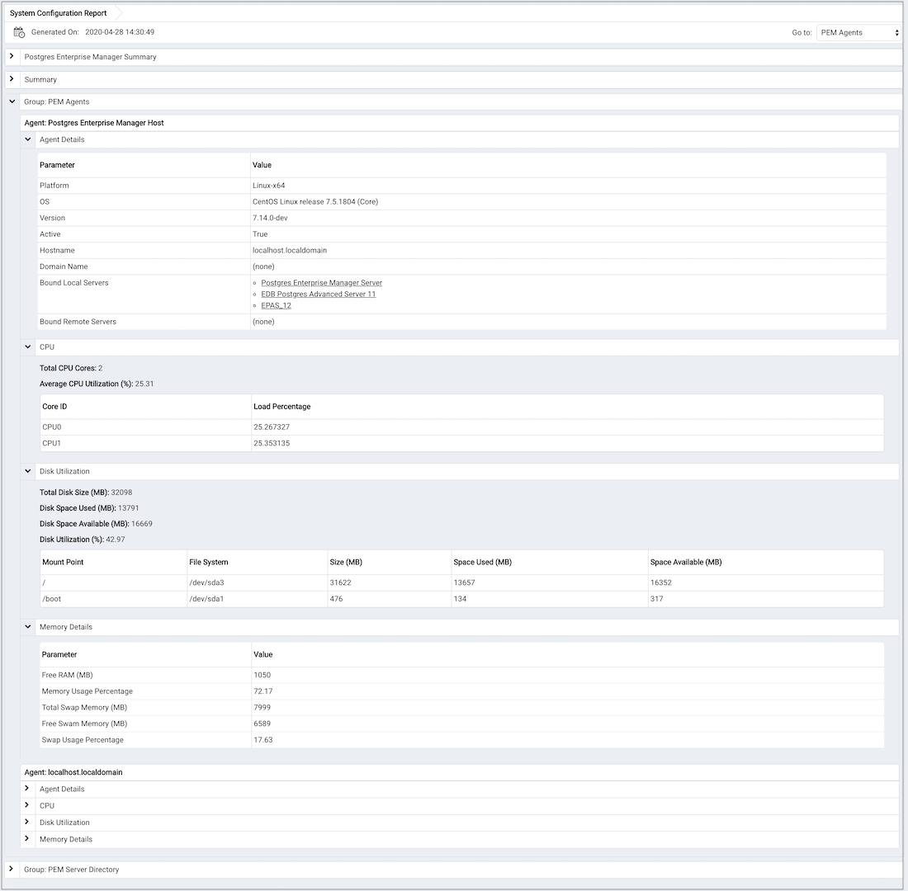
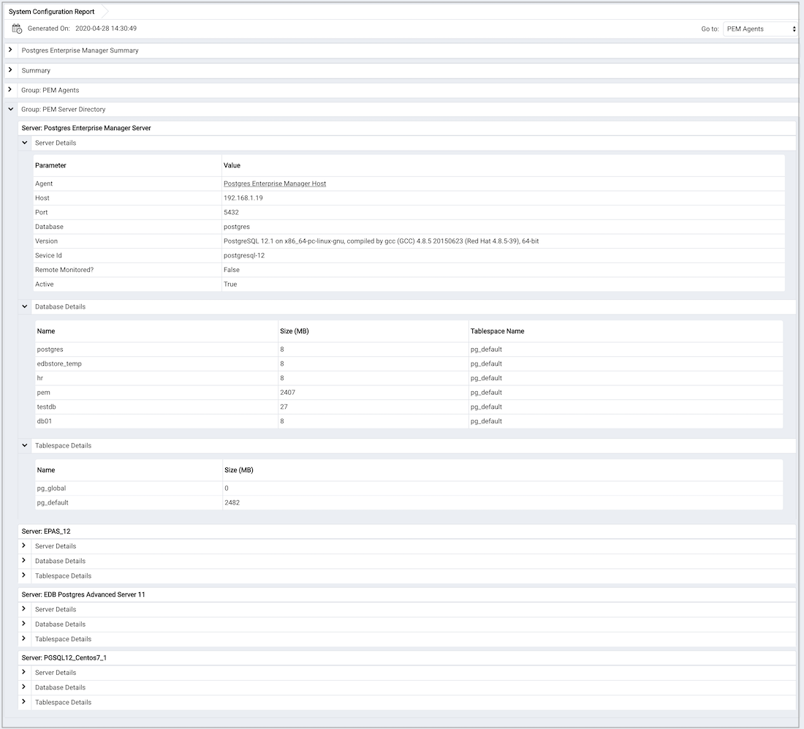
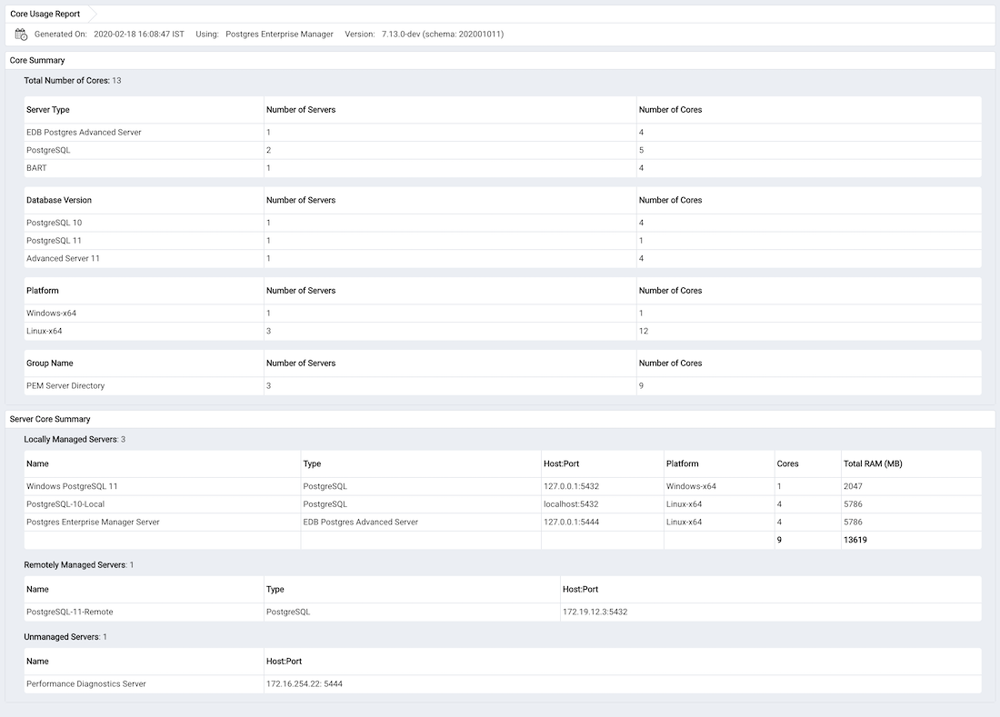

You can generate the System Configuration report and Core Usage report for all locally and remotely managed servers. To generate this report, select **Management > Reports**.

Reports has following options:

-   System Configuration Report (JSON)
-   System Configuration Report (HTML)
-   Core Usage Report (JSON)
-   Core Usage Report (HTML)

Only superusers or the users with the pem_admin role can download the System Configuration or Core Usage reports.

Information in these reports shows the latest probe run time.

## System Configuration Report

The System Configuration Report provides detailed information about the PEM Agents group, PEM Server Directory group, and custom groups listed under the browser tree. These groups can contain Postgres Enterprise Manager, PEM agent, and database servers. You can download this report in HTML and JSON formats.

The Postgres Enterprise Manager Summary provides details about:

-   The Postgres Enterprise Manager backend database server version
-   Application version
-   User name accessing the application
-   Python version
-   Flask version
-   Platform specific information

The summary provides information about the number of agents and servers.

The Group: PEM Agents panel provides details about the PEM agent, CPU cores, disk utilization, and memory information.

The Group: PEM Server Directory panel provides details about:

-   Database server version
-   Host
-   Port
-   Database name
-   Database size
-   Tablespace size

The group server name depends on the group name to which the server is added.

## Core Usage report

The Core Usage report provides detailed information about the number of cores specific to:

-   Server type
-   Database version
-   Platform and group name

The report also gives detailed information about locally managed servers:

-   Type
-   Host
-   Port
-   Platform
-   Cores
-   RAM

