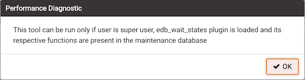
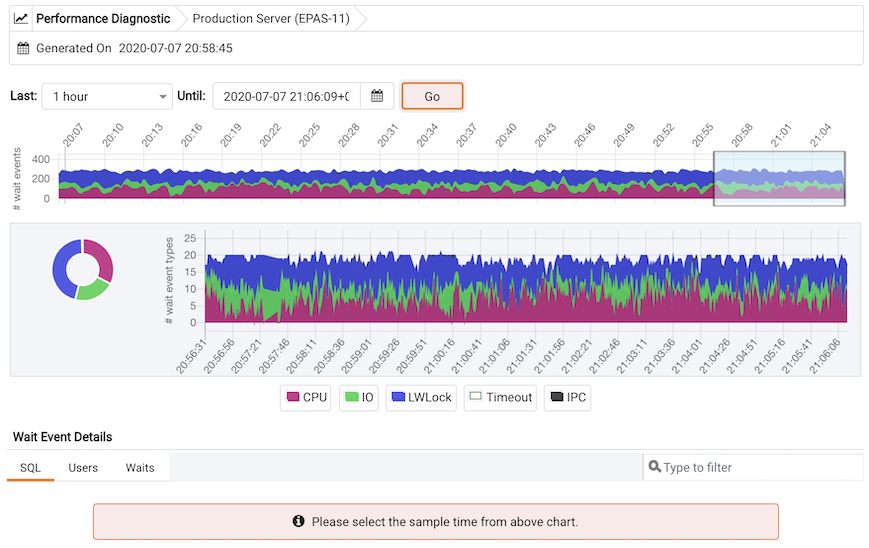
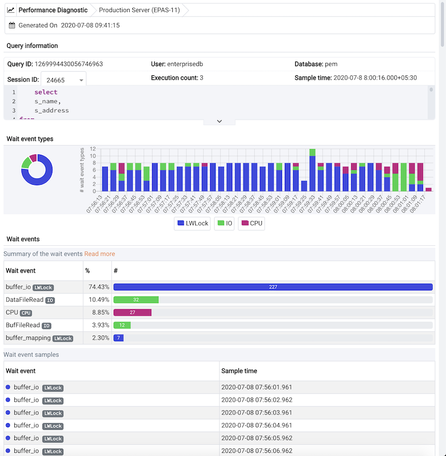

The Performance Diagnostic dashboard analyzes the database performance for Postgres instances by monitoring the wait events. To display the diagnostic graphs, PEM uses the data collected by EDB Wait States module.

The Peformance Diagnostic feature is supported for Advanced Server databases from PEM version 7.6 onwards. For PostgreSQL databases, the Performance Diagnostic feature is supported from PEM version 8.0 onwards.

!!! Note
    For PostgreSQL databases, Performance Diagnostics is supported for only versions 10, 11, and 12 that are installed on the supported CentOS or RHEL platforms.

For more information on EDB Wait States, see [EDB Wait States docs](/epas/latest/epas_guide/13_performance_analysis_and_tuning/#edb-wait-states).

You can analyze the Wait States data on multiple levels by narrowing down your selection of data. Each level of the graph is populated on the basis of your selection of data at the higher level.

## Prerequisites

- For PostgreSQL, you need to install `edb_wait_states_<X>` package from `edb.repo`, where `<X>` is the version of PostgreSQL Server. You can refer to [EDB Build Repository](https://repos.enterprisedb.com/) for the steps to install this package. For Advanced Server, you need to install `edb-as<X>-server-edb-modules`, where `<X>` is the version of Advanced Server.

- Once EDB Wait States module of EDB Postgres Advanced Server is installed:
   1. Configure the list of libraries in the `postgresql.conf` file as shown:

   ```ini
   shared_preload_libraries = '$libdir/edb_wait_states'
   ```

   1. Restart the database server. 
   
   1. Create the following extension in the maintenance database:

   ```sql
   CREATE EXTENSION edb_wait_states;
   ```

-   You must have super user privileges to access the Performance Diagnostic dashboard.

If the prerequisites are not met, then you get this error while accessing the Performance Diagnostic dashboard:



## Using the Performance Diagnostic dashboard

To open the Performance Diagnostic dashboard, on the PEM client select **Tools > Server > Performance Diagnostic...**.



By default, the top most Performance Diagnostic graph pulls the data of the last hour, starting from the current date and time. This graph shows the time series containing the number of active sessions. Each point of this time series represents the active sessions along with the wait events at a particular time and the last 15 seconds. These sessions may or may not be waiting for a wait event or using the CPU at a particular point in time. This time series is generated based on the wait event samples collected by the EDB Wait States extension.

To display the Performance Diagnostic dashboard in a new browser tab, select **Preferences > Open in New Browser Tab?**.

The range selection in the first graph is 10 minutes. To select the duration for which you want to see the graph, select a duration from the **Last** list. To select the date and time for which you want the data to be displayed, select a date and time from the **Until** list.


The first graph displays the number of active sessions and wait event types for the selected time period. You can change the time period in the first graph to analyze the data for a specific time period.

The next section plots the following graphs based on the selected time period in the first graph:

Donut graph &mdash; Shows total wait event types according to the time period selection in the first graph. It can provide a better understanding of how much time was spent by those sessions on waiting for an event.
   
Line graph &mdash; Plots a time series with each point representing the active sessions for each sample time.

To differentiate each wait event type and the CPU usage more clearly, the graph for each wait event type displays in a different color.

Select a particular time on the Line graph to analyze the wait events. The third section displays the wait event details in the Performance Diagnostics dashboard on the basis of your selected time period in the second graph. The third section displays wait event details on three tabs:

-   The **SQL** tab displays the list of SQL queries having wait events for the selected sample time.
-   The **Users** tab displays the details of the wait events grouped by users for the selected sample time.
-   The **Waits** tab displays the number of wait events belonging to each wait event type for the selected sample time.


To show or hide a particular wait event type in all the graphs, select the graph legends. The analysis of a specific wait event type is now easier.


You can filter the data displayed in the rows under all the three tabs. You can also sort the data alphabetically by selecting the column headers.

**SQL** tab


**Users** tab


**Waits** tab


Select the eye in any row of the **SQL** tab to display a window with details on the query of that particular row. This window displays a query ID and its corresponding session IDs in a list at that particular selected sample time in the **Query information** section. You can select the **Session ID** list for the selected query that you want to analyze the data. The details corresponding to the selected session ID and query ID display. The **Query information** table also displays the SQL query. If the SQL query displays partially, then select the down arrow at the bottom of the section to view the complete SQL query.

The **Wait event types** section displays the total number of wait event types for the selected session ID and query ID. It shows two types of graphs:

Donut graph &mdash; Shows the proportions of categorical data with the size of each piece representing the proportion of each wait event type.

Timeline bar graph &mdash; Visualizes trends in counts of wait event types over time.

To differentiate clearly, each wait event type is represented by a different color in the bar graph.



The **Wait events** section has a table displaying all the wait events that occured during the query execution. The data displays in decreasing order by number of wait events. The second table displays the wait event with sample time occured over the period of whole query execution. It allows you to analyze the wait events during the query execution over the period of time. Also, it shows the actual samples collected by the EDB Wait States extension for that particular query ID and session ID.
