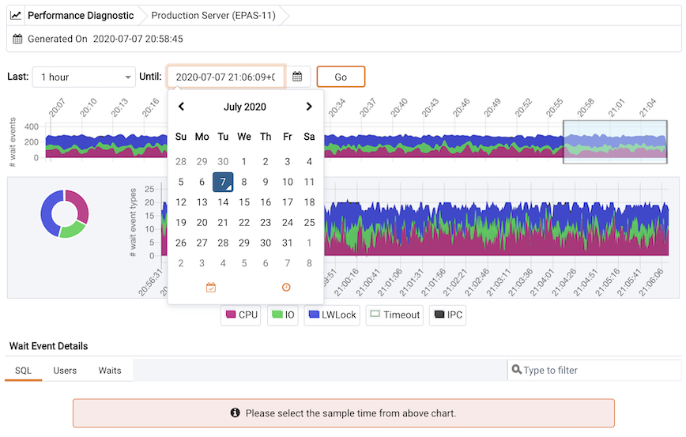
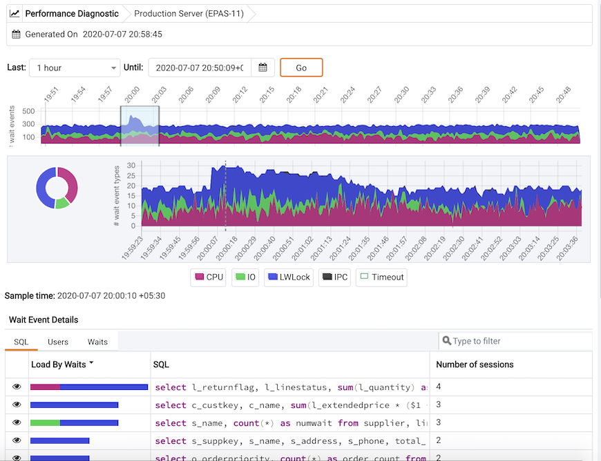
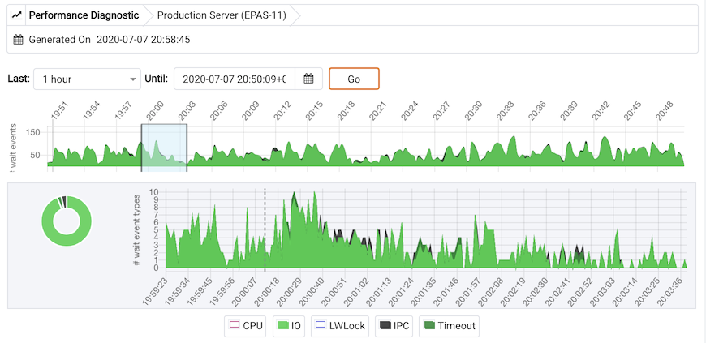
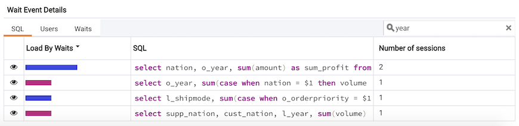
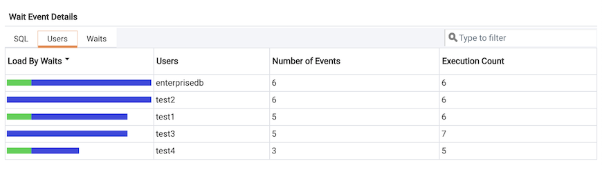
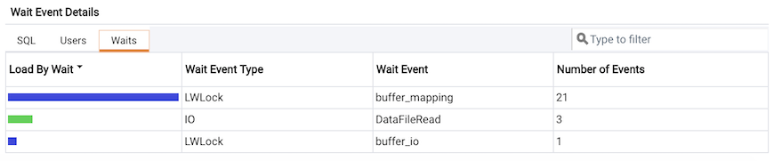

You can use the Performance Diagnostic dashboard to analyze the database performance for Postgres instances by monitoring the wait events. To display the diagnostic graphs, PEM uses the data collected by EDB Wait States module.

Peformance Diagnostic feature is supported for Advanced Server databases from PEM 7.6 version onwards and for PostgreSQL databases it is supported from PEM 8.0 onwards.

!!! Note
    For PostgreSQL databases, Performance Diagnostics is supported only for versions 10, 11, and 12 installed on the supported CentOS or RHEL platforms.

For more information on EDB Wait States, see [EDB Postgres Advanced Server Guide](/epas/latest/epas_guide/13_performance_analysis_and_tuning/#edb-wait-states).

You can analyze the Wait States data on multiple levels by narrowing down your selection of data. Each level of the graph is populated on the basis of your selection of data at the higher level.

Prerequisite:

-   For PostgreSQL, you need to install `edb_wait_states_<X>` package from `edb.repo` where `<X>` is the version of PostgreSQL Server. You can refer to [EDB Build Repository](https://repos.enterprisedb.com/) for the steps to install this package. For Advanced Server, you need to install `edb-as<X>-server-edb-modules`, Where `<X>` is the version of Advanced Server.

-   Once you ensure that EDB Wait States module of EDB Postgres Advanced Server is installed, then configure the list of libraries in the `postgresql.conf` file as below:

    `shared_preload_libraries = '$libdir/edb_wait_states'`

Restart the database server, and then create the following extension in the maintenance database:

`CREATE EXTENSION edb_wait_states;`

-   You must have super user privileges to access the Performance Diagnostic dashboard.

You get the following error while accessing the Performance Diagnostic dashboard if the above prerequisites are not met:

To open the Performance Diagnostic dashboard, select `Server` and then `Performance Diagnostic...` from the `Tools` menu of the PEM client.

By default, the top most Performance Diagnostic graph pulls the data of last one hour, starting from current date and time. This graph shows the time series containing the number of active sessions. Each point of this time series represents the active sessions and wait events at a particular time and last 15 seconds. These sessions may or may not be waiting for an wait event, or using the CPU at a particular point in time. This time series is generated based on the wait event samples collected by the `edb_wait_states` extension.

You can also use the `Preferences` dialog to display Performance Diagnostic in a new browser tab. Use `Open in New Browser Tab?` to display the Performance Diagnostics dashboard in a new browser tab.

The range selection in the first graph is 10 minutes. You can use the `Last` drop-down list box to select the duration for which you want to see the graph: select the last 1 hour, last 4 hours, last 12 hours, or last 24 hours. You can also select the date and time through which you want the data to be displayed.

The first graph displays the number of active sessions (and - wait event types) for the selected time interval. You can narrow down the timeline in the first graph to analyze the data for a specific time period.

Next section plots the following graphs based on the selected time interval in the first graph:

1.  Donut graph - It shows total wait event types according to the time range selection in the first graph. It helps you understand how much time was spent by those session on waiting for an event.
2.  Line graph - It plots a time series with each point representing the active sessions for each sample time.

To differentiate each wait event types and the CPU usage clearly, the graph for each wait event type is displayed in a different color.

Select a particular time on the `Line graph` for which you wish to analyze the wait events; the third section displays the wait event details in the Performance Diagnostics dashboard on the basis of your selected particular time in the second graph. The third section displays wait event details on three tabs:

-   The `SQL` tab displays the list of SQL queries having wait events for the selected sample time.
-   The `Users` tab displays the details of the wait events grouped by users for selected sample time.
-   The `Waits` tab displays the number of wait events belonging to each wait event type for the selected sample time.

You can click on the graph legends to show or hide a particular wait event type in all the graphs. This will make the analysis of a specific wait event type easier.

You can filter the data displayed in the rows under all the three tabs. You can also sort the data alphabetically by clicking on the column headers.

SQL tab

Users tab

Waits tab

Click on the Eye icon in any row of the SQL tab to display a new tab with details of the query of that particular row. This page displays Query ID and its corresponding session IDs in a dropdown list at that particular selected sample time in the Query information section. You can select the session ID for the selected query for which you want to analyze the data. You will see the details corresponding to the selected session ID and query ID. The Query information table also displays the SQL query. If the SQL query is being displayed partially, click the down arrow at the bottom of the section to view the complete SQL query.

The `Wait event types` section displays the total number of wait event types for the selected session ID and query ID. It shows two type of graphs:

1.  Donut graph - It shows the proportions of categorical data, with the size of each piece representing the proportion of each wait event type.
2.  Timeline bar graph - It can be used to visualize trends in counts of wait event types over time.

To differentiate clearly, each wait event type is represented by a different color in the bar graph.

The `Wait events` section has a table displaying all the wait events occured during the query execution. It displays data in decreasing order by number of the wait events. Second table displays the wait event with sample time occured over the period of whole query execution. It allows to analyze the wait events during the query execution over the period of time. It shows the actual samples collected by the EDB Wait States extension for that particular query ID and session ID.
