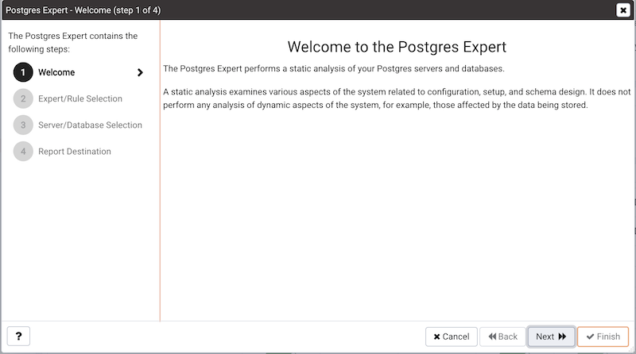
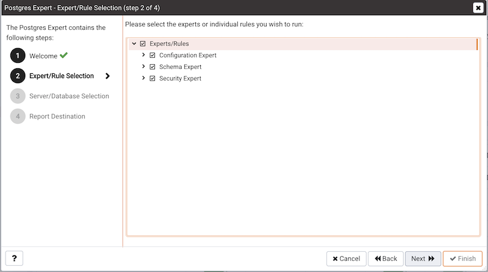
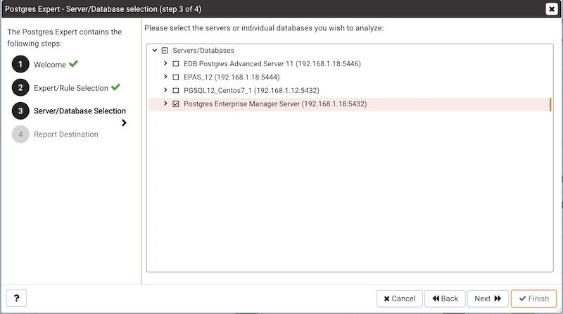
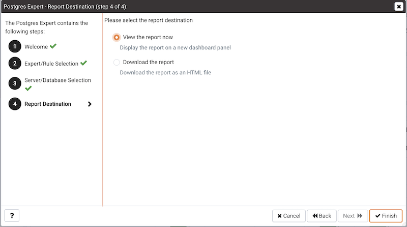
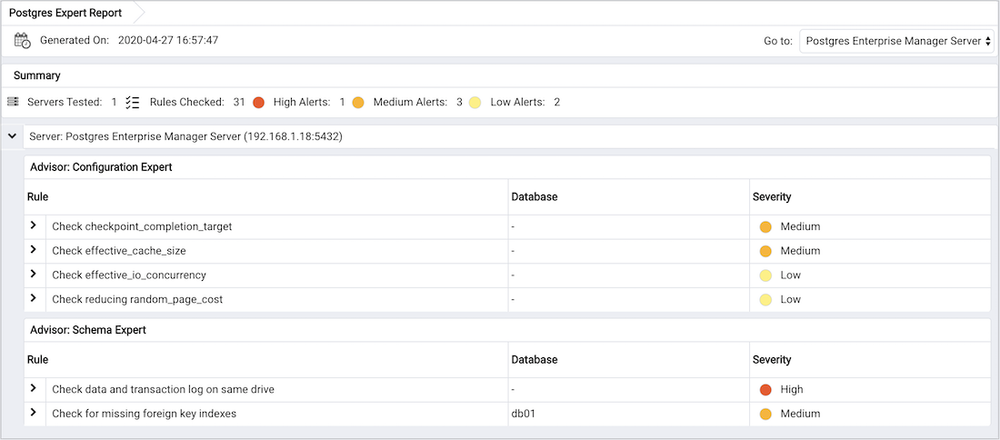
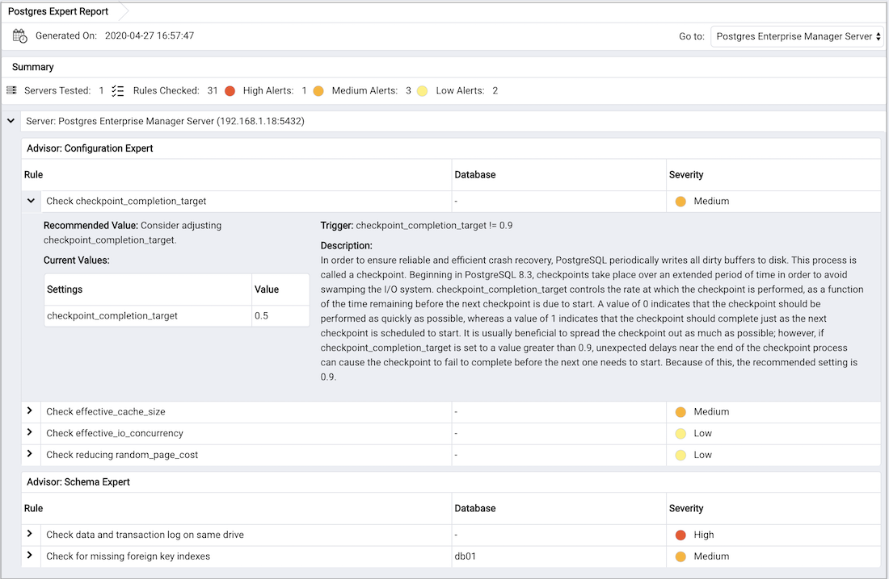

The Postgres Expert utility provides expert advice on how to best configure your Postgres servers for optimal performance, security, and more. Postgres Expert serves as a PostgreSQL 'DBA in a box' by analyzing your servers for deviations in best practices. Postgres Expert contains three specialized Experts:

-   The Configuration Expert.
-   The Schema Expert.
-   The Security Expert.

You can select specific rules for each Expert to analyze, or accept all rules, and then review Postgres Expert reports detailing any best practice issues that require your attention.

## Using the Postgres Expert wizard

To use the Postgres Expert wizard select the `Postgres Expert` option from the `Management` menu in the PEM client. When the wizard's `Welcome` window opens, click `Next` to continue.

The wizard displays a tree control that allows you to choose the `Experts and Rules` with which Postgres Expert will evaluate the specified server or database.

The tree control categorizes the rules under three Expert headings:

-   Select from the `Configuration Expert rules` to analyze the parameter settings of the server or operating system to find any adjustments that might improve system performance.
-   Select from the `Schema Expert rules` to analyze schema objects (locating missing primary keys, foreign keys without indexes, etc).
-   Select from the `Security Expert rules` to review the system to find security vulnerabilities.

Use the checkmark indicator to the left of an expert or rule to indicate that the Postgres Expert should analyze the configuration of the selected servers for any best practice deviations related to the checked item.

You can:

-   Check the box next to the name of an expert to select or deselect all of the configuration items listed under that node of the tree control.
-   Check the box next to `Servers/Databases` to instruct Postgres Expert to review the selected server for all of the items in the tree control.
-   Deselect the box next to `Servers/Databases` to to un-check all of the rules; then, navigate through the tree control, specifying only the items that you wish Postgres Expert to evaluate.

After making your selections, click `Next` to continue to the Server/Databases tree control.

Select or de-select the servers and databases that you would like Postgres Expert to analyze. If you select multiple servers or databases, the resulting report will contain a separate analysis of each target. When you've finished, click `Next` to select a report destination.

You can select the default option and click `Finish` to view an onscreen report from Postgres Expert, or check the box next to Download the report to save a copy of the report to an HTML file for later use. If you choose to save the report to a file, the download will begin immediately. The file will be saved in your default download directory.

## Reviewing Postgres Expert recommendations

Postgres Expert produces an easily navigated report that contains an analysis of the selected rules, categorized by high, medium, and low severities, for the selected servers.

The report header contains a summary of the report, and includes the date and time that the report was generated, the number of rules analyzed, and the number of deviations from best practices found by Postgres Expert. Use the `Jump to` drop-down listbox to select a server to navigate to the section of the report that targets recommendations for that server.

The body of the report contains the detailed findings for each server selected for analysis. The findings are sorted by Expert; within each Expert heading, any rule violations are ranked by Severity.

Click on each rule in the Postgres Expert report to display details and recommendations for that rule. Within each rule, section headings display:

-   The `Advisor` section lists the name of the Postgres Expert advisor that prompted the recommendation.
-   The `Trigger` section displays a description of the rule that raised the alert.
-   The `Recommended Value` section displays the value to which Postgres Expert recommends setting the selected parameter.
-   The `Description` section displays information and advice about the parameter that caused the alert.
-   The `Current Values` section displays the current value(s) of any parameter(s) that influence the Postgres Expert's evaluation.
