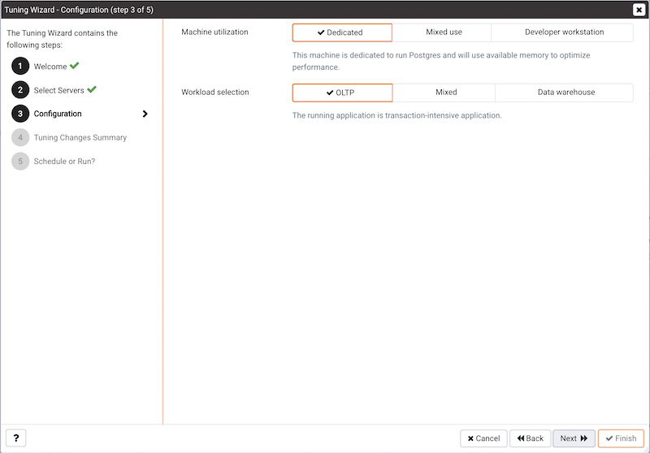
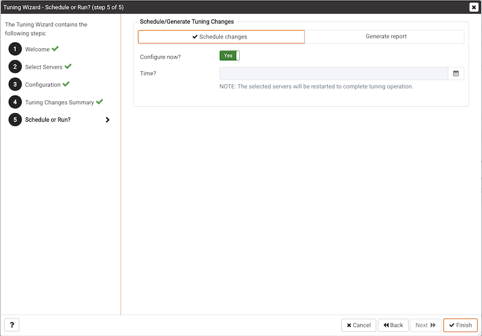

The Tuning Wizard reviews your PostgreSQL or EDB Postgres Advanced Server installation, recommending a set of configuration options tuned to the installation's anticipated workload. Please note that benchmarking systems or systems with a high work load might require additional manual tuning to reach optimum performance.

Before using the Tuning Wizard, you must specify the name of the service. Go to **Properties > Advanced** and enter the name in the Service ID field. PEM uses the service name when restarting the service after tuning.

The Tuning Wizard can only make recommendations for those servers that reside on the same server as their bound PEM agent. If you have specified a value of Yes in the Remote monitoring field when defining your server, the server won't display in the Tuning Wizard tree menu.

To open the Tuning Wizard, in the PEM client select **Management > Tuning Wizard**.


Select **Next** to continue.


When you expand the **Servers** node of the tree menu, a list of servers appears. All of these servers are currently monitored by PEM and available for tuning. Select a server to tune it. 

!!! Note
    If the server's service name is not provided, then the Tuning Wizard displays a warning next to the server name on the tree menu.

Select **Next** to continue.



Select an option in the Machine utilization field to specify the type of work performed by each server. The type of work performed by the server determines how the Tuning Wizard allocates system resources:

-   Select **Dedicated** to dedicate the majority of the system resources to the database server.
-   Select **Mixed use** to dedicate a moderate amount of system resources to the database server.
-   Select **Developer workstation** to dedicate a relatively small amount of system resources to the database server.

Select an option in the Workload Selection field to specify the type of workload typically performed on the selected server:

-   Select **OLTP** if the selected server is used primarily to process online transaction workloads.
-   Select **Mixed** if the selected server provides a mix of transaction processing and data reporting.
-   Select **Data warehouse** if the server is used for heavy data reporting.

Select **Next** to continue.


The tree menu on the **Tuning Changes Summary** window displays the parameter setting modifications recommended for each server analyzed by the Tuning Wizard. Select the recommendations that you want Tuning Wizard to apply or to include in a preview report:

-   Select a parameter name and Tuning Wizard includes the parameter setting.
-   Select the server name and the Tuning Wizard includes all parameter setting recommendations for the specified server.

Select **Next** to continue.

In the **Schedule or Run?** window, either choose a time when PEM applies the recommended changes or choose to generate a report that details the recommended changes.

PEM makes the recommended changes that you selected in the **Tuning Changes Summary** window. If you choose to generate a report, then PEM creates a report. It contains a list of the current values and recommended modifications to the configuration parameters as selected in the **Tuning Changes Summary** window. To implement changes, you must open the Tuning Wizard a second time, selecting the parameters you want to modify in the **Tuning Changes Summary** window.

Select **Schedule changes** to view and specify your scheduling options.



The **Configuration now?** slider can be set to:

   - **Yes** &mdash; Apply the Tuning Wizard's recommendations and restart the server.

   - **No** &mdash; Enables the Time? field where you can specify a date and time with the calendar selector. PEM applies the recommended changes and restarts the server at this time. If you schedule a time for the changes to be applied, then you aren't provided with a preview of the recommended changes.

Select **Generate report** to view your report options.


The **View report now?** slider can be set to:

   - **Yes** &mdash; Display the Tuning Wizard report onscreen.

   - **No** &mdash; Enables the Save the report to file field where you can specify a file name and location. PEM saves the Tuning Wizard report with this name and location.

Select **Finish**.


To confirm that Tuning Wizard implemented the recommended changes, review the postgresql.conf file for the modified server. When the change is applied, the Tuning Wizard adds a comment above each modified parameter in the postgresql.conf file.


You can also confirm a parameter value by querying the server. For example, to confirm the value of the shared_buffers parameter, open a SQL command line using either the Query Tool (accessed through the Tools menu) or the psql client, and issue the command:

```sql
SHOW shared_buffers;
```

The value returned by the server confirms whether the parameter has been modified.
