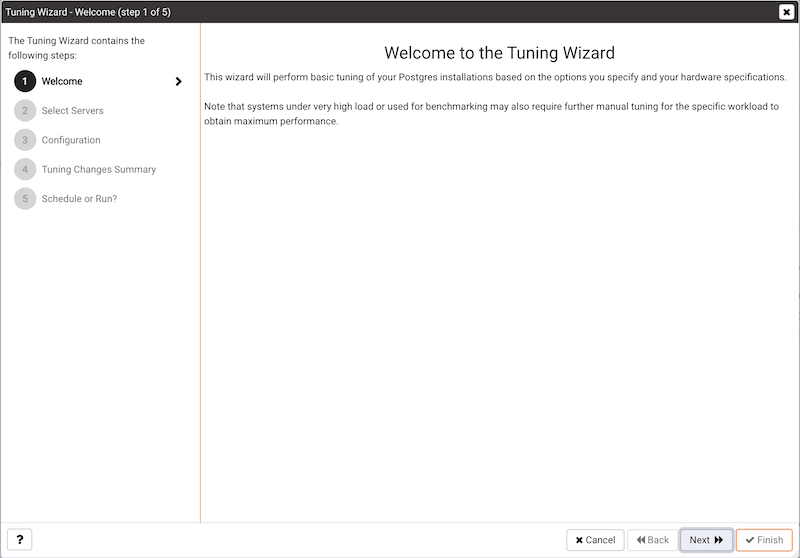
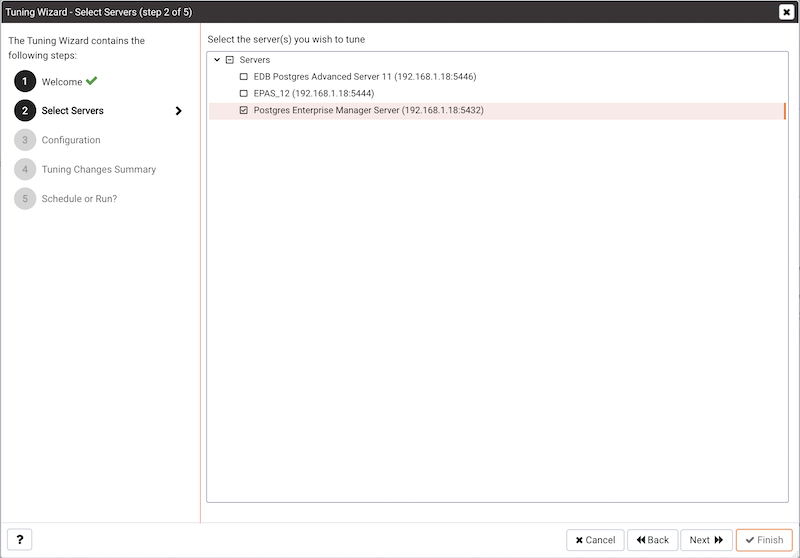
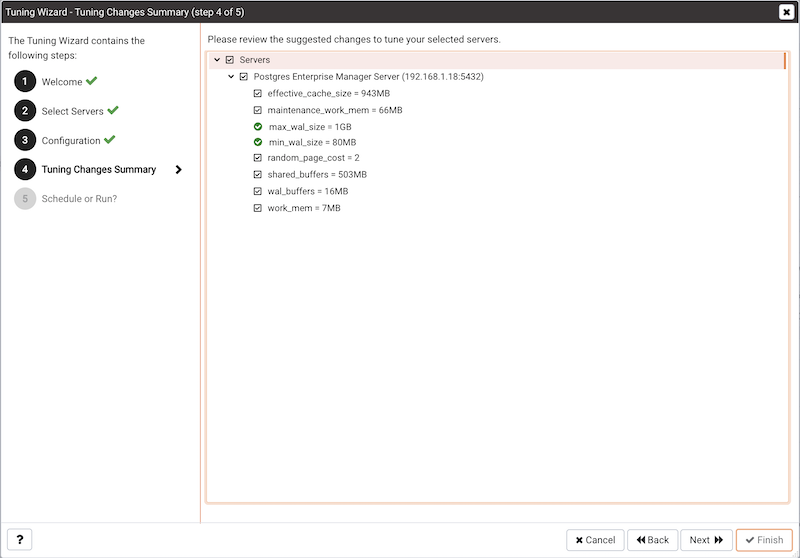
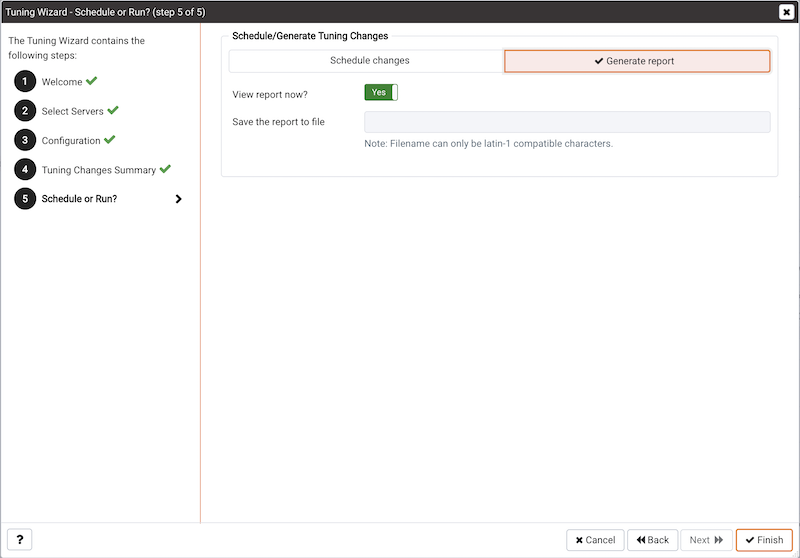
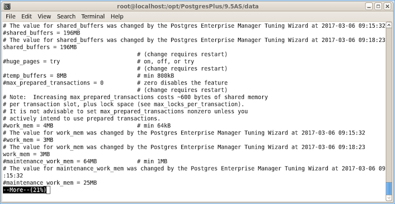

The Tuning Wizard reviews your PostgreSQL or Advanced Server installation, and recommends a set of configuration options that will help tune the installation to best suit its anticipated workload. Please note that benchmarking systems or systems with a high work load may require additional manual tuning to reach optimum performance.

Before using the Tuning Wizard, you must specify the name of the service in the Service ID field on the Advanced tab of the server's Properties dialog. PEM will use the service name when restarting the service after tuning.

The Tuning Wizard can only make recommendations for those servers that reside on the same server as their bound PEM agent. If you have specified a value of Yes in the Remote monitoring field when defining your server, the server will not be displayed in the Tuning Wizard tree control.

To open the Tuning Wizard, select `Tuning Wizard...` from the `Management` menu of the PEM client. The Tuning Wizard opens, welcoming you.

Click `Next` to continue to the server selection dialog.

Expand the `Servers` node of the tree control to view a list of the servers that are currently monitored by PEM that are available for tuning. Check a box to the left of a server name to select the server for tuning.

!!! Note
    The Tuning Wizard displays a red warning symbol to the left of a server name in the tree control if the service name for that server is not provided on the server's Properties dialog.

Click `Next` to continue to the Configuration dialog.

Select an option in the `Machine utilization` field to specify the type of work performed by the selected servers. The type of work performed by the server determines how the tuning wizard will allocate system resources:

-   Select `Dedicated` to dedicate the majority of the system resources to the database server.
-   Select `Mixed use` to dedicate a moderate amount of system resources to the database server.
-   Select `Developer workstation` to dedicate a relatively small amount of system resources to the database server.

Select an option in the `Workload Selection` field to specify the type of workload typically performed on the selected server:

-   Select `OLTP` if the selected server is used primarily to process online transaction workloads.
-   Select `Mixed` if the selected server provides a mix of transaction processing and data reporting.
-   Select `Data warehouse` if the server is used for heavy data reporting.

Click `Next` to continue to the `Tuning Changes Summary` dialog.

The tree control on the `Tuning Changes Summary` dialog displays the parameter setting modifications recommended for each server analyzed by the Tuning Wizard. Use the checkboxes next to a server or parameter name to select the recommendations that tuning wizard will either include in a preview report or apply:

-   A checked box to the left of a parameter name specifies that the Tuning Wizard will include the parameter setting.
-   A checked box to the left of a server name specifies that the Tuning Wizard will include all parameter setting recommendations for the specified server.

Specify which Tuning Wizard recommendations you wish to include in a report or apply, and click `Next` to continue.

Use the `Schedule or Run?` dialog to either specify a time that PEM will apply the changes, or generate a report that details the recommended changes.

The selected actions will apply to all of the changes noted on the Tuning Changes Summary. If you opt to generate a report, PEM will create a report that contains a list of the current values and recommended modifications to the configuration parameters selected on the Tuning Changes Summary dialog. Note that to implement changes, you will need to invoke the Tuning Wizard a second time, specifying the parameters you wish to modify on the `Tuning Changes Summary` dialog.

Select `Schedule changes` to view and specify your scheduling options.

You can:

-   Set the `Configuration now?` slider to `Yes` to apply the tuning wizard's recommendations and restart the server now.
-   Set the `Configuration now?` slider to `No` to enable the Time? field and use the calendar selector to specify a time for PEM to apply the tuning wizard's recommendations and restart the server. Note that if you schedule a time for the changes to be applied, you will not be provided with a preview of the change recommendations.

Select `Generate report` to view your report options.

You can:

-   Set the `View report now?` slider to `Yes` to display the Tuning Wizard report onscreen.
-   Set the `View report now?` slider to `No` to enable the `Save the report to file` field and use the calendar selector to specify a file name and location to which PEM will write the Tuning Wizard report.

Click the `Finish` button to either apply the Tuning Wizard's modifications or generate a report and exit the Tuning Wizard.

You can confirm that Tuning Wizard has implemented the recommended changes by reviewing the `postgresql.conf` file for the modified server. The Tuning Wizard adds a comment above each modified parameter in the postgresql.conf file when the change is applied.

You can also confirm a parameter value by querying the server. For example, to confirm the value of the shared_buffers parameter, open a SQL command line using either the Query Tool (accessed through the Tools menu) or the psql client, and issue the command:

`SHOW shared_buffers;`

The value returned by the server will confirm that the parameter has been modified.
