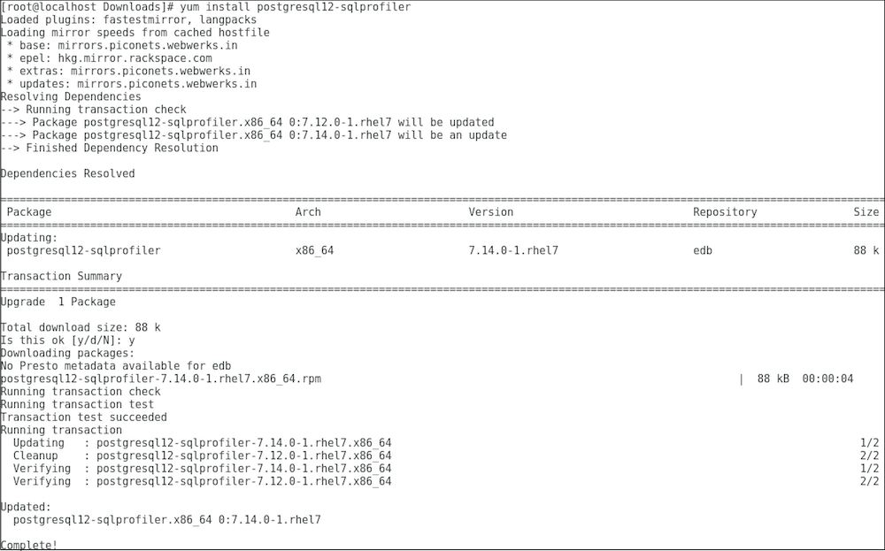

To upgrade a SQL Profiler installation that resides on a Linux host:

1.  Delete the existing SQL Profiler query set on each node by invoking the `uninstall-sql-profiler.sql` script. By default, on a Linux host the script resides in the `share/contrib` directory under your Advanced Server or PostgreSQL installation.

    You can use the following server-specific command:

    For PostgreSQL:

    ```text
    /usr/pgsql-<x>/bin/psql -f /usr/pgsql-<x>/share/contrib/uninstall-sql-profiler.sql -d postgres -U postgres
    ```

    Where, `x` is the version of PostgreSQL and `-d` specifies the name of the maintenance database.

    For Advanced Server:

    ```text
    /usr/edb/as<x>/bin/psql -f /usr/edb/as<x>/share/contrib/uninstall-sql-profiler.sql -d edb -U enterprisedb
    ```

    Where, `x` is the version of Advanced Server and `-d` specifies the name of the maintenance database.

2.  Invoke the new SQL Profiler installer on each node you wish to profile.

    For PostgreSQL:

    ```text
    yum upgrade postgresql<x>-sqlprofiler
    ```

    Where, `x` is the version of the PostgreSQL.

    For Advanced Server:

    ```text
    yum upgrade edb-as<x>-server-sqlprofiler
    ```

    Where `x` is the version of Advanced Server.

The installer will detect the existing `SQL Profiler` installation and upgrade with the latest version of SQL Profiler.

Please see the following example of upgrading SQL Profiler for PostgreSQL:



3.  Then, run the `sql-profiler.sql` script file in the maintenance database.

    For PostgreSQL:

    ```text
    /usr/pgsql-<x>/bin/psql -f /usr/pgsql-<x>/share/contrib/sql-profiler.sql -d postgres -U postgres
    ```

    Where, `x` is the version of PostgreSQL and `-d` specifies the name of the maintenance database.

    For Advanced Server:

    ```text
    /usr/edb/as<x>/bin/psql -f /usr/edb/as<x>/share/contrib/sql-profiler.sql -d edb -U enterprisedb
    ```

    Where, `x` is the version of Advanced Server and `-d` specifies the name of the maintenance database.

4.  Restart the PostgreSQL/Advanced Server to resume profiling the node from the PEM Client.
