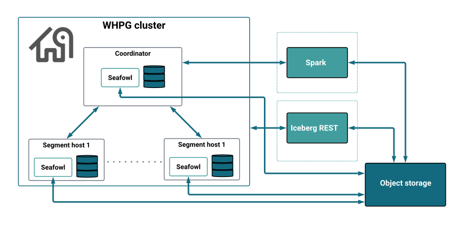

Postgres Analytics Accelerator (PGAA) extends WarehousePG 7 with lakehouse capabilities, enabling distributed analytical queries against data in object storage without separate infrastructure or data movement. PGAA on WarehousePG requires WarehousePG 7.4 or later.

## Capabilities

- **Query object storage directly from WarehousePG:** Register an S3, Google Cloud Storage (GCS), or Azure path as a storage location, create a PGAA table pointing to it, and query Parquet, Delta Lake, or Iceberg files with standard SQL without the need for ETL or data import. See [Querying object storage using storage locations](reading#querying-object-storage-using-storage-locations).
- **Connect to an Iceberg catalog:** Attach PGAA to an external Iceberg REST catalog for table discovery, schema and partition metadata, and authentication to the underlying object storage. When EDB Postgres Distributed (PGD) replicates data to object storage, WarehousePG can attach to the shared catalog and read that data at MPP scale, enabling a combined OLTP and analytical workload across both platforms. See [Connecting to an Iceberg catalog](reading#connecting-to-an-iceberg-catalog).
- **Accelerate with Spark:** For large workloads, or if you already operate a Spark cluster, route queries through Spark Connect instead of Seafowl. If your cluster includes GPU-enabled nodes, RAPIDS acceleration is available on top of Spark for even higher throughput on compute-intensive queries. See [Accelerating with Spark](reading#accelerating-with-spark).
- **Back up and restore:** Use gpbackup to capture PGAA table definitions and storage bindings. After a restore, tables immediately reference the correct object storage paths with no manual reconfiguration required. See [Backing up and restoring](backup).
- **Monitor and maintain:** Monitor table health and run maintenance operations such as compaction and vacuum on PGAA tables. On WarehousePG, maintenance workers run on the coordinator only. See [Monitoring and maintaining analytical tables](../monitoring).

For current limitations, see [Known issues](../overview/known_issues#warehousepg).

## When to use PGAA on WarehousePG

Choose PGAA when:

- You need to query open table formats (Iceberg, Delta Lake).
- You want to attach to an Iceberg REST catalog shared with other pipelines, such as PGD, querying their data at MPP scale without duplicating it, leveraging catalog-managed authentication. 
- You need faster analytical queries. PGAA's vectorized engine processes data in columnar batches rather than row by row.
- You want to route queries through Spark Connect or use RAPIDS for GPU-accelerated execution.

Current limitations to consider:

- PGAA only supports the standard PostgreSQL planner, not Orca.
- PGAA tables are read-only.

## Architecture overview

PGAA on WarehousePG connects the cluster's coordinator and segment hosts to object storage through a vectorized query engine, with optional Iceberg catalog and Spark integration.

### Core components

**WarehousePG (WHPG)** 

A Postgres-based massively parallel processing (MPP) database composed of a coordinator host and multiple segment hosts. The coordinator handles query planning and dispatching, while segments execute queries in parallel.

**PGAA extension**

Integrates with the WarehousePG query planner to identify queries that can be offloaded to the analytical engine. It bundles Seafowl as its default vectorized execution engine, manages the metadata for analytical tables, and coordinates communication between the Postgres process and the query executors.

**PGFS extension**

A dependency of PGAA that provides the storage layer for object storage connectivity. It handles credential management and abstracts access to S3, GCS, and Azure.

**Seafowl**

The vectorized query engine bundled with PGAA. In a WarehousePG installation, Seafowl runs as a `systemd` service on the WHPG coordinator and each segment host, enabling both coordinator-only and distributed query execution.

**Iceberg REST catalog (optional)**

An external metadata registry that tracks table schemas, partitions, and snapshots. PGAA enables table discovery and authentication to the underlying object storage through a registered catalog.

**Spark cluster (optional)** 

An external Apache Spark cluster used as an alternative execution engine. When configured via Spark Connect, the WHPG coordinator forwards queries to Spark instead of Seafowl.

**Object storage**

The source of analytical data. PGAA supports S3, GCS, and Azure, and querying Parquet, Delta Lake, and Iceberg files directly at query time, with no data import into WarehousePG.

## How PGAA works on WarehousePG

PGAA integrates with WarehousePG at two levels: the storage layer, where analytical tables are defined and bound to object storage, and the query execution layer, where the planner and the vectorized query engine work together to distribute and execute queries across the cluster.

### Analytical table creation

PGAA provides a custom table access method, `pgaa`, that lets you define and query tables residing in object storage through standard SQL, with no data import into WarehousePG. PGAA catalog tables use a `DISTRIBUTED REPLICATED` policy, making metadata available on every node.

PGAA tables are read-only and don't support write operations. The data must already exist in object storage, for example written by PGD or another pipeline.

### Query execution

Unlike native WarehousePG tables, whose data is fixed to specific segment hosts, PGAA data lives in object storage and is accessible from any node, giving PGAA more freedom to choose the most efficient execution strategy for each query.

!!! Note
    PGAA only supports the standard PostgreSQL planner, not the Orca optimizer.

PGAA executes queries through one of two engines: Seafowl, the default vectorized engine bundled with PGAA, or Spark, when you configure Spark Connect to point to a Spark cluster.

When Spark is the active engine, the coordinator forwards the query to the Spark cluster via Spark Connect, without involving segment hosts. Spark handles its own planning and distribution independently of the Seafowl scan modes.

When Seafowl is the active engine, PGAA selects one of two scan modes depending on the nature of the query:

- **DirectScan:** PGAA offloads the query entirely to Seafowl on the coordinator, without involving the segment hosts.

- **CompatScan:** Used when the query involves operations Seafowl can't handle, such as a join with a native WarehousePG heap table. For every table, PGAA proposes two candidate execution plans to the WarehousePG planner, which picks the cheaper one:

    - **Strewn locus (MPP):** the scan is distributed across all segment hosts, each reading a portion of the data in parallel.
    - **General locus:** the whole table can be processed on the coordinator and every segment. With [aggregation pushdown](../optimize_performance#configuring-compute-pushdowns) enabled, the coordinator processes aggregations before returning results, which can further reduce the data sent back to the client.

    Combining both strategies is particularly useful for joins between PGAA tables of different sizes. For example, when joining a small table against a large one, the planner can use General locus for the small table, scanning it in full on every segment and loading it into a local hash map, while using Strewn locus for the large table, where each segment reads only its portion. The join then runs locally on each segment without any data shuffling between hosts.

| Engine | Scan mode | Execution |
|---|---|---|
| Seafowl | DirectScan | Coordinator only. |
| Seafowl | CompatScan | Coordinator and every segment scan the full table (General locus), or each segment reads a portion of the data in parallel (Strewn locus), based on cost. |
| Spark | SparkDirectScan | Spark cluster via coordinator only. |

For a deeper explanation of Seafowl scan modes, see [Understanding scan types](../optimize_performance/#understanding-scan-types).
