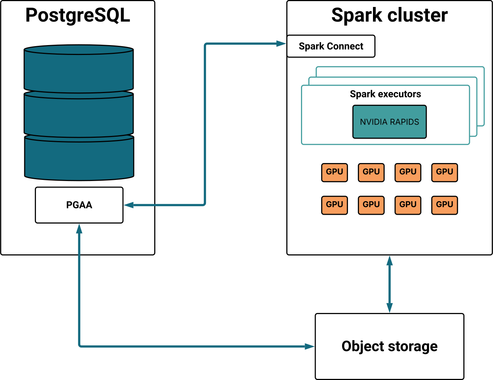

Integrate NVIDIA RAPIDS with your Spark-connected PGAA environment to achieve hardware-level acceleration for your data lakehouse. While Spark orchestrates distributed workloads across the cluster, RAPIDS offloads intensive computational tasks to the GPU, delivering massive throughput gains for complex queries on large-scale datasets.

<p align="center">
  
</p>

Offloading query execution to Apache Spark via PGAA provides immediate architectural advantages:
- **Intentional hand-off:** You maintain full control by explicitly selecting the execution engine; PGAA then packages the SQL query and routes it to a Spark Connect endpoint.
- **Distributed processing:** By moving workloads to a Spark cluster, you leverage distributed computing power to handle massive datasets that would otherwise bottleneck a single database instance.
- **Zero indexing:** Achieve peak analytical performance without the need for manual index creation or constant maintenance, significantly reducing operational overhead.

When you use Spark as the execution engine for PGAA, you get scale-out distributed query execution, and NVIDIA RAPIDS takes it to another level, with drop-in GPU acceleration for the SQL queries you send to Postgres:
- **Massively parallel performance:** Leveraging thousands of GPU cores to process columnar data batches simultaneously, RAPIDS provides a much higher degree of parallelism that completes complex analytical workloads 50–100 times faster than standard PostgreSQL transactional tables.
- **Scaling ROI:** The performance advantage grows with your data; while Spark provides a boost at 100GB, RAPIDS becomes the primary driver at 3TB and beyond, as the hardware efficiency gap widens with larger datasets.
- **Transparent reliability:** The system ensures query completion via automatic fallback. If a specific operation is not supported by the GPU, it seamlessly shifts back to the CPU to ensure maximum efficiency without user intervention. Similarly, if it's not supported by Spark, it falls back to Postgres.

!!! Note
  Currently, GPU acceleration with Apache Spark is optimized for read-only queries on Parquet files in S3-compatible object storage or a shared POSIX filesystem. Support for Iceberg (read/write) is coming soon.
!!!

## Configuring GPU acceleration with NVIDIA RAPIDS

The core architecture consists of a PostgreSQL server with the PGAA extension, an Apache Spark cluster configured with NVIDIA RAPIDS, and compatible object storage containing Parquet-formatted data.

To implement this environment, you can leverage existing infrastructure, perform a manual installation, or use our [ready-to-run Docker Compose stack](https://github.com/EnterpriseDB/spark-rapids-tutorial) to quickly deploy all necessary components. This stack includes pre-configured examples optimized for the NVIDIA Brev platform, allowing you to easily deploy self-serve GPU instances in the cloud. If compatible GPUs are detected, NVIDIA RAPIDS will automatically provide hardware acceleration; otherwise, the system transparently falls back to CPU-based processing.

The configuration of PGAA with NVIDIA RAPIDS consists of the following steps:

1. Verify the [prerequisites](#prerequisites).
1. Confirm that [NVIDIA RAPIDS](#enabling-nvidia-rapids) is properly installed and active within your Spark cluster. 
1. [Configure PostgreSQL's source data](#configuring-the-source-data). 
1. [Connect Postgres to Spark](#connecting-to-spark).
1. [Run analytical queries](#running-analytical-queries) and verify that the workload is utilizing GPU acceleration.

### Prerequisites

- **PostgreSQL**: Version 16 or later. Any supported PostgreSQL distributions, and running on Debian 11/12 or Ubuntu 22/24 on amd64 architectures, and RHEL 8/9 on both amd64 and arm64.
- **PGAA extension**: Version 1.6 or later installed on your PostgreSQL database.
- **Storage location**: Currently, only S3-compatible storage and local file system are supported as data storage locations.
- **Apache Spark**: Version 3.4 or later.  
- **Spark Connect**: A running [Spark Connect](https://spark.apache.org/docs/3.5.7/api/python/getting_started/quickstart_connect.html) server configured with the following dependencies:

  ```
  org.apache.spark:spark-connect_2.12:3.5.6,\
  io.delta:delta-spark_2.12:3.3.1,\
  org.apache.iceberg:iceberg-spark-runtime-3.5_2.12:1.6.1,\
  org.apache.iceberg:iceberg-aws-bundle:1.6.1,\
  org.apache.hadoop:hadoop-aws:3.3.4
  ```

- **NVIDIA RAPIDS**: Version 2025.10 or above installed on your Spark cluster. See [Enabling RAPIDS](#enabling-nvidia-rapids) for details. 
- **Hardware**: Access to a machine equipped with NVIDIA GPUs. 

### Enabling NVIDIA RAPIDS

To utilize GPU acceleration, NVIDIA RAPIDS must be correctly installed and active within your Apache Spark cluster. Follow these steps to configure the environment:

1. Ensure your Spark environment downloads the necessary [RAPIDS JAR files](https://docs.nvidia.com/spark-rapids/user-guide/latest/getting-started/on-premise.html#download-the-rapids-accelerator-jar). Specify the plugin version `com.rapids-4-spark_2.12:25.10.0` when submitting a job. For example:

  ```
  --packages "org.apache.spark:spark-connect_2.12:3.5.6,com.nvidia:rapids-4-spark_2.12:25.10.0,io.delta:delta-spark_2.12:3.3.1,org.apache.hadoop:hadoop-aws:3.3.4"
  ```

1. [Install the GPU discovery script](https://docs.nvidia.com/spark-rapids/user-guide/latest/getting-started/on-premise.html#install-the-gpu-discovery-script) that allows Spark identify the available GPUs. For example:

  ```
  SPARK_WORKER_OPTS: >-
    -Dspark.worker.resource.gpu.discoveryScript=/opt/spark/examples/src/main/scripts/getGpusResources.sh
    -Dspark.worker.resource.gpu.amount="2"
    -Dspark.executor.extraJavaOptions="-Djava.io.tmpdir=/data/spark"
  ```

1. Apply Spark configuration settings. The following are the essential parameters required:

  ```
  --conf "spark.rapids.sql.enabled=true"
  --conf "spark.rapids.filecache.enabled=true"
  --conf "spark.executor.resource.gpu.amount=1"
  --conf "spark.plugins=com.nvidia.spark.SQLPlugin"
  --conf "spark.shuffle.manager=com.nvidia.spark.rapids.spark356.RapidsShuffleManager"
  ```

  See [RAPIDS Accelerator for Apache Spark Configuration](https://nvidia.github.io/spark-rapids/docs/configs.html) from the NVIDIA documentation for a full list of parameters, and [RAPIDS Accelerator for Apache Spark Tuning Guide](https://docs.nvidia.com/spark-rapids/user-guide/latest/tuning-guide.html) for tuning.

1. If deploying Spark via Docker, modify your `docker-compose.yaml`, under the Spark Worker configuration (`spark-worker-0`), to grant Spark containers access to the GPUs:

  ```
  [...]
      deploy:
        resources:
          reservations:
            devices:
              - driver: nvidia
                capabilities: [gpu]
                device_ids: ["all"]
  [...]
  ```

### Configuring the source data

1. Create a [PGFS storage location](/edb-postgres-ai/latest/ai-factory/pipeline/pgfs/functions/#creating-a-storage-location) in your PostgreSQL database that points to the bucket containing your analytical data. For example, with a public bucket:

  ```sql
  SELECT pgfs.create_storage_location(
  'biganimal-sample-data',
  's3://beacon-analytics-demo-data-us-east-1-prod',
  '{"skip_signature": "true", "region": "us-east-1"}'
  );
  ```

1. Create tables using the `PGAA` access method. Specify the storage location created in the previous step, the path to either a single Parquet file or a directory containing multiple Parquet files, and the format (currently Parquet). For example:

  ```sql
  CREATE TABLE public.customer_address () USING PGAA
      WITH (pgaa.storage_location = 'biganimal-sample-data', pgaa.path = 'tpcds_sf_10/customer_address', pgaa.format = 'parquet');
  CREATE TABLE public.customer_demographics () USING PGAA
      WITH (pgaa.storage_location = 'biganimal-sample-data', pgaa.path = 'tpcds_sf_10/customer_demographics', pgaa.format = 'parquet');
  CREATE TABLE public.date_dim () USING PGAA
      WITH (pgaa.storage_location = 'biganimal-sample-data', pgaa.path = 'tpcds_sf_10/date_dim', pgaa.format = 'parquet');
  CREATE TABLE public.warehouse () USING PGAA
      WITH (pgaa.storage_location = 'biganimal-sample-data', pgaa.path = 'tpcds_sf_10/warehouse', pgaa.format = 'parquet');
  CREATE TABLE public.ship_mode () USING PGAA
      WITH (pgaa.storage_location = 'biganimal-sample-data', pgaa.path = 'tpcds_sf_10/ship_mode', pgaa.format = 'parquet');
  CREATE TABLE public.store_returns () USING PGAA
      WITH (pgaa.storage_location = 'biganimal-sample-data', pgaa.path = 'tpcds_sf_10/store_returns', pgaa.format = 'parquet');
  CREATE TABLE public.store () USING PGAA
      WITH (pgaa.storage_location = 'biganimal-sample-data', pgaa.path = 'tpcds_sf_10/store', pgaa.format = 'parquet');
  ```    

  If you specify a directory containing multiple Parquet files, PGAA automatically unions all files into a single table for processing.

### Connecting to Spark

1. From your PostgreSQL's terminal, set PGAA to use Spark as the execution engine and define your Spark Connect endpoint:

  ```sql
  SET pgaa.executor_engine = 'spark_connect';
  SET pgaa.spark_connect_url = 'sc://spark-connect:15002';
  ```

  Where `spark-connect` points to your Spark Connect service address.

1. Confirm that PostgreSQL can communicate with the Spark cluster by executing a simple version check through the PGAA interface:

  ```sql
  SELECT pgaa.spark_sql('SELECT version()');
  ```

  If successful, the command returns the version string of your Spark cluster.

### Running analytical queries

Run heavy analytical queries against your defined tables to verify that they are successfully leveraging GPU acceleration.

The query is offloaded to the Spark cluster, and if NVIDIA RAPIDS is active, the join and aggregation operations are performed in parallel across thousands of GPU cores.

The following example runs a TPC-DS inspired analytical query that identifies "high-return" customers by comparing their total store returns against the regional average. This involves complex Common Table Expressions (CTEs), correlated subqueries, and multi-stage aggregations—precisely the type of CPU-intensive workload that PGAA accelerates through vectorized execution:

```sql
WITH customer_total_return AS (
    SELECT 
        sr_customer_sk AS ctr_customer_sk,
        sr_store_sk AS ctr_store_sk,
        SUM(sr_return_amt) AS ctr_total_return
    FROM store_returns, date_dim
    WHERE sr_returned_date_sk = d_date_sk 
      AND d_year = 2000
    GROUP BY sr_customer_sk, sr_store_sk
)
SELECT c_customer_id
FROM customer_total_return ctr1, store, customer
WHERE ctr1.ctr_total_return > (
    SELECT AVG(ctr_total_return) * 1.2
    FROM customer_total_return ctr2
    WHERE ctr1.ctr_store_sk = ctr2.ctr_store_sk
)
AND s_store_sk = ctr1.ctr_store_sk
AND s_state = 'TN'
AND ctr1.ctr_customer_sk = c_customer_sk
ORDER BY c_customer_id
LIMIT 100;
```

To confirm that NVIDIA RAPIDS is actively accelerating your queries, monitor the execution plan through the Spark Connect UI:

1. Access the Spark UI at `http://<spark_driver_host>:4040`.
1. Navigate to the SQL tab and select your recently executed query.
1. Inspect plan. If RAPIDS is active, the query nodes will be prefixed with **Gpu**. For example, `GpuFilter`, `GpuBatchScan`, `GpuUnion`, etcetera. 


Beyond the query plan, you can analyze GPU-specific performance metrics directly within the Spark UI to identify potential bottlenecks. For a detailed breakdown of these metrics and how to optimize them, refer to the [NVIDIA Tuning Guide](https://docs.nvidia.com/spark-rapids/user-guide/latest/tuning-guide.html).


