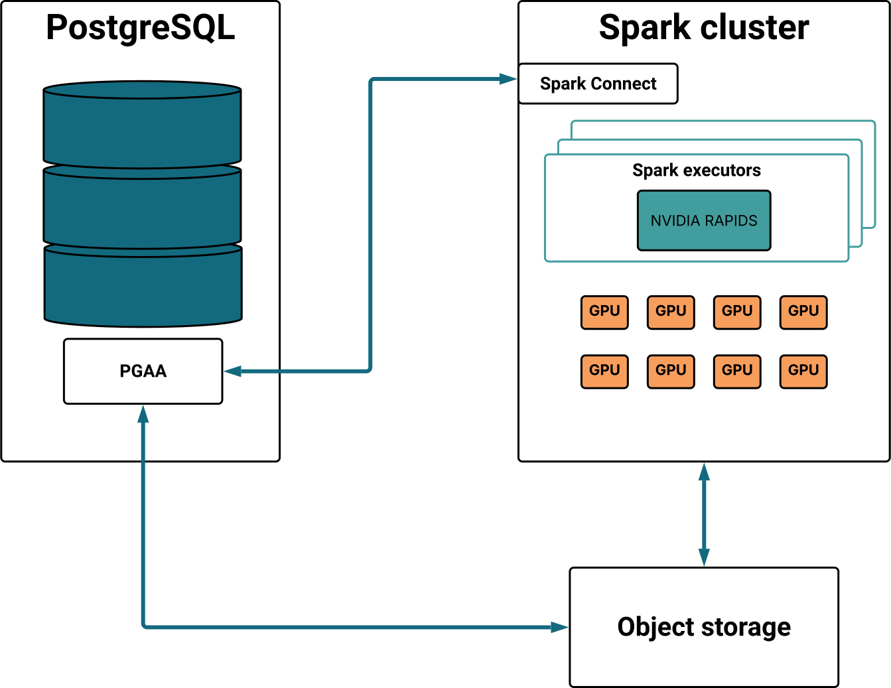

Integrate NVIDIA RAPIDS with your Spark-connected Postgres Analytics Accelerator (PGAA) environment to achieve hardware-level acceleration for your data lakehouse. While Spark orchestrates distributed workloads across the cluster, RAPIDS offloads intensive computational tasks to the GPU, delivering massive throughput gains for complex queries on large-scale datasets.

<p align="center">
  
</p>

This GPU-accelerated approach allows PGAA to transcend standard distributed processing through the following core capabilities:

- **Massively parallel execution:** Thousands of NVIDIA GPU cores process columnar data simultaneously, completing complex queries up to 100x faster than standard Postgres tables.
- **Hardware-accelerated scaling:** While Spark manages distribution at 100 GB, RAPIDS becomes the primary performance driver at 3 TB and beyond, widening the hardware efficiency gap as data grows.
- **Zero-overhead performance:** Operates directly on columnar data in memory, delivering peak performance without manual indexing, vacuuming, or traditional database tuning.
- **Intelligent fallback:** Ensures query completion by automatically shifting unsupported operations back to the Spark CPU or the Postgres kernel without user intervention.

!!! Note
  Currently, GPU acceleration with Apache Spark is optimized for read-only queries on Parquet files in S3-compatible object storage or a shared POSIX filesystem. Support for Iceberg (read/write) is coming soon.
!!!

## Configuring GPU acceleration with NVIDIA RAPIDS

The core architecture consists of a Postgres server with the PGAA extension, an Apache Spark cluster configured with NVIDIA RAPIDS, and compatible object storage containing Parquet-formatted data.

To implement this environment, you can leverage existing infrastructure, perform a manual installation, or use our [ready-to-run Docker Compose stack](https://github.com/EnterpriseDB/spark-rapids-tutorial) to quickly deploy all necessary components. This stack includes pre-configured examples optimized for the NVIDIA Brev platform, allowing you to easily deploy self-serve GPU instances in the cloud. If compatible GPUs are detected, NVIDIA RAPIDS will automatically provide hardware acceleration; otherwise, the system transparently falls back to CPU-based processing.

The configuration of PGAA with NVIDIA RAPIDS consists of the following steps:

1. Verify the [prerequisites](#prerequisites).
1. Confirm that [NVIDIA RAPIDS](#enabling-nvidia-rapids) is properly installed and active within your Spark cluster. 
1. [Connect Postgres to Spark](#connecting-postgres-to-spark).
1. [Configure Postgres's source data](#configuring-the-source-data). 
1. [Run analytical queries](#running-analytical-queries) and verify that the workload is utilizing GPU acceleration.

### Prerequisites

- **Postgres:** Version 16 or later with PGAA and PGFS extensions installed.
- **Storage locations**: Currently, only S3-compatible storage and local file system are supported as data storage locations.
- **Apache Spark**: Version 3.4 or later.  
- **Spark Connect**: A running [Spark Connect](https://spark.apache.org/docs/3.5.7/api/python/getting_started/quickstart_connect.html) server configured with the following dependencies:

  ```
  org.apache.spark:spark-connect_2.12:3.5.6,\
  io.delta:delta-spark_2.12:3.3.1,\
  org.apache.iceberg:iceberg-spark-runtime-3.5_2.12:1.9.2,\
  org.apache.iceberg:iceberg-aws-bundle:1.9.2,\
  org.apache.hadoop:hadoop-aws:3.3.4
  ```

- **NVIDIA RAPIDS**: Version 2025.10 or above installed on your Spark cluster. See [Enabling RAPIDS](#enabling-nvidia-rapids) for details. 
- **Hardware**: Access to a machine equipped with NVIDIA GPUs. 

### Enabling NVIDIA RAPIDS

To utilize GPU acceleration, you must correctly install and activate NVIDIA RAPIDS within your Apache Spark cluster. Configure your Spark environment to support hardware acceleration by following these integration guidelines:

1. **Download RAPIDS JARs:** Ensure your Spark environment downloads the necessary [RAPIDS JAR files](https://docs.nvidia.com/spark-rapids/user-guide/latest/getting-started/on-premise.html#download-the-rapids-accelerator-jar). Specify the plugin version `com.rapids-4-spark_2.12:25.10.0` when submitting a job.

1. **GPU discovery:** [Install the GPU discovery script](https://docs.nvidia.com/spark-rapids/user-guide/latest/getting-started/on-premise.html#install-the-gpu-discovery-script) that allows Spark to identify the available GPUs. 

1. **Apply Spark configuration:** Enable the following parameters as a minimum. For a full list of optimization settings, see the [RAPIDS configuration](https://nvidia.github.io/spark-rapids/docs/configs.html) and [Tuning guide](https://docs.nvidia.com/spark-rapids/user-guide/latest/tuning-guide.html).

  ```yaml
  spark.rapids.sql.enabled=true
  spark.rapids.filecache.enabled=true
  spark.executor.resource.gpu.amount=1
  spark.plugins=com.nvidia.spark.SQLPlugin
  spark.shuffle.manager=com.nvidia.spark.rapids.spark356.RapidsShuffleManager
  ```

1. **Container provisioning:** If deploying Spark via Docker, modify your container manifest to grant Spark access to the host GPUs.

For a complete example that implements the above steps—including volume mounting the discovery script, setting environment-level Spark configurations, and configuring the NVIDIA container runtime—refer to our sample [docker-compose.yaml](https://github.com/EnterpriseDB/spark-rapids-tutorial/blob/main/gpu-2xl40s/docker-compose.yml).

### Connecting Postgres to Spark

1. From your Postgres's terminal, set PGAA to use Spark as the execution engine and define your Spark Connect endpoint:

  ```sql
  SET pgaa.executor_engine = 'spark_connect';
  SET pgaa.spark_connect_url = 'sc://spark-connect:15002';
  ```

  Where `spark-connect` points to your Spark Connect service address.

1. Confirm that Postgres can communicate with the Spark cluster by executing a simple version check through the PGAA interface:

  ```sql
  SELECT pgaa.spark_sql('SELECT version()');
  ```

  If successful, the command returns the version string of your Spark cluster.


### Configuring the source data

1. Create a [PGFS storage location](/edb-postgres-ai/latest/ai-factory/pipeline/pgfs/functions/#creating-a-storage-location) in your Postgres database that points to the bucket containing your analytical data. For example, with a public bucket:

  ```sql
  SELECT pgfs.create_storage_location(
  'my-sample-data',
  's3://beacon-analytics-demo-data-us-east-1-prod',
  '{"skip_signature": "true", "region": "us-east-1"}'
  );
  ```

1. Create tables using the `PGAA` access method. Specify the storage location created in the previous step, the path to either a single Parquet file or a directory containing multiple Parquet files, and the format (currently Parquet). For example:

  ```sql
  CREATE TABLE store () USING PGAA
      WITH (pgaa.storage_location = 'my-sample-data', pgaa.path = 'tpcds_sf_10/store', pgaa.format = 'parquet');
  CREATE TABLE customer () USING PGAA
      WITH (pgaa.storage_location = 'my-sample-data', pgaa.path = 'tpcds_sf_10/customer', pgaa.format = 'parquet');
  CREATE TABLE date_dim () USING PGAA
      WITH (pgaa.storage_location = 'my-sample-data', pgaa.path = 'tpcds_sf_10/date_dim', pgaa.format = 'parquet');
    CREATE TABLE store_returns () USING PGAA
      WITH (pgaa.storage_location = 'my-sample-data', pgaa.path = 'tpcds_sf_10/store_returns', pgaa.format = 'parquet');
  ```    

  If you specify a directory containing multiple Parquet files, PGAA automatically unions all files into a single table for processing.

### Running analytical queries

Run heavy analytical queries against your defined tables to verify that they are successfully leveraging GPU acceleration.

The query is offloaded to the Spark cluster, and if NVIDIA RAPIDS is active, the join and aggregation operations are performed in parallel across thousands of GPU cores.

The following example runs a TPC-DS inspired analytical query that identifies high-return customers by comparing their total store returns against the regional average. This involves complex Common Table Expressions (CTEs), correlated subqueries, and multi-stage aggregations—precisely the type of CPU-intensive workload that PGAA accelerates through vectorized execution:

```sql
WITH customer_total_return AS (
    SELECT 
        sr_customer_sk AS ctr_customer_sk,
        sr_store_sk AS ctr_store_sk,
        SUM(sr_return_amt) AS ctr_total_return
    FROM store_returns, date_dim
    WHERE sr_returned_date_sk = d_date_sk 
      AND d_year = 2000
    GROUP BY sr_customer_sk, sr_store_sk
)
SELECT c_customer_id
FROM customer_total_return ctr1, store, customer
WHERE ctr1.ctr_total_return > (
    SELECT AVG(ctr_total_return) * 1.2
    FROM customer_total_return ctr2
    WHERE ctr1.ctr_store_sk = ctr2.ctr_store_sk
)
AND s_store_sk = ctr1.ctr_store_sk
AND s_state = 'TN'
AND ctr1.ctr_customer_sk = c_customer_sk
ORDER BY c_customer_id
LIMIT 100;
```

To confirm that NVIDIA RAPIDS is actively accelerating your queries, monitor the execution plan through the Spark Connect UI:

1. Access the Spark UI at `http://<spark_driver_host>:4040`.
1. Navigate to the SQL tab and select your recently executed query.
1. Inspect the plan. If RAPIDS is active, the query nodes will be prefixed with **Gpu**. For example, `GpuFilter`, `GpuBatchScan`, `GpuUnion`, etcetera. 


Beyond the query plan, you can analyze GPU-specific performance metrics directly within the Spark UI to identify potential bottlenecks. For a detailed breakdown of these metrics and how to optimize them, refer to the [NVIDIA tuning guide](https://docs.nvidia.com/spark-rapids/user-guide/latest/tuning-guide.html).


