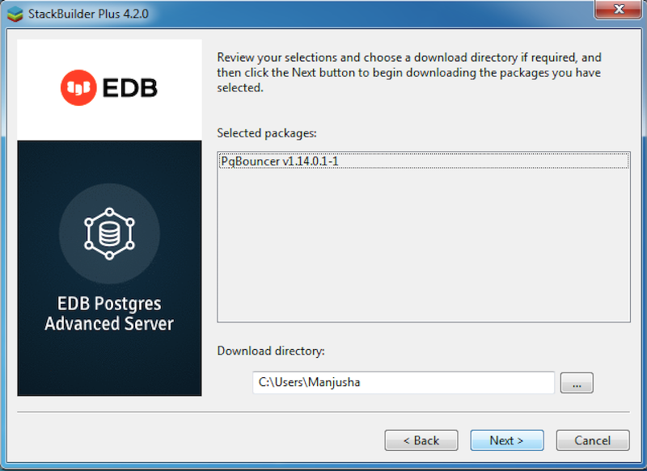
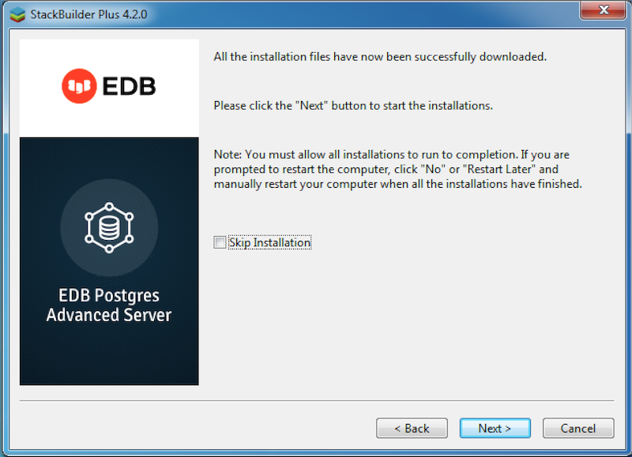
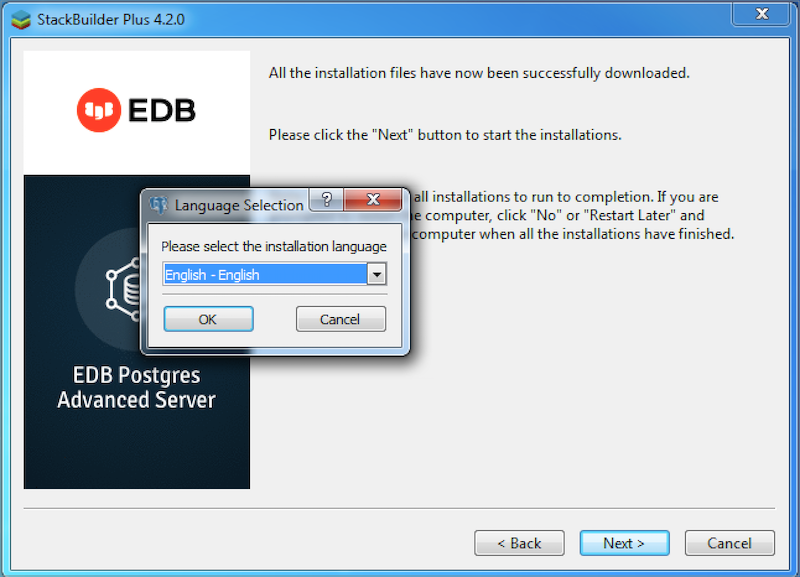
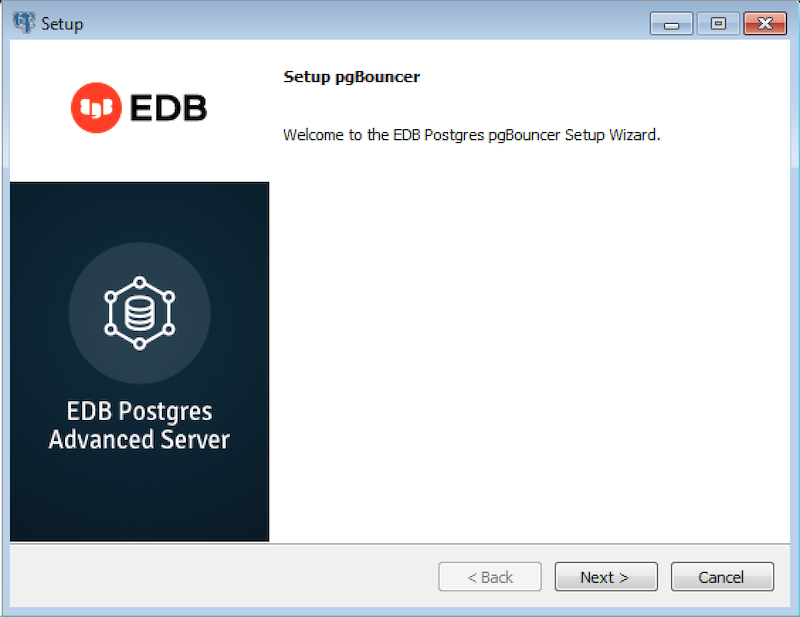
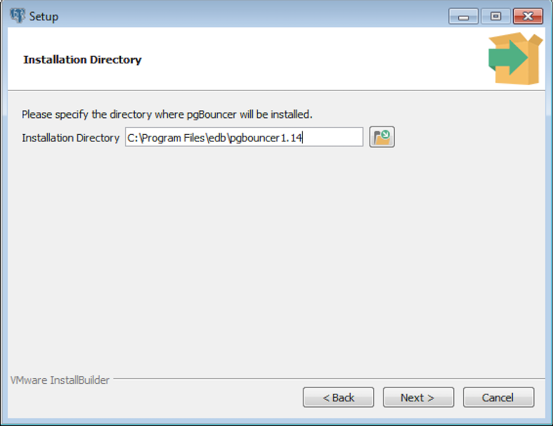
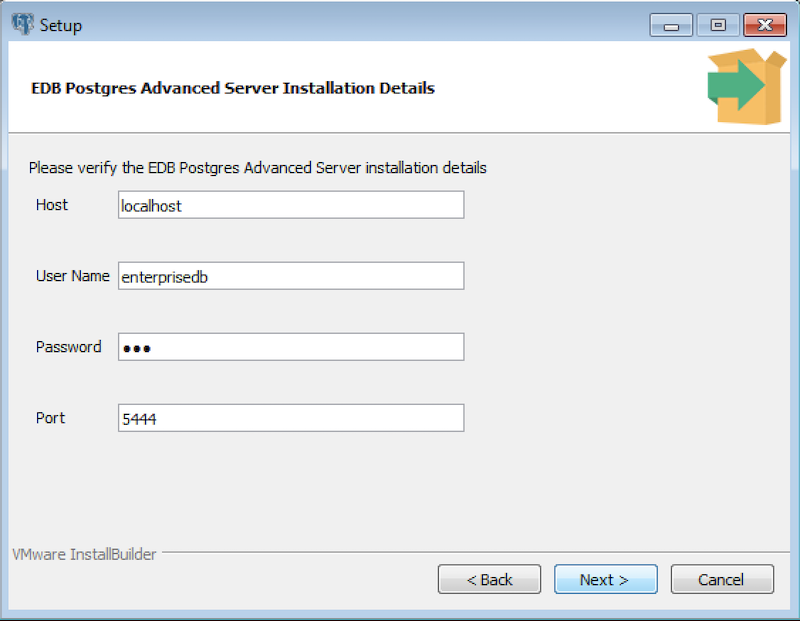
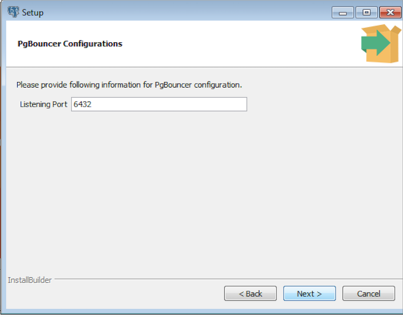
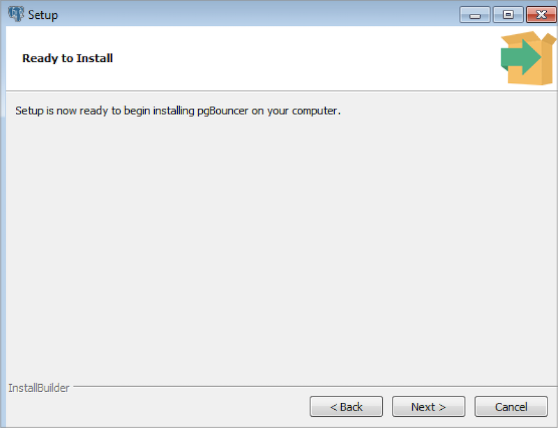
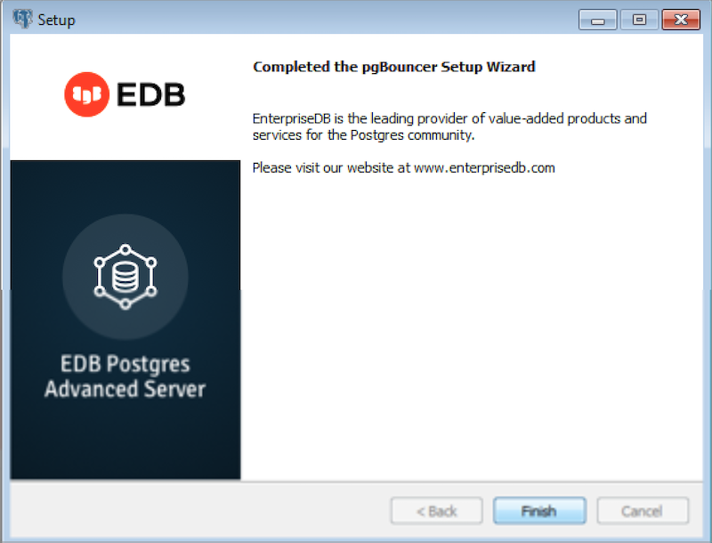

Graphical installers for PgBouncer are available via StackBuilder Plus (for Advanced Server hosts) or Stack Builder (for PostgreSQL hosts).

The following steps walk you through installing PgBouncer 1.14.0.1 by accessing StackBuilder Plus through Windows start menu

1.  Access StackBuilder Plus through the Windows start menu; on the `Welcome` window, select your Advanced Server installation from the drop-down list. Click `Next` to continue to the application selection page.

1.  Expand the `Add-ons, tools and utilities` node, and check the box next to the `PgBouncer v1.14.0.1-1`. Click `Next` to continue.
2.  The selected packages and the default download directory where the package will be installed are displayed; change the download directory location if required. Click `Next`.

1.  Once you have downloaded the installation files, a confirmation message is displayed. Click `Next` to start the PgBouncer installation.

1.  Select an installation language and click `OK`.

1.  The installer welcomes you to the setup wizard. Click `Next`.

1.  Use the `Installation Directory` field to specify the directory in which you wish to install PgBouncer (the default installation directory is `C:\Program Files\edb`) Then, click `Next` to continue.

1.  Use fields on the `EDB Postgres Advanced Server Installation Details` window to provide connection information for the Advanced Server host:

> -   Use the `Host` field to identify the system on which Advanced Server resides.
> -   Provide the name of the role that PgBouncer will use for connections to the server in the `User Name` field.
> -   Provide the password associated with the role in the `Password` field.
> -   Use the `Port` field to identify the listener port that Advanced Server monitors for client connections.
>
> Then, click `Next` to continue.

1.  Use fields on the `PgBouncer Configurations` window to provide your preferences for the PgBouncer installation:

> -   Use the `Listening Port` field to specify the port that PgBouncer monitors for connections.
> -   Use the `Operating System User` field to specify the name of the Linux operating system user that PgBouncer will change to after startup. This option is not supported on Windows hosts.

1.  The `Ready to Install` window notifies you when the installer has all of the information needed to install PgBouncer on your system. Click `Next` to install PgBouncer. Progress bars inform you as the installation progresses.

1.  The installer notifies you when the setup wizard has completed the installation. Click `Finish` to exit the installer.

