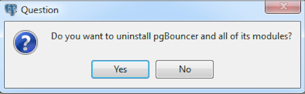

This section walks you through uninstalling PgBouncer.

## Uninstalling PgBouncer on a CentOS Host

To uninstall PgBouncer on a CentOS host, assume the identity of the root user and invoke the following command:

On RHEL/CentOS 6 and 7:

``` text
yum erase edb-pgbouncer<xx>
```

On RHEL/CentOS 8:

``` text
dnf erase edb-pgbouncer<xx>
```

Where `<xx>` is the pgbouncer version.

## Uninstalling PgBouncer on a Debian or Ubuntu Host

To uninstall PgBouncer on a Debian or Ubuntu host, invoke the following command:

``` text
apt-get remove edb-pgbouncer<xx>
```

Where `<xx>` is the version you want to uninstall.

## Uninstalling PgBouncer on a Windows Host

The PgBouncer graphical installer creates an uninstaller in the installation directory that you have specified while installing PgBouncer.

To uninstall PgBouncer on a Windows Host:

1.  Navigate into the directory that contains the uninstaller and assume superuser privileges. Open the uninstaller and click `Yes` to begin uninstalling PgBouncer:



2.  The uninstallation process begins. Click `OK` when the uninstallation completes:


