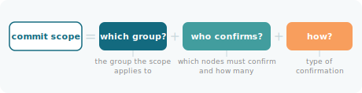
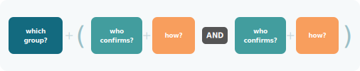
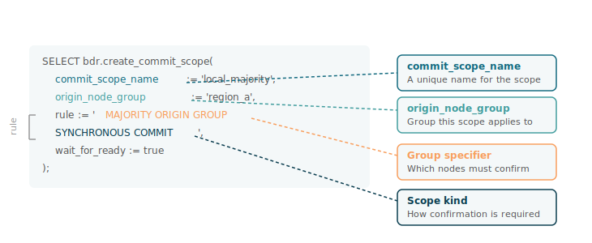
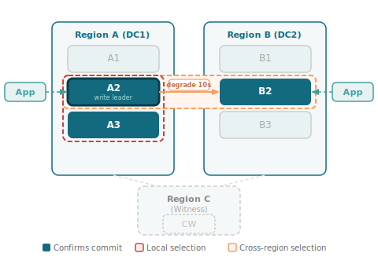
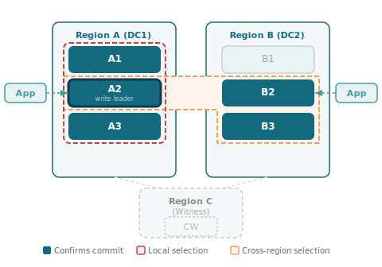

Use custom scopes to achieve full granularity over commit behavior in complex environments. Each clause defines its own confirmation requirements independently, covering which nodes must respond, how many, and what kind of confirmation applies. Combining clauses lets you enforce different durability requirements across different node groups within a single commit.

## Constructing a custom scope

Every custom scope definition answers three questions:



Combine clauses to enforce different durability requirements across node groups in the same commit. PGD evaluates each clause independently, and all must be satisfied before the commit returns.



When you create a custom commit scope, you define:

- A unique name via `commit_scope_name`, used to reference and assign the scope to a node group or individual transaction
- Which group the scope applies to, via `origin_node_group`. Only transactions originating from nodes in this group use the scope
- A `rule` string specifying who confirms and how:
  - The confirming nodes are expressed as a [commit scope group specifier](/pgd/current/commit-scopes/origin_groups/), which defines how many must confirm and which group they come from.
  - The type of confirmation is the [commit kind](#choosing-a-commit-kind), whether that means durability, quorum agreement, bounded lag, or single-commit enforcement.
  - Optionally, `DEGRADE ON` sets a timeout after which the clause falls back to asynchronous if the required nodes don't respond in time.

Optionally, specify `wait_for_ready` to block the call until the scope is active across all nodes before returning.

For example, define a scope that requires a majority of local nodes to confirm synchronously before the commit returns.



In this example, the rule requires a majority of nodes in the group `my_group` to confirm (`MAJORITY ORIGIN GROUP`), using synchronous commit as the commit kind (`SYNCHRONOUS COMMIT`).

## Choosing a commit kind

Pick a commit kind to define what confirmation means for your workload. The right choice depends on how much latency you can tolerate, whether conflicts need to be prevented at commit time, and how your application handles retries:

- **[Synchronous Commit](/pgd/current/commit-scopes/synchronous_commit/)** requires acknowledgment from the designated peers before the commit returns. Pair with `DEGRADE ON` to fall back to asynchronous after a timeout if the required peers don't respond.
- **[Quorum Commit](/pgd/current/commit-scopes/quorum-commit/)** requires all participating nodes to agree on the transaction outcome before any node commits, preventing conflicting changes from being committed independently across nodes.
- **[CAMO](/pgd/current/commit-scopes/camo/)** (Commit At Most Once) enforces single-commit semantics across nodes, preventing a transaction from being applied more than once when a client retries after a connection failure. You must implement a [verification step](/pgd/current/commit-scopes/camo/) in your application to check transaction status before retrying.
- **[Lag Control](/pgd/current/commit-scopes/lag-control/)** provides async semantics gated by a maximum lag threshold. As the cluster approaches the threshold, PGD throttles application traffic to prevent runaway lag. The commit returns after local durability, but writes slow down before the threshold is breached.

| Commit kind | Best for | Key trade-off |
|---|---|---|
| Synchronous Commit | Geo-distributed workloads requiring confirmation that data is persisted on remote nodes before the commit returns, with optional graceful degradation when peers are slow to respond | Higher commit latency than async |
| Quorum Commit | High-value workloads in payments, banking, or telecom where conflicting commits can't be untangled after the fact | Higher per-transaction latency, and a majority must participate |
| CAMO | Workloads where processing a transaction twice causes real harm, such as payments or inventory updates, and where your application can implement a status check before retrying | Application must implement a verification step before retrying |
| Lag Control | High-throughput ingest pipelines that need async performance but can't tolerate unbounded replication lag | Commits throttle or block when lag threshold is reached |

!!! Note
Commit kinds guarantee durability, not conflict prevention. Two nodes can still independently commit conflicting changes, which surface after the fact and are resolved using timestamps or other post-commit strategies. See [Conflict management](/pgd/current/conflict-management/). Unlike the other commit kinds, Quorum Commit prevents conflicts at commit time rather than resolving them afterward.
!!!

## Applying a commit scope

You can apply a scope at three levels of granularity. A transaction-level setting overrides a session-level one, which in turn overrides the group default.

- **Per group:** Set a default scope on the node group when you want a consistent default for all writes originating from that group without changing application code:

  ```sql
  SELECT bdr.alter_node_group_option(
      node_group_name := 'my_group',
      config_key := 'default_commit_scope',
      config_value := 'my_scope'
  );
  ```

- **Per session:** Set the scope as a configuration parameter when running a batch of operations that all need the same scope, or when testing a scope before committing to a group-level default. The scope applies to all transactions in the session until changed or the session ends:

  ```sql
  SET bdr.commit_scope = 'my_scope';
  ```

- **Per transaction:** Set the scope inside the transaction block when you need a different durability guarantee for a specific high-value operation without affecting everything else. You must set the scope before issuing any writes:

  ```sql
  BEGIN;
  SET LOCAL bdr.commit_scope = 'my_scope';
  -- application writes
  COMMIT;
  ```

## Example: Combining local majority with cross-region confirmation

When a geo-distributed workload needs strong local durability and cross-region confirmation, but can't afford to block if the remote region is unavailable, pair a local majority clause with a cross-region clause and a degrade timeout. The example uses the [two data groups, active-active](/pgd/current/planning/deployment-patterns/two-data-groups/) topology, with two active data groups (Region A and Region B, each with three data nodes) and a single witness node in Region C.

```sql
SELECT bdr.create_commit_scope(
    commit_scope_name := 'regional_ha',
    origin_node_group := 'region_a',
    rule := 'MAJORITY ORIGIN GROUP SYNCHRONOUS COMMIT
             AND ANY 1 NOT ORIGIN GROUP SYNCHRONOUS COMMIT
                 DEGRADE ON (timeout = 10s, require_write_lead = true) TO ASYNCHRONOUS COMMIT',
    wait_for_ready := true
);
```

The scope uses two clauses joined by `AND`. The red box shows the local clause, where A2 (write leader) and A3 satisfy `MAJORITY ORIGIN GROUP`. The amber box shows the cross-region clause, where A2 as the origin node participates in both and B2 in Region B satisfies `ANY 1 NOT ORIGIN GROUP`. Each clause is evaluated independently and both must be satisfied before the commit returns. `DEGRADE ON` applies only to the cross-region clause. If B2 can't confirm within 10 seconds, the cross-region clause falls back to async while the local majority requirement stays enforced.

<div style="text-align: center;"></div>

Depending on your workload, you can also apply this scope at the session or transaction level, for example to enforce stricter durability only for specific high-value writes rather than all traffic from the group.

## Example: Requiring all local nodes and two cross-region nodes

When partial confirmation isn't acceptable, for example in regulated industries or financial systems requiring complete consensus, require every local node and two remote nodes to confirm with no fallback. Built on the same [two data groups, active-active](/pgd/current/planning/deployment-patterns/two-data-groups/) topology, `ALL ORIGIN GROUP` requires every node in Region A to confirm rather than a majority, and `ANY 2 NOT ORIGIN GROUP` requires two Region B nodes to confirm rather than one.

```sql
SELECT bdr.create_commit_scope(
    commit_scope_name := 'strict_ha',
    origin_node_group := 'region_a',
    rule := 'ALL ORIGIN GROUP SYNCHRONOUS COMMIT
             AND ANY 2 NOT ORIGIN GROUP SYNCHRONOUS COMMIT',
    wait_for_ready := true
);
```

The red box covers A1, A2, and A3 because `ALL ORIGIN GROUP` selects every node in the origin group, including A1, which plays no role in the previous example. The amber selection covers A2, B2, and B3, and the two arrows show that both B nodes must confirm. There's no `DEGRADE ON` clause, so if any of the required nodes can't confirm, the transaction waits.

<div style="text-align: center;"></div>
