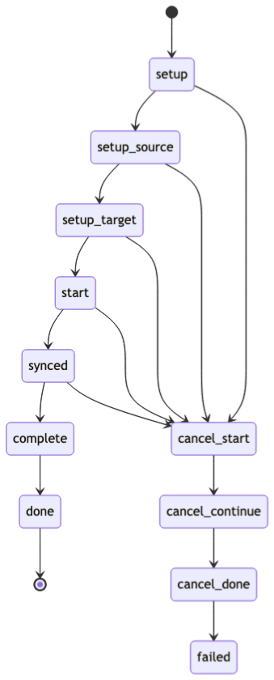

## Auto-triggering the Sync

The BDR manager process does the auto-triggering of sync requests. When there are no updates from a node for an interval of time greater than 3 times [`bdr.replay_progress_frequency`](/pgd/6/reference/tables-views-functions/pgd-settings#bdrreplay_progress_frequency), it is considered to be down. 

Nodes are checked for their closeness to each other. If all nodes are equally caught up, no sync is needed. If not, the node that is furthest ahead from the "down" node is chosen as a source.  Once a source is determined, for each target - nodes other than the origin and source - a sync request is set up. Witness and standby nodes do not need to be targets in the sync. 

The view [`bdr.sync_node_requests_summary`](/pgd/6/reference/tables-views-functions/catalogs-internal#bdrsync_node_requests_summary) tracks the sync requests.

- `Origin`: origin node is the down node.
- `Source`: source node is the node furthest ahead from origin.
- `Target`: each of the other nodes that’s behind the source with respect to the origin.
- `Sync_start_lsn`: Highest LSN received by the target from origin when sync started.
- `Sync_end_lsn`: Target LSN of the target node from the origin when the sync ended.
- `Sync_status`: status of the sync.
- `Sync_start_ts`: Time when sync started.

Once a sync request is entered in the catalog, it is carried forward to completion.

## Cancellation

If the source node chosen is found to be down, the manager will cancel the sync operation. This is because some other node can be up which if not furthest, is at least further ahead than some targets. And it may be used to sync the nodes. Therefore the manager will cancel all sync operations which have the down node as source, and will choose another node that is not down as the source for sync. The state machine is described below for a successful sync as well as a cancelled sync.

The sync cancellation API, [`bdr.sync_node_cancel()`](/pgd/6/reference/tables-views-functions/nodes-management-interfaces#bdrsync_node_cancel) is meant only to be used manually and only if the sync request gets stuck for any reason and is blocking normal functioning of the cluster.

```sql
select bdr.sync_node_cancel(origin, source)
```

This cancels all sync node requests for all targets that have the given origin and source. This can be invoked only from a write lead.

## Sync Request Life Cycle

A single sync request has an origin, source, target and a sync_end_lsn to reach. The sync request goes through various states and each state executes on a different node.

<center>



</center>

The states are as follows:  
**setup**: Executes on the write lead. It sets up the fields of the sync, except `sync_end_lsn`.  
**setup_source**: Executes on the source. It populates `sync_end_lsn` and creates a slot for the sync subscription.  
**setup_target**: This executes on the target node. In this state, the original subscription to the origin is disabled. A sync subscription is set up on the target which forwards the origin’s changes from the source node to the target.  
**start**: This executes on the target. It monitors the progress of the target to see if `sync_end_lsn` is reached and if reached moves to synced state.  
**synced**: subscription has synced to `sync_end_lsn`. In this state the slot is dropped.  
**complete**: This state executes on the target. In this state, sync subscription is dropped on the target and original subscription is enabled. It then moves to to done state.  
**done**: This means sync is successful.  
**cancel start**: This executes on the target node. In this state, the sync subscription is disabled, in preparation for a drop later, and the original subscription to the origin is re-enabled.  
**cancel continue**: This executes on the target node. In this state, the sync subscription is dropped.  
**cancel done**: This executes on the source node. In this state, the slot is dropped.  
**failed**: A sync ends-up in this state if a cancellation happens and all cleanup is done. This means the sync could not happen and needs to be retried.

A cancellation of sync can also happen automatically if the chosen source node is found to be down. During cancellation the subscription and slot needs to be cleaned up, and the original subscription enabled. A sync request can be stalled if the source or target nodes are down.

## GUC

The GUC that controls automatic sync is [`bdr.enable_auto_sync_reconcile`](/pgd/6/reference/tables-views-functions/pgd-settings#bdrenable_auto_sync_reconcile) and it is set to true by default. To turn it off, it needs to be set to false on all nodes and the server restarted.

