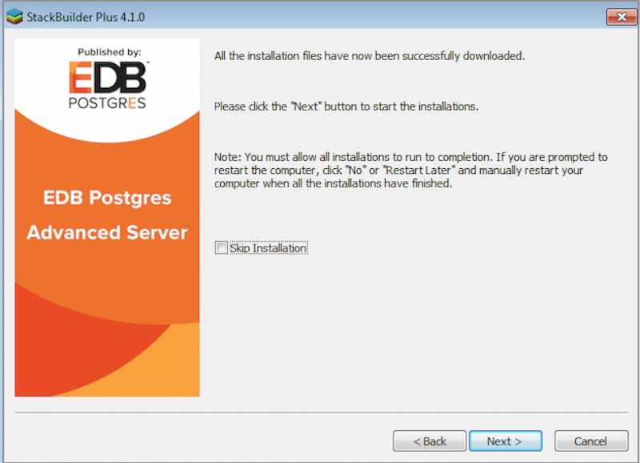
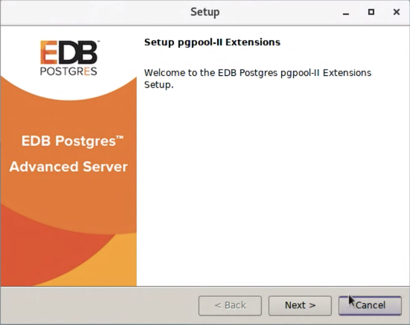
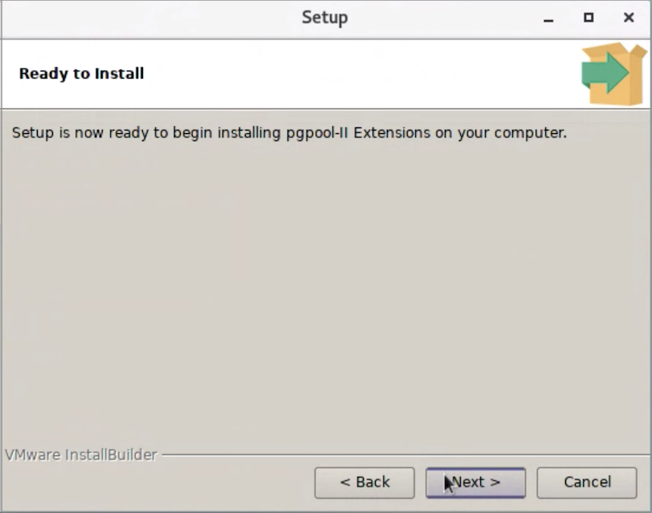
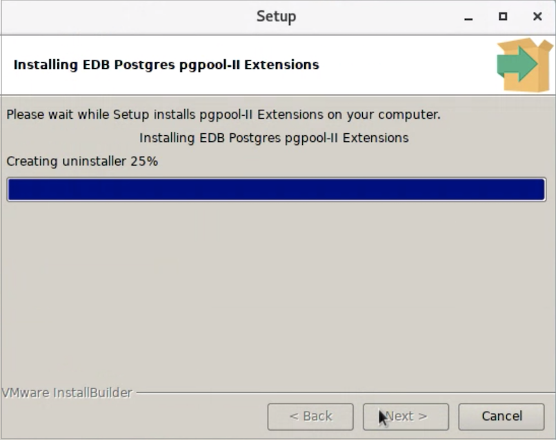
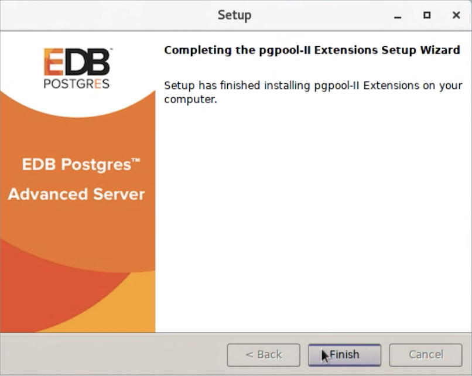

Modules in the extensions directory are additional features to Advanced Server, which are generally not included in the core database. Once loaded in a database, they can function just like built-in features. They allow you to use simple `SELECT` commands to use PCP remotely.

Before installing pgpool extensions, ensure that Advanced Server is installed on your host system. You can install the following pgpool-specific extensions using the following command:

> -   pgpool\_adm &lt;pgpool\_adm&gt;
> -   pgpool\_recovery &lt;pgpool\_recovery&gt;

## Installing pgpool-II Extensions

The following section walks you through the steps of installing pgpool-II extensions.

### Installing pgpool-II Extension on a RHEL/CentOS Host

Assume superuser privileges and execute the following command to install pgpool-II extensions:

On RHEL/CentOS 6 and 7:

    yum install edb-as<xx>-pgpool<yy>-extensions

For example, to install pgpool41 extensions for Advanced Server 12, execute the following command:

    yum install edb-as12-pgpool41-extensions

On RHEL/CentOS 8:

    dnf install edb-as<xx>-pgpool<yy>-extensions

In the above command, `<xx>` is the Advanced Server version, and `<yy>` is the pgpool-II extension version. The extensions will be available in the `/usr/edb/as<xx>/share/extension` directory.

Currently, pgpool-II 4.0.&lt;x&gt; and 4.1.&lt;x&gt; extensions can be installed on RHEL8 platforms.

### Installing pgpool-II Extension Using Linux Graphical Installer

Graphical installers for pgpool-II extensions are available via StackBuilder Plus (for Advanced Server hosts) or Stack Builder (on PostgreSQL hosts). You can access StackBuilder Plus through your Linux start menu.

Perform the following steps to install pgpool-II extensions:

1.  Open StackBuilder Plus and select your Advanced Server installation from the drop-down list on the `Welcome` window. Click `Next` to continue to the application selection page.

1.  Expand the `Add-ons, tools and utilities` node, and check the box next to the pgpool-II extension to select and download the installer. Click `Next` to continue.
2.  Provide the credentials and click `Next`.
3.  The selected packages and the default download directory where the package will be installed are displayed; change the download directory location if required. Click `Next`.
4.  Once you have downloaded the installation files, a confirmation message is displayed. Click `Next` to start the installation.

1.  Select an installation language and click `OK`.

The pgpool extensions installer welcomes you to the setup wizard.

Use the `Installation Directory` field to specify the directory in which you wish to install the pgpool-II extensions software (the default installation directory is `/opt/edb/as<xx>`) Then, click `Next` to continue.

The `Ready to Install` window notifies you when the installer has all of the information needed to install pgpool-II extensions on your system. Click `Next` to install pgpool-II extensions.

Progress bars inform you as the installation progresses.

The installer notifies you when the setup wizard has completed the pgpool-II installation. Click `Finish` to exit the installer.

The extensions will be available in the `/opt/edb/as<xx>/share/extension/pgpool*` directory.

### Installing pgpool-II Extension Using an SLES 12 Host

You can use the zypper package manager to install pgpool-II extension on an SLES 12 host. zypper will attempt to satisfy package dependencies as it installs a package, but requires access to specific repositories that are not hosted at EnterpriseDB.

1.  Assume superuser privileges.

<!-- -->

    Sudo su -

1.  Use the following command to add the EnterpriseDB repository to your SLES host.

<!-- -->

    zypper addrepo https://zypp.enterprisedb.com/suse/edb-sles.repo

Ensure you have credentials that allow access to the EnterpriseDB repository. For information about requesting credentials, [click this link](https://info.enterprisedb.com/rs/069-ALB-339/images/Repository%20Access%2004-09-2019.pdf).

1.  Use the following command to refresh the metadata on your SLES host to include the EnterpriseDB repository:

<!-- -->

    zypper refresh

1.  Then, use the zypper utility to install pgpool-II extension:

<!-- -->

    zypper install edb-as<xx>-pgpool<yy>-extensions

Where &lt;xx&gt; is the advanced server version and &lt;yy&gt; is the pgpool version you wish to install. Currently, 4.0.9 and 4.1.2 versions are supported on Advanced server 11 and 12 on an SLES 12 host.

## Creating pgpool-II Extensions

You must install and create the extensions in each database in which you will be using pgpool-II functionality. To ensure all extensions are available for future databases, you can add the extension to the `template1` database; any extensions installed in the `template1` database will be created in each of the database that uses `template1` as a template during creation.

**pgpool\_adm Extension**

The `pgpool_adm` extension is available for the following pgpool-II versions.

3.5.24, 3.5.25, 3.6.20, 3.6.21, 3.7.13, 3.7.14, 4.0.9, and 4.1.2

`pgpool_adm` is a set of extensions that allows SQL access to PCP commands. To view information about PCP commands, see <https://www.pgpool.net/docs/41/en/html/pcp-commands.html>.

After installing the `pgpool_adm` extension, use the psql client application to connect to the database, and execute the following SQL command:

    CREATE EXTENSION pgpool_adm;

To view more information about `pgpool_adm`, see <https://www.pgpool.net/docs/41/en/html/pgpool-adm.html>.

**pgpool\_recovery Extension**

The `pgpool_recovery` extension is required for online recovery and future fail-back mechanism.

After installing the `pgpool_recovery` extension, use psql to connect to the database, and execute the following SQL command to create a `pgpool_recovery` extension:

    CREATE EXTENSION pgpool_recovery;

For more information about using the `CREATE EXTENSION` command, see the [PostgreSQL core documentation](https://www.postgresql.org/docs/12/static/sql-createextension.html).
