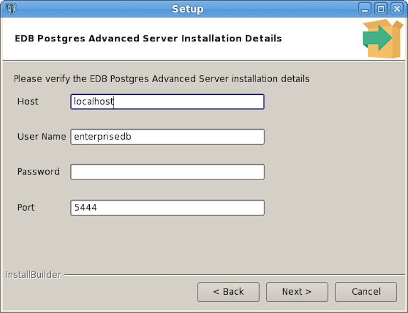

<div id="installing_postgis" class="registered_link"></div>


The following table lists the latest PostGIS versions and their corresponding Advanced Server versions. The PostGIS version required by your Advanced Server installation is version-specific, but the documented and supported functionality of each version is the same. The information in this guide applies to each version listed in the table below.

| **PostGIS Version** | **Supported Advanced Server Versions** |
| ------------------- | -------------------------------------- |
| PostGIS 3.0.1       | Advanced Server 12                     |
| PostGIS 2.5.4       | Advanced Server 11 and 12              |
| PostGIS 2.5.3       | Advanced Server 12                     |
| PostGIS 2.5.1       | Advanced Server 11                     |
| PostGIS 2.4.6       | Advanced Server 9.6, 10 and 11         |
| PostGIS 2.3.8       | Advanced Server 9.6 and 10             |
| PostGIS 2.1.9       | Advanced Server 9.5                    |

To view a complete list of EnterpriseDB supported platforms, visit [the EnterpriseDB website](https://www.enterprisedb.com/services-support/edb-supported-products-and-platforms#epas).

<div id="using_rpm_to_install_postgis" class="registered_link"></div>

## Installing PostGIS on a CentOS/RHEL Host

You must install Advanced Server before installing PostGIS. For details about installing and configuring Advanced Server, see [the EDB Postgres Advanced Server Installation Guide](https://www.enterprisedb.com/edb-docs/p/edb-postgres-advanced-server).

The following steps provide detailed information about adding a repository configuration file to your system and installing PostGIS from an RPM package.

Before creating the repository configuration file, you must have credentials that allow access to the EnterpriseDB repository. For information about requesting credentials, [visit this page](https://info.enterprisedb.com/rs/069-ALB-339/../../../../../../../../../../images/Repository%20Access%2004-09-2019.pdf).

1.  Use the following command to create the repository configuration file:

On CentOS/RHEL 7:

> 
> 
> ``` text
> yum -y install https://yum.enterprisedb.com/edb-repo-rpms/edb-repo-latest.noarch.rpm
> ```

On CentOS/RHEL 8:

> 
> 
> ``` text
> dnf -y install https://yum.enterprisedb.com/edb-repo-rpms/edb-repo-latest.noarch.rpm
> ```

The repository configuration file is named `edb.repo`, which resides in `/etc/yum.repos.d`.

2.  Use your choice of editor to open the file. Ensure that the value of the enabled parameter is `1` and the `<username>` and `<password>` placeholders in the `baseurl` specification are replaced with the username and password of a registered EnterpriseDB user.
    
    ``` text
    [edb]
    name=EnterpriseDB RPMs $releasever - $basearch
    baseurl=https://<username>:<password>@yum.enterprisedb.com/edb/redhat/rhel-$releasever-$basearch
    enabled=1
    gpgcheck=1
    gpgkey=file:///etc/pki/rpm-gpg/ENTERPRISEDB-GPG-KEY
    ```

3.  Save the configuration file and exit the editor.

4.  Before installing PostGIS on a CentOS/RHEL 8 machine, you need to enable the `PowerTools` repo with the following command:
    
    ``` text
    dnf config-manager --set-enabled PowerTools
    ```

5.  Install `PostGIS` with one of the following platform-specific command:

On CentOS/RHEL 7:

> 
> 
> ``` text
> yum install edb-as<xx>-postgis-<y.y.y>
> ```

Where *\<xx\>* is the Advanced Server version and *\<y.y.y\>* is the PostGIS version you want to install. For example, to install PostGIS 3.0.1 on Advanced Server 12, execute the following command:

> 
> 
> ``` text
> yum install edb-as12-postgis-3.0.1
> ```

On CentOS/RHEL 8:

> 
> 
> ``` text
> dnf install edb-as<xx>-postgis-<y.y.y>
> ```

Where *\<xx\>* is the Advanced Server version and *\<y.y.y\>* is the PostGIS version you want to install. For example, to install PostGIS 3.0.1 on Advanced Server 12, execute the following command:

> 
> 
> ``` text
> dnf install edb-as12-postgis-3.0.1
> ```

When you install an RPM package that is signed by a source that is not recognized by your system, yum may ask for your permission to import the key to your local server. If prompted, and you are satisfied that the packages come from a trustworthy source, enter `y` and press `Return` to continue.

After installing PostGIS with a package manager, please note that you must manually create a template database and the required PostGIS extension.

<div id="installing_a_deb_package_on_a_debian_or_ubuntu_host" class="registered_link"></div>

## Installing PostGIS on a Debian/Ubuntu Host

You must install Advanced Server before installing PostGIS. For details about installing and configuring Advanced Server, see [the EDB Postgres Advanced Server Installation Guide](https://www.enterprisedb.com/edb-docs/p/edb-postgres-advanced-server).

To install a package on a Debian or Ubuntu host, you must have credentials to access the EnterpriseDB repository. If you need EnterpriseDB credentials, [visit the EnterpriseDB website](https://info.enterprisedb.com/rs/069-ALB-339/../../../../../../../../../../images/Repository%20Access%2004-09-2019.pdf).

The following steps will walk you through using the EnterpriseDB repository to install a DEB package. When using the commands, replace the `username` and `password` with the credentials provided by EnterpriseDB.

<div class="note">

<div class="title">

Note

</div>

If you are using the pdf version of this document, using cut/paste to copy command may result in extra spaces or carriage returns in the pasted command. If a command fails, check the command carefully for additional characters.

</div>

1.  Assume superuser privileges:
    
    > 
    > 
    > ``` text
    > sudo su –
    > ```

2.  Configure the EnterpriseDB repository:
    
    > 
    > 
    > ``` text
    > sh -c 'echo "deb https://<username>:<password>@apt.enterprisedb.com/$(lsb_release -cs)-edb $(lsb_release -cs) main" > /etc/apt/sources.list.d/edb-$(lsb_release -cs).list'
    > ```

3.  Add support to your system for secure APT repositories:
    
    > 
    > 
    > ``` text
    > apt-get install apt-transport-https
    > ```

4.  Add the EDB signing key:
    
    > 
    > 
    > ``` text
    > wget -q -O - https://<username>:<password>@apt.enterprisedb.com/edb-deb.gpg.key | apt-key add -
    > ```

5.  Update the repository metadata:
    
    > 
    > 
    > ``` text
    > apt-get update
    > ```

6.  Install DEB package:
    
    > 
    > 
    > ``` text
    > apt-get install edb-as<xx>-postgis-<y.y>
    > ```
    > 
    > Where *\<xx\>* is the Advanced Server version and *\<y.y\>* is the PostGIS version you want to install.
    > 
    > For example, to install the PostGIS 3.0.1 package for Advanced Server 12, execute the following command:
    > 
    > ``` text
    > apt-get install edb-as12-postgis-3.0
    > ```

<div id="using_stackbuilder_plus_to_install_postgis" class="registered_link"></div>

## Installing PostGIS on a Windows Host

You must install Advanced Server before installing PostGIS. If you have used the graphical Setup wizard to install Advanced Server, you can use StackBuilder Plus to add PostGIS to your installation. For details about using the graphical installer to install and configure Advanced Server, see the [EDB Postgres Advanced Server Installation Guide for Windows](https://www.enterprisedb.com/edb-docs/).

1.  Open StackBuilder Plus and select your Advanced Server installation from the drop-down list on the `Welcome` window. Click `Next` to continue to the application selection page.


2.  Expand the `Spatial Extensions` node, and check the box next to the PostGIS version. Click `Next` to continue.
3.  The selected packages and the default download directory where the package will be installed are displayed; change the locations if required. Click `Next`.
4.  Once you have downloaded the installation files, a confirmation message is displayed. Click `Next` to start the PostGIS installation.


5.  Select an installation language and click `OK`.


6.  The PostGIS welcome screen is displayed. Click `Next`.


7.  Use the `Installation Directory` field to specify the directory in which you wish to install the PostGIS software. Click `Next` to continue.


8.  Use fields on the `EDB Postgres Advanced Server Installation Details` window to provide connection information for the Advanced Server host:

<!-- end list -->

  - Use the `Host` field to identify the system on which Advanced Server resides.
  - Provide the name of the role that PostGIS will use for connections to the server in the `User Name` field.
  - Provide the password associated with the role in the `Password` field.
  - Use the `Port` field to identify the listener port that Advanced Server monitors for client connections.

Then, click `Next` to continue.



9.  The `Ready to Install` window notifies you when the installer has all of the information needed to install PostGIS on your system. Click `Next`.


10. Progress bars inform you as the installation progresses; click `Finish` to exit the installer when the PostGIS installation completes.


StackBuilder Plus will install PostGIS, and create the `template_postgis` database and PostGIS functions.
