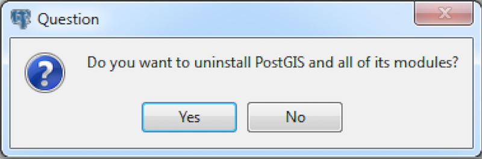
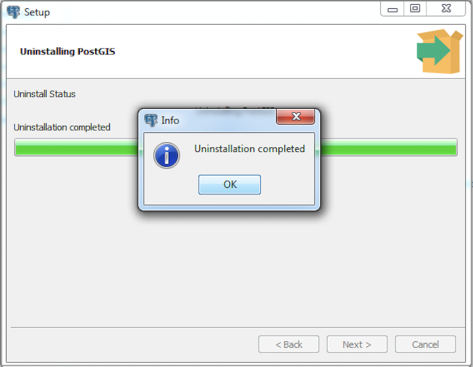

<div id="uninstalling_postgis" class="registered_link"></div>


## Uninstalling PostGIS on a CentOS/RHEL Host

To uninstall PostGIS, assume the identity of the root user and invoke the following command:

On CentOS/RHEL7:

``` text
yum erase edb-as<xx>-postgis-*<y.y.y>
```

On CentOS/RHEL8:

``` text
dnf erase edb-as<xx>-postgis-*<y.y.y>
```

Where *\<xx\>* is the Advanced Server version and \<y.y.y\> is the PostGIS version you want to uninstall.

## Uninstalling PostGIS on a Debian/Ubuntu Host

To uninstall PostGIS on a Debian or Ubuntu platform, invoke the following command:

``` text
apt-get remove edb-as<xx>-postgis-<y.y>*
```

Where *\<xx\>* is the Advanced Server version and \<y.y\> is the PostGIS version you want to uninstall

## Uninstalling PostGIS on a Windows Host

The PostGIS graphical installer creates an uninstaller that you can use to remove PostGIS. The uninstaller is created in the installation directory that you have specified while installing PostGIS (default is `C:\Program Files\edb\as12`).

1.  Navigate into the directory that contains the uninstaller and assume superuser privileges. Open the uninstaller and click `Yes` to begin uninstalling PostGIS:



2.  The uninstallation process begins. Click `OK` when the uninstallation completes:


