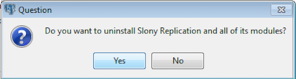

This section walks you through uninstalling Slony Replication.

## Uninstalling Slony Replication on a RHEL/CentOS Host

To uninstall Slony Replication on a RHEL/CentOS host, assume identity of the root user and invoke the following command:

On RHEL/CentOS 7:

```text
yum remove edb-as<xx>-slony-replication*
```

where &lt;xx> is the Advanced Server version.

On RHEL/CentOS 8:

```text
dnf remove edb-as<xx>-slony-replication*
```

## Uninstalling Slony Replication on a Debian or Ubuntu Host

To uninstall Slony Replication on a Debian or Ubuntu host, invoke the following command:

```text
apt-get remove edb-as<xx>-slony-replication*
```

where &lt;xx> is the Advanced Server version.

## Uninstalling Slony Replication on a Windows Host

The Slony Replication graphical installer creates an uninstaller in the installation directory.

To uninstall Slony Replication on a Windows Host:

1.  Navigate into the installation directory that contains the uninstaller and assume superuser privileges. Open the uninstaller and click `Yes` to begin uninstalling Slony Replication:



Fig. 1: The Slony Replication Uninstaller

2.  The uninstallation process begins. Click `OK` once the process completes.


Fig. 2: Uninstallation completes
