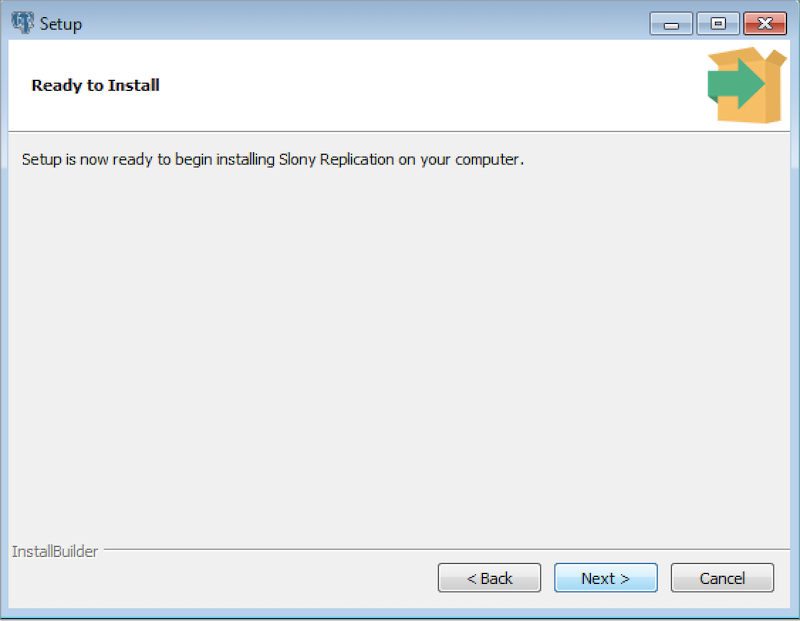

Graphical installers for Slony Replication are available via StackBuilder Plus (for Advanced Server hosts) or Stack Builder (on PostgreSQL hosts). You can access StackBuilder Plus through your Windows start menu.

Perform the following steps to install Slony Replication:

1.  Open StackBuilder Plus and select your Advanced Server installation from the drop-down list on the `Welcome` window. Click `Next` to continue to the application selection page.

2.  Expand the `Replication Solutions` node, and check the box next to the Slony Replication version. Click `Next` to continue.

3.  The selected packages and the default download directory are displayed. Change the download directory location if required. Click `Next`.

4.  Once you have downloaded the installation files, a confirmation message is displayed. Click `Next` to start the Slony Replication installation.

5.  Select an installation language and click `OK`.

6.  The installer welcomes you to the setup wizard. Click `Next`.

7.  Use the `Installation Directory` field to specify the directory in which you wish to install Slony Replication (the default installation directory is `C:\Program Files\edb\as12`) Then, click `Next` to continue.

8.  The `Ready to Install` window notifies you when the installer has all of the information needed to install Slony Replication on your system. Click `Next` to install Slony Replication. Progress bars inform you as the installation progresses.

9.  The installer notifies you when the setup wizard has completed the installation. Click `Finish` to exit the installer.

10. Click `Finish` to exit the StackBuilder Plus.

