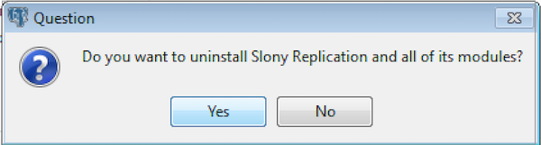
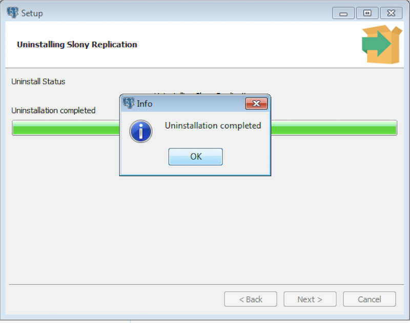

This section walks you through uninstalling Slony Replication.

## Uninstalling Slony Replication on a RHEL/CentOS Host

To uninstall Slony Replication on a RHEL/CentOS host, assume identity of the root user and invoke the following command:

On RHEL/CentOS 6 and 7:

``` text
yum remove edb-as12-slony-replication*
```

On RHEL/CentOS 8:

``` text
dnf remove edb-as12-slony-replication*
```

## Uninstalling Slony Replication on a Debian or Ubuntu Host

To uninstall Slony Replication on a Debian or Ubuntu host, invoke the following command:

``` text
apt-get remove edb-as12-slony-replication*
```

## Uninstalling Slony Replication on a Windows Host

The Slony Replication graphical installer creates an uninstaller named `uninstall-edb-as12-slony-replication` in the installation directory (the default location is `C:\Program Files\edb\as12`).

To uninstall Slony Replication on a Windows Host:

1.  Navigate into the directory that contains the uninstaller and assume superuser privileges. Open the uninstaller `uninstall-edb-as12-slony-replication` and click `Yes` to begin uninstalling Slony Replication:



2.  The uninstallation process begins. Click `OK` once the process completes.


